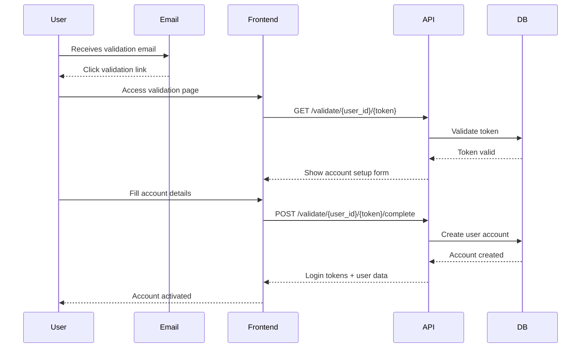

# User Validation APIs

## Overview

The User Validation APIs handle the account activation process for new users. This typically occurs when users receive an email with a validation link and need to complete their account setup.

## Validation Flow



## Token Validation

### Check Token Validity

Verify that a validation token is valid before showing the account setup form.

**Endpoint:** `GET /cms-api/v1/validate/{user_id}/{token}`

**Path Parameters:**
- `user_id` (integer): The user ID
- `token` (string): The 32-character validation token

**Success Response:**
```json
{
  "status": 200,
  "message": "OK",
  "error": null,
  "logged_in": false,
  "meta": {
    "version": "v1",
    "timestamp": "2025-01-23T10:30:00Z"
  },
  "data": {
    "user_id": 123,
    "email": "user@example.com",
    "name": "John Doe",
    "token_valid": true,
    "message": "Token is valid. You can proceed with account setup."
  }
}
```

**Error Responses:**
- `400 Bad Request`: Invalid parameters or token doesn't match
- `404 Not Found`: User not found

**Permissions:** None (public endpoint)

### Complete Account Validation

Complete the account setup process with user details.

**Endpoint:** `POST /cms-api/v1/validate/{user_id}/{token}/complete`

**Path Parameters:**
- `user_id` (integer): The user ID
- `token` (string): The 32-character validation token

**Request Body:**
[View JSON Schema](../../config/schemas/api/v1/requests/auth/complete_validation.json)
```json
{
  "name": "John Doe",
  "user_name": "johndoe",
  "password": "SecurePassword123!",
  "confirm_password": "SecurePassword123!",
  "language_id": 1
}
```

**Success Response:**
```json
{
  "status": 200,
  "message": "OK",
  "error": null,
  "logged_in": true,
  "meta": {
    "version": "v1",
    "timestamp": "2025-01-23T10:30:00Z"
  },
  "data": {
    "access_token": "eyJ0eXAiOiJKV1QiLCJhbGciOiJSUzI1NiJ9...",
    "refresh_token": "abc123def456...",
    "user": {
      "id": 123,
      "email": "user@example.com",
      "name": "John Doe",
      "user_name": "johndoe",
      "language_id": 1,
      "language_locale": "en"
    },
    "message": "Account validated successfully"
  }
}
```

**Validation Rules:**

**Name:**
- Required
- String, 1-255 characters
- Can contain letters, spaces, hyphens, apostrophes

**Username:**
- Required
- String, 3-50 characters
- Alphanumeric characters, underscores, and hyphens only
- Must be unique across all users

**Password:**
- Required
- Minimum 8 characters
- Must contain at least one uppercase letter
- Must contain at least one lowercase letter
- Must contain at least one number
- Must contain at least one special character

**Confirm Password:**
- Must match the password field exactly

**Language ID:**
- Required
- Must be a valid language ID from the system

**Error Responses:**
- `400 Bad Request`: Invalid token, validation errors
- `404 Not Found`: User not found
- `409 Conflict`: Account already validated or username taken
- `422 Unprocessable Entity`: Field validation failed

**Permissions:** None (public endpoint)

## Frontend Implementation

### Validation Page Flow

```javascript
// Page component for account validation
const AccountValidation = ({ userId, token }) => {
  const [step, setStep] = useState('validating');
  const [userData, setUserData] = useState(null);
  const [formData, setFormData] = useState({
    name: '',
    user_name: '',
    password: '',
    confirm_password: '',
    language_id: 1
  });
  const [errors, setErrors] = useState({});

  // Step 1: Validate token on page load
  useEffect(() => {
    validateToken();
  }, [userId, token]);

  const validateToken = async () => {
    try {
      const response = await fetch(`/cms-api/v1/validate/${userId}/${token}`);
      const data = await response.json();

      if (response.ok) {
        setUserData(data.data);
        setStep('form');
        // Pre-fill name from user data
        setFormData(prev => ({ ...prev, name: data.data.name || '' }));
      } else {
        setStep('error');
        setErrors({ general: data.error || 'Invalid validation link' });
      }
    } catch (error) {
      setStep('error');
      setErrors({ general: 'Network error. Please try again.' });
    }
  };

  const handleSubmit = async (e) => {
    e.preventDefault();

    try {
      const response = await fetch(`/cms-api/v1/validate/${userId}/${token}/complete`, {
        method: 'POST',
        headers: {
          'Content-Type': 'application/json'
        },
        body: JSON.stringify(formData)
      });

      const data = await response.json();

      if (response.ok) {
        // Store tokens and redirect to dashboard
        localStorage.setItem('access_token', data.data.access_token);
        localStorage.setItem('refresh_token', data.data.refresh_token);
        window.location.href = '/dashboard';
      } else {
        // Handle validation errors
        if (data.validation) {
          setErrors(data.validation);
        } else {
          setErrors({ general: data.error || 'Validation failed' });
        }
      }
    } catch (error) {
      setErrors({ general: 'Network error. Please try again.' });
    }
  };

  if (step === 'validating') {
    return <div>Validating your account...</div>;
  }

  if (step === 'error') {
    return (
      <div className="error">
        <h2>Validation Failed</h2>
        <p>{errors.general}</p>
        <a href="/login">Return to Login</a>
      </div>
    );
  }

  return (
    <div className="account-validation">
      <h2>Complete Your Account Setup</h2>
      <p>Welcome {userData?.email}! Please complete your account information.</p>

      <form onSubmit={handleSubmit}>
        <div className="form-group">
          <label htmlFor="name">Full Name</label>
          <input
            type="text"
            id="name"
            value={formData.name}
            onChange={(e) => setFormData({...formData, name: e.target.value})}
            required
          />
          {errors.name && <span className="error">{errors.name}</span>}
        </div>

        <div className="form-group">
          <label htmlFor="user_name">Username</label>
          <input
            type="text"
            id="user_name"
            value={formData.user_name}
            onChange={(e) => setFormData({...formData, user_name: e.target.value})}
            required
          />
          {errors.user_name && <span className="error">{errors.user_name}</span>}
        </div>

        <div className="form-group">
          <label htmlFor="password">Password</label>
          <input
            type="password"
            id="password"
            value={formData.password}
            onChange={(e) => setFormData({...formData, password: e.target.value})}
            required
          />
          {errors.password && <span className="error">{errors.password}</span>}
        </div>

        <div className="form-group">
          <label htmlFor="confirm_password">Confirm Password</label>
          <input
            type="password"
            id="confirm_password"
            value={formData.confirm_password}
            onChange={(e) => setFormData({...formData, confirm_password: e.target.value})}
            required
          />
          {errors.confirm_password && <span className="error">{errors.confirm_password}</span>}
        </div>

        <div className="form-group">
          <label htmlFor="language_id">Preferred Language</label>
          <select
            id="language_id"
            value={formData.language_id}
            onChange={(e) => setFormData({...formData, language_id: parseInt(e.target.value)})}
          >
            <option value={1}>English</option>
            <option value={2}>German</option>
            <option value={3}>French</option>
          </select>
        </div>

        {errors.general && <div className="error">{errors.general}</div>}

        <button type="submit">Complete Setup</button>
      </form>
    </div>
  );
};
```

### Email Link Handling

```javascript
// Handle validation links from emails
const handleValidationLink = (userId, token) => {
  // Extract parameters from URL
  const urlParams = new URLSearchParams(window.location.search);
  const userId = urlParams.get('user_id');
  const token = urlParams.get('token');

  if (!userId || !token) {
    // Invalid link
    showError('Invalid validation link');
    return;
  }

  // Render validation component
  ReactDOM.render(
    <AccountValidation userId={userId} token={token} />,
    document.getElementById('root')
  );
};
```

### Password Strength Validation

```javascript
const validatePassword = (password) => {
  const errors = [];

  if (password.length < 8) {
    errors.push('Password must be at least 8 characters long');
  }

  if (!/[A-Z]/.test(password)) {
    errors.push('Password must contain at least one uppercase letter');
  }

  if (!/[a-z]/.test(password)) {
    errors.push('Password must contain at least one lowercase letter');
  }

  if (!/\d/.test(password)) {
    errors.push('Password must contain at least one number');
  }

  if (!/[!@#$%^&*()_+\-=\[\]{};':"\\|,.<>\/?]/.test(password)) {
    errors.push('Password must contain at least one special character');
  }

  return errors;
};

// Real-time password validation
const PasswordInput = ({ value, onChange, onValidation }) => {
  const [errors, setErrors] = useState([]);

  const handleChange = (e) => {
    const newValue = e.target.value;
    onChange(newValue);

    const validationErrors = validatePassword(newValue);
    setErrors(validationErrors);
    onValidation(validationErrors.length === 0);
  };

  return (
    <div className="password-input">
      <input
        type="password"
        value={value}
        onChange={handleChange}
        className={errors.length > 0 ? 'invalid' : 'valid'}
      />
      {errors.length > 0 && (
        <ul className="password-requirements">
          {errors.map((error, index) => (
            <li key={index} className="error">{error}</li>
          ))}
        </ul>
      )}
    </div>
  );
};
```

## Security Considerations

1. **Token Expiration**: Validation tokens should expire after a reasonable time (e.g., 24-48 hours)
2. **Single Use**: Tokens should be invalidated after successful validation
3. **Secure Transmission**: Always use HTTPS for validation endpoints
4. **Rate Limiting**: Implement rate limiting to prevent brute force attacks
5. **Input Validation**: Strictly validate all user input
6. **CSRF Protection**: Include CSRF tokens if using forms
7. **Audit Logging**: Log all validation attempts for security monitoring

## Error Handling Patterns

### Network Errors

```javascript
const handleValidationError = (error, setErrors) => {
  if (!error.response) {
    // Network error
    setErrors({ general: 'Network error. Please check your connection and try again.' });
  } else {
    const { status, data } = error.response;

    switch (status) {
      case 400:
        if (data.error === 'Invalid validation token') {
          setErrors({ general: 'This validation link is invalid or has expired.' });
        } else {
          setErrors({ general: 'Invalid request. Please check your information.' });
        }
        break;
      case 404:
        setErrors({ general: 'User not found. This validation link may be incorrect.' });
        break;
      case 409:
        if (data.error.includes('already validated')) {
          setErrors({ general: 'This account has already been validated. Please log in instead.' });
        } else if (data.error.includes('username')) {
          setErrors({ user_name: 'This username is already taken.' });
        }
        break;
      case 422:
        // Handle validation errors
        setErrors(data.validation || { general: 'Please correct the errors below.' });
        break;
      default:
        setErrors({ general: 'An unexpected error occurred. Please try again.' });
    }
  }
};
```

### Token Expiration Handling

```javascript
const handleTokenExpiration = () => {
  return (
    <div className="token-expired">
      <h2>Validation Link Expired</h2>
      <p>This validation link has expired. Please request a new one.</p>
      <button onClick={() => window.location.href = '/resend-validation'}>
        Request New Validation Email
      </button>
    </div>
  );
};
```

## Testing Validation Flow

### Unit Tests

```javascript
describe('Account Validation', () => {
  test('validates token successfully', async () => {
    const response = await request(app)
      .get('/cms-api/v1/validate/123/validtoken123')
      .expect(200);

    expect(response.body.data.token_valid).toBe(true);
  });

  test('rejects invalid token', async () => {
    const response = await request(app)
      .get('/cms-api/v1/validate/123/invalidtoken')
      .expect(400);

    expect(response.body.error).toContain('Invalid validation token');
  });

  test('completes validation successfully', async () => {
    const userData = {
      name: 'John Doe',
      user_name: 'johndoe',
      password: 'SecurePass123!',
      confirm_password: 'SecurePass123!',
      language_id: 1
    };

    const response = await request(app)
      .post('/cms-api/v1/validate/123/validtoken123/complete')
      .send(userData)
      .expect(200);

    expect(response.body.data).toHaveProperty('access_token');
    expect(response.body.data).toHaveProperty('refresh_token');
    expect(response.body.data.user.name).toBe('John Doe');
  });
});
```

---

**Next:** [Admin Pages & Sections](./04-admin-pages-sections.md) | **Previous:** [User Profile Management](./02-user-profile.md) | **Back to:** [API Overview](../README.md)
