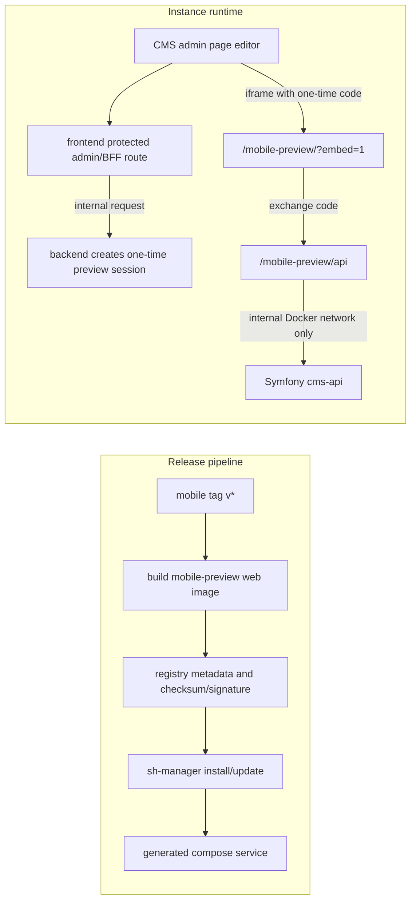

# Production Mobile Preview Service for CMS Embedding

Audience: Developers and technical operators
Status: Archived planning draft
Applies to: sh-selfhelp_backend, sh-selfhelp_frontend, sh-selfhelp_mobile, sh-manager, sh2-plugin-registry
Last verified: 2026-06-11
Source of truth: Runtime code, route metadata, release workflows, and manager-generated deployment configuration in the affected repositories

## Architecture Decision

Use option B: the mobile preview is a separate `mobile-preview` component/service.

The preview is not baked into the frontend image. The public instance domain exposes only `/mobile-preview`; it does not expose `/cms-api`. The preview service reaches the Symfony backend over the internal Docker network and only through a controlled preview API/proxy surface.

This fits the modular SelfHelp architecture better than option C because `backend`, `frontend`, `mobile-preview`, plugins, database, Redis, registry metadata, and manager installer remain separately versioned and independently deployable.

## Hard Constraints

- Do not expose `/cms-api` publicly on the instance domain.
- Do not pass the real CMS/admin JWT in a URL, iframe attribute, `postMessage`, or mobile-preview `localStorage`.
- The CMS admin flow creates a short-lived, scoped, one-time preview code for the iframe.
- The one-time code is exchanged for a preview session that allows read/preview access only.
- The preview proxy must allowlist the routes needed by mobile preview and reject arbitrary admin/write routes.
- The preview session must be tied to the creating admin user and expire quickly, for example after 5 to 15 minutes.
- Production preview builds use the internal proxy path; `backendUrl` overrides are allowed only for local/dev builds.

## Embed URL Contract

`/mobile-preview/?embed=1&keyword=<kw>&device=phone|tablet&orientation=portrait|landscape&frame=0|1&preview=true&previewSession=<one-time-code>&hideDebugPanel=true&banner=0&language=<locale>`

Decisions:

- `previewSession` is a one-time code, not a full credential. It is safe to place in the iframe URL only because it is short-lived, scoped, and invalid after exchange.
- The exchange happens inside the preview app through `/mobile-preview/api/preview-session/exchange`.
- After exchange, the preferred v1 credential is an HttpOnly, same-origin cookie scoped to `/mobile-preview/api`. The iframe JavaScript never reads a backend JWT.
- Query params override persisted mobile dev state but are session-only and are not written to `localStorage`.
- `embed=1` hides the debug panel/server picker, suppresses persistence, and shows a slim "Mobile preview" badge unless `banner=0`.
- `preview=true` requests draft content only within the scope granted by the preview session and existing backend permission rules.
- `backendUrl` remains a dev-only convenience for local preview testing and is rejected in production preview builds.

## Preview Session Flow

1. The CMS admin opens the page editor preview panel.
2. The frontend calls a protected admin/BFF route to request a mobile preview session for the current page/keyword/language/draft state.
3. The frontend/BFF calls the backend internally. The backend validates the admin user and page preview permission.
4. The backend creates a one-time preview code, stores only hashed/opaque session state in Redis/cache, and returns the code plus expiry metadata.
5. The frontend builds the iframe URL with `previewSession=<one-time-code>`.
6. On boot, the mobile preview app posts the code to `/mobile-preview/api/preview-session/exchange`.
7. The mobile-preview service forwards the exchange to the backend over the internal Docker network.
8. The backend validates and consumes the one-time code, then establishes the short-lived preview session.
9. Subsequent mobile preview API calls go to `/mobile-preview/api/...`; the proxy forwards only allowlisted read/preview requests to the backend.
10. Expired or revoked sessions return 401. Cross-page or cross-scope access returns 403 or 404 according to the established backend access rule.

## Backend Work

- Add a `MobilePreviewSessionService` or equivalent under the existing service patterns.
- Store preview codes/sessions with existing Redis-backed cache infrastructure where practical; avoid a new table unless audit or cleanup requirements make persistence necessary.
- Add backend endpoints for:
  - creating a preview session from the protected admin context;
  - exchanging a one-time code for a preview session;
  - validating preview-session access for allowlisted mobile preview reads.
- Keep controllers thin and route behavior through services.
- Add JSON schemas under `config/schemas/api/v1` for request/response contracts.
- Add database-backed API route metadata, route permissions, and a generated Doctrine migration if a new `/cms-api/v1` route is required.
- Reuse existing page preview/page edit permissions where possible; otherwise add a narrowly named preview permission through the established permission migration pattern.
- Ensure preview session creation is logged through the existing transaction/audit pattern if comparable admin preview actions are logged.
- Invalidate or expire preview sessions when related auth/ACL/page permissions change if the existing cache invalidation model supports that scope.
- Add focused tests for session creation, one-time exchange, expiry, replay rejection, unauthenticated access, lower-privileged access, and cross-scope denial.

Security impact: this adds a new authentication path. It must be reviewed as auth/security work and covered by negative-permission regression tests.

## Mobile Preview Service Work

- Build a production web preview image from the mobile repo instead of exporting assets into the frontend image.
- Serve the Expo web export under `/mobile-preview/` with `APP_WEB_PREVIEW=true` and `APP_WEB_PREVIEW_BASE_URL=/mobile-preview`.
- Add `version.json` and a health endpoint or static health file for manager checks.
- Add a controlled `/mobile-preview/api` proxy that reaches the backend through an internal URL such as `http://backend/cms-api/v1`.
- The proxy must not forward arbitrary `/cms-api` requests. It must allowlist only preview-session exchange and mobile read/preview endpoints.
- Add runtime env such as `SELFHELP_BACKEND_INTERNAL_URL`, `MOBILE_PREVIEW_BASE_PATH`, and a route allowlist config using names that match the repo's existing conventions.
- Keep local dev support through a dev-only `backendUrl` override so developers can run Expo web against a local backend.
- In embed mode, disable debug panel, server picker, auth persistence, and dev-mode persistence.
- Keep device/orientation/frame/preview query params as session-only overrides.

## Frontend Admin Work

- Add a `MobilePreviewPanel` in the CMS page editor.
- The panel creates a preview session through the protected frontend/admin flow and never reads or forwards the real admin JWT to the iframe.
- The iframe `src` uses `/mobile-preview/?embed=1&previewSession=<code>&keyword=...`.
- Controls include device, orientation, draft/preview mode, language if applicable, and reload/regenerate session.
- Show a graceful unavailable state when `/mobile-preview/version.json` or health check is missing.
- Do not add a public `/cms-api` rewrite in `next.config.mjs`.
- Add component tests for iframe URL construction, toolbar state, session refresh, and missing-preview fallback.

## Manager Work

- Add `mobile-preview` to generated compose files as a first-class service.
- Add Traefik routing for the `/mobile-preview` path prefix only.
- Pass the internal backend URL and required preview env vars to the service.
- Add health checks and include the service in install, update, rollback, clone, backup/restore assumptions, and e2e deployment validation.
- Ensure service updates can be rolled back independently according to the manager's existing versioning model.
- Keep `/cms-api` private in the generated deployment.

## Registry Work

- Add mobile-preview artifact/image metadata to the registry model consumed by sh-manager.
- Include exact version, digest/checksum, compatibility with backend/frontend versions, and signature/provenance metadata if the registry already supports it.
- Document the release order:
  1. tag mobile and publish the mobile-preview image/artifact;
  2. update registry metadata;
  3. manager installs or updates the instance;
  4. CMS admin verifies `/mobile-preview/version.json`.

## CI/CD Work

- Mobile repo: add a tag workflow that builds the web preview image, runs typecheck/lint/tests, exports the Expo web bundle, writes `version.json`, verifies `/mobile-preview/` asset paths, and publishes the image/artifact with checksum.
- Registry repo: validate mobile-preview metadata and publish it with the existing registry release process.
- sh-manager: add install/update/rollback tests for the new service and route.
- Frontend repo: add tests for the admin panel and protected session creation call.
- Backend repo: add focused API/security tests and run `composer phpstan` after backend code changes.

## Testing Plan

- Backend:
  - preview session create succeeds for an allowed admin/editor;
  - lower-privileged users fail with 403;
  - unauthenticated users fail with 401;
  - one-time code replay fails;
  - expired code/session fails;
  - cross-scope page access fails;
  - allowed preview reads return the standard API envelope and expected draft/public behavior.
- Mobile:
  - query parser validates embed params and rejects invalid production `backendUrl`;
  - embed mode disables persistence and debug/server picker UI;
  - preview-session exchange bootstraps API access without storing admin tokens.
- Frontend:
  - `MobilePreviewPanel` requests a session and builds the iframe URL correctly;
  - missing preview service renders the unavailable state;
  - changing device/orientation/draft regenerates or reloads as designed.
- Manager/e2e:
  - generated compose includes `mobile-preview`;
  - only `/mobile-preview` is public;
  - `/cms-api` remains private;
  - mobile preview can fetch content through the internal proxy;
  - rollback restores the prior mobile-preview version.

## Documentation Updates

- Backend docs: preview-session API contract, auth/security notes, permission matrix, and test command.
- Mobile docs: production web preview build, embed params, dev-only `backendUrl`, and local backend workflow.
- Frontend docs: admin preview panel behavior and unavailable-state expectations.
- Manager docs: compose service, route, health check, update, rollback, clone, and troubleshooting.
- Registry docs: mobile-preview metadata and release process.
- CHANGELOG entries in every changed repo.

## Risks And Mitigations

- New auth surface: keep session scope narrow, add one-time exchange, short TTL, replay protection, and negative-permission tests.
- Proxy accidentally exposes admin/write APIs: use an explicit allowlist and tests that rejected routes stay rejected.
- Preview session leaks through browser history: the URL contains only a short-lived one-time code that is invalid after exchange.
- Version skew between frontend panel and mobile-preview service: expose `version.json` and compatibility metadata in the registry/manager flow.
- Local dev complexity: keep `backendUrl` in dev builds only and document the exact workflow.
- Mercure realtime may still be unavailable in embedded deployments: document graceful degradation and provide a reload control.
