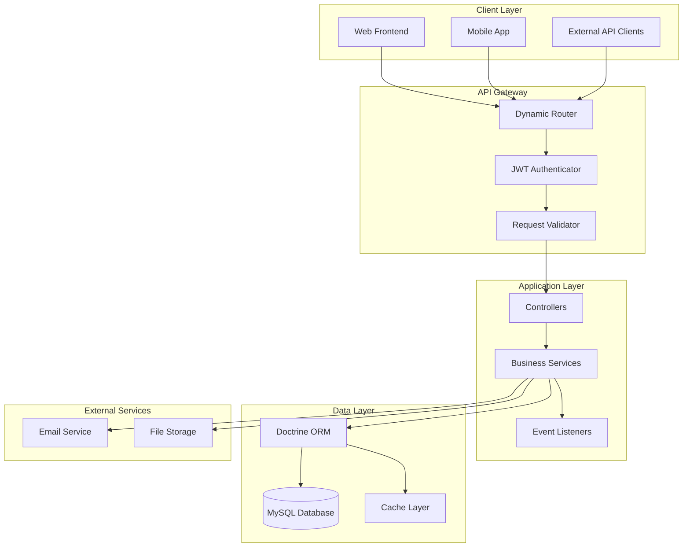
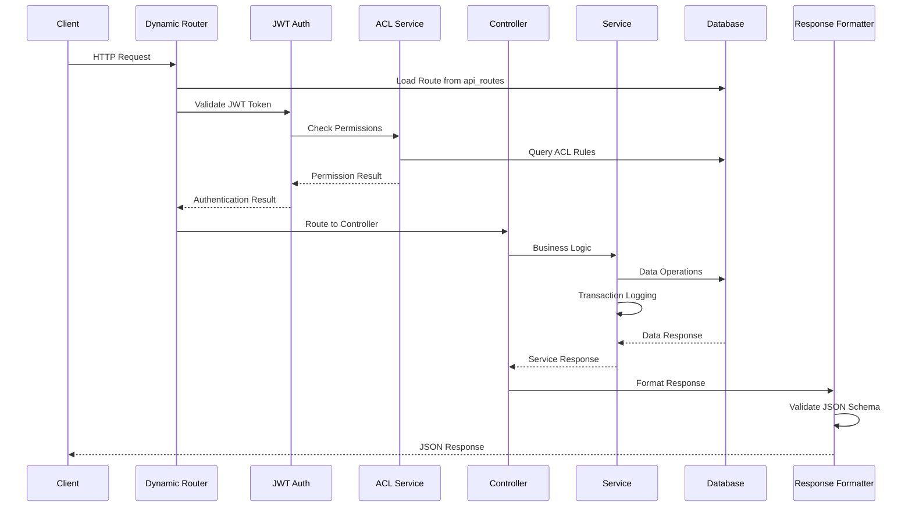
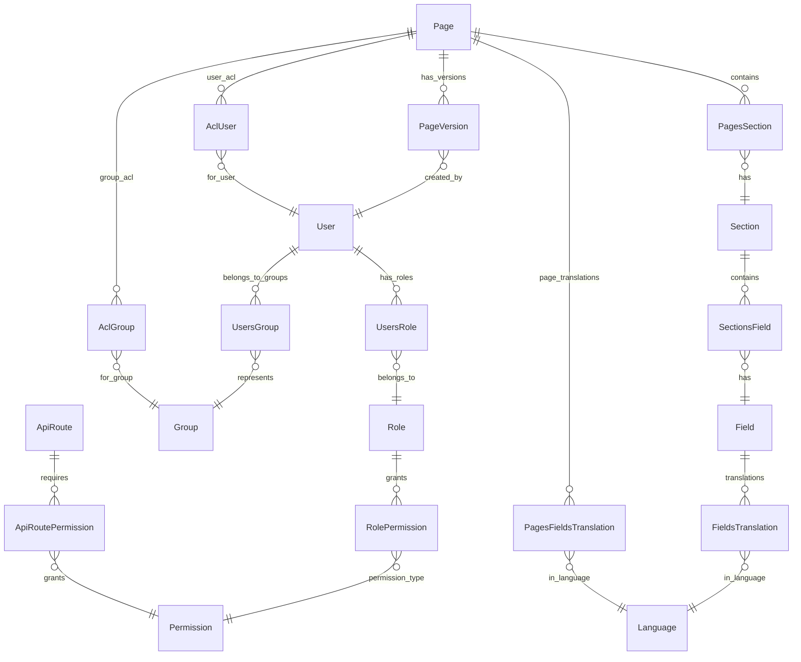

# System Architecture Overview

## 🏗️ High-Level Architecture

The SelfHelp Symfony Backend is built as a modern, database-driven REST API with a dynamic content management system. The architecture emphasizes flexibility, maintainability, and strict data integrity.

## 📊 System Components



## 🔄 Request Flow Architecture



## 🏛️ Architectural Patterns

### 1. **Database-Driven Configuration**
- **API Routes**: All routes stored in `api_routes` table
- **Permissions**: Route permissions managed via database relationships
- **Configuration**: System settings stored in database tables
- **Benefits**: Runtime configuration changes without code deployment

### 2. **Service-Oriented Architecture**
- **Thin Controllers**: Controllers handle HTTP concerns only
- **Rich Services**: Business logic encapsulated in services
- **Service Composition**: Services use other services through dependency injection
- **Transaction Management**: Services handle database transactions

### 3. **Event-Driven Components**
- **Request/Response Events**: Authentication, validation, logging
- **Domain Events**: Business logic triggers
- **Cross-Cutting Concerns**: Security, logging, caching

## 📁 Directory Structure

```
src/
├── Command/                # Symfony console commands
├── Controller/             # HTTP request handlers
│   ├── Api/V1/            # Versioned API controllers
│   │   ├── Admin/         # Administrative endpoints
│   │   │   ├── AdminActionController.php
│   │   │   ├── AdminAssetController.php
│   │   │   ├── AdminCacheController.php
│   │   │   ├── AdminCmsPreferenceController.php
│   │   │   ├── AdminDataController.php
│   │   │   ├── AdminGroupController.php
│   │   │   ├── AdminLanguageController.php
│   │   │   ├── AdminPageController.php
│   │   │   ├── AdminRoleController.php
│   │   │   ├── AdminScheduledJobController.php
│   │   │   ├── AdminSectionController.php
│   │   │   ├── AdminSectionUtilityController.php
│   │   │   ├── AdminStyleController.php
│   │   │   ├── AdminUserController.php
│   │   │   ├── AdminActionTranslationController.php
│   │   │   ├── Common/
│   │   │   │   └── LookupController.php
│   │   │   └── PageVersionController.php
│   │   ├── Auth/          # Authentication endpoints
│   │   │   ├── AuthController.php
│   │   │   ├── ProfileController.php
│   │   │   ├── UserDataController.php
│   │   │   └── UserValidationController.php
│   │   └── Frontend/      # Public endpoints
│   │       ├── FormController.php
│   │       ├── LanguageController.php
│   │       └── PageController.php
│   └── DefaultController.php
│   └── Trait/
│       └── RequestValidatorTrait.php
├── Entity/                 # Doctrine ORM entities (52 entities)
│   ├── AclGroup.php
│   ├── AclUser.php
│   ├── Action.php
│   ├── ActionTranslation.php
│   ├── ApiRequestLog.php
│   ├── ApiRoute.php
│   ├── Asset.php
│   ├── CallbackLog.php
│   ├── CmsPreference.php
│   ├── CodesGroup.php
│   ├── DataCell.php
│   ├── DataCol.php
│   ├── DataRow.php
│   ├── DataTable.php
│   ├── Field.php
│   ├── FieldType.php
│   ├── Group.php
│   ├── Hook.php
│   ├── Language.php
│   ├── Library.php
│   ├── LogPerformance.php
│   ├── Lookup.php
│   ├── MailQueue.php
│   ├── Notification.php
│   ├── Page.php
│   ├── PagesField.php
│   ├── PagesFieldsTranslation.php
│   ├── PagesSection.php
│   ├── PageType.php
│   ├── PageTypeField.php
│   ├── PageVersion.php
│   ├── Permission.php
│   ├── Plugin.php
│   ├── RefreshToken.php
│   ├── Role.php
│   ├── ScheduledJob.php
│   ├── Section.php
│   ├── SectionsFieldsTranslation.php
│   ├── SectionsHierarchy.php
│   ├── SectionsNavigation.php
│   ├── Style.php
│   ├── StyleGroup.php
│   ├── StylesAllowedRelationship.php
│   ├── StylesField.php
│   ├── Transaction.php
│   ├── User.php
│   ├── UserActivity.php
│   ├── Users2faCode.php
│   ├── ValidationCode.php
│   └── Version.php
├── EventListener/         # Event subscribers
│   ├── ApiExceptionListener.php
│   ├── ApiRequestLoggerListener.php
│   ├── ApiSecurityListener.php
│   └── ApiVersionListener.php
├── Exception/             # Custom exceptions
│   ├── RequestValidationException.php
│   └── ServiceException.php
├── Kernel.php            # Symfony kernel
├── Repository/           # Data access layer (26 repositories)
├── Routing/              # Custom route loading
│   └── ApiRouteLoader.php
├── Security/             # Security components
│   ├── JWTTokenAuthenticator.php
│   └── Voter/
├── Service/              # Business logic layer
│   ├── ACL/              # Access control services
│   │   └── ACLService.php
│   ├── Auth/             # Authentication services
│   │   ├── JWTService.php
│   │   ├── LoginService.php
│   │   ├── ProfileService.php
│   │   ├── UserContextService.php
│   │   ├── UserDataService.php
│   │   └── UserValidationService.php
│   ├── Cache/            # Cache management services
│   │   ├── Command/
│   │   └── Core/
│   ├── CMS/              # Content management services
│   │   ├── Admin/        # Admin CMS services
│   │   ├── Common/       # Common CMS services
│   │   └── Frontend/     # Frontend CMS services
│   ├── Core/             # Core application services
│   ├── Dynamic/          # Dynamic routing services
│   ├── JSON/             # JSON handling services
│   └── Util/             # Utility classes
└── Repository/           # Doctrine repositories
```

## 🔧 Core Services

### Authentication & Authorization
- **JWTService**: Token generation, validation, blacklisting
- **LoginService**: User authentication and login logic
- **UserContextService**: Current user context management
- **UserDataService**: User data retrieval for JWT tokens
- **ProfileService**: User profile management (name, password changes)
- **UserValidationService**: User validation and activation
- **JWTTokenAuthenticator**: Symfony authenticator implementation
- **ACLService**: Fine-grained access control

### Content Management
- **AdminPageService**: Page CRUD operations and versioning
- **AdminSectionService**: Section management and export/import
- **PageFieldService**: Field content management with translations
- **SectionFieldService**: Section field management
- **AdminAssetService**: File upload and asset management
- **PageVersionService**: Page versioning and publishing workflow
- **SectionCreationService**: Section creation utilities
- **SectionRelationshipService**: Section hierarchy management
- **PositionManagementService**: Section positioning logic

### System Services
- **TransactionService**: Audit trail and change logging
- **JobSchedulerService**: Background task scheduling
- **ApiResponseFormatter**: Standardized response formatting
- **JsonSchemaValidationService**: Request/response validation
- **CacheService**: Global cache management
- **CacheStatsService**: Cache statistics and monitoring

### Dynamic Routing
- **ApiRouteLoader**: Database-driven route loading
- **DynamicControllerService**: Dynamic controller resolution
- **ApiVersionResolver**: API version detection

## 💾 Data Architecture

### Entity Relationships


### Key Database Tables
- **`api_routes`**: Dynamic route definitions with permissions
- **`users`, `roles`, `permissions`**: Authentication/authorization (role-based)
- **`users_groups`**: Group memberships (for page ACL)
- **`pages`, `sections`, `fields`**: CMS content structure
- **`page_versions`**: Page versioning and publishing system
- **`acl_users`, `acl_groups`**: Fine-grained access control for pages
- **`fields_translations`, `sections_fields_translations`**: Multi-language support
- **`transactions`**: Comprehensive audit trail
- **`scheduled_jobs`**: Background task scheduling system
- **`data_tables`, `data_rows`, `data_cols`, `data_cells`**: Dynamic data tables
- **`assets`**: File upload and asset management

## 🔐 Security Architecture

### Multi-Layer Security
1. **Firewall Level**: Symfony security configuration
2. **Route Level**: Database-driven permission checks
3. **ACL Level**: Fine-grained page/resource access
4. **Service Level**: Business logic validation

### Authentication Flow
1. User submits credentials to `/cms-api/v1/auth/login`
2. System validates credentials and generates JWT tokens
3. Client includes JWT in `Authorization: Bearer {token}` header
4. `JWTTokenAuthenticator` validates token on each request
5. User context established for the request

### Authorization Flow
1. Route permissions checked via `api_routes_permissions`
2. ACL permissions checked for page-level access
3. Business logic validation in services
4. All operations logged via `TransactionService`

## 📋 API Design Principles

### RESTful Design
- **Resource-Based URLs**: `/api/v1/admin/pages/{id}`
- **HTTP Methods**: GET, POST, PUT, DELETE
- **Status Codes**: Proper HTTP status code usage
- **Content Types**: JSON request/response bodies

### Standardized Response Format
```json
{
    "status": 200,
    "message": "OK",
    "error": null,
    "logged_in": true,
    "meta": {
        "version": "v1",
        "timestamp": "2025-01-23T10:30:00Z"
    },
    "data": { }
}
```

### Validation Strategy
- **Request Validation**: JSON Schema validation for all inputs
- **Response Validation**: Schema validation in debug mode
- **Entity Validation**: Doctrine constraints and custom validators

## 🔄 Version Management Strategy

### Version Types
- **Major Version** (7.5.1 → 7.6.0): Database schema changes
- **Minor Version** (7.5.1 → 7.5.2): Code-only changes

### Version Components
- **Database Version**: Tracked in `version` table
- **API Version**: Included in URLs and route definitions
- **Schema Version**: JSON schemas organized by version
- **Controller Version**: Namespaced by API version

### Migration Process
1. Database changes go in SQL update scripts
2. API routes added to `api_routes.sql`
3. New controllers placed in versioned namespaces
4. JSON schemas updated for new version
5. Version number updated in database

## 🚀 Performance Considerations

### Caching Strategy
- **Route Caching**: Dynamic routes cached in memory
- **ACL Caching**: Permission results cached per request
- **Entity Caching**: Doctrine second-level cache for lookups

### Database Optimization
- **Connection Pooling**: Efficient database connections
- **Query Optimization**: Optimized queries with proper indexes
- **Stored Procedures**: ACL checks use stored procedures

### Response Optimization
- **JSON Schema Validation**: Only in debug mode for performance
- **Response Compression**: Gzip compression enabled
- **Pagination**: Large result sets properly paginated

---

**Next**: [Dynamic Routing System](./02-dynamic-routing.md)