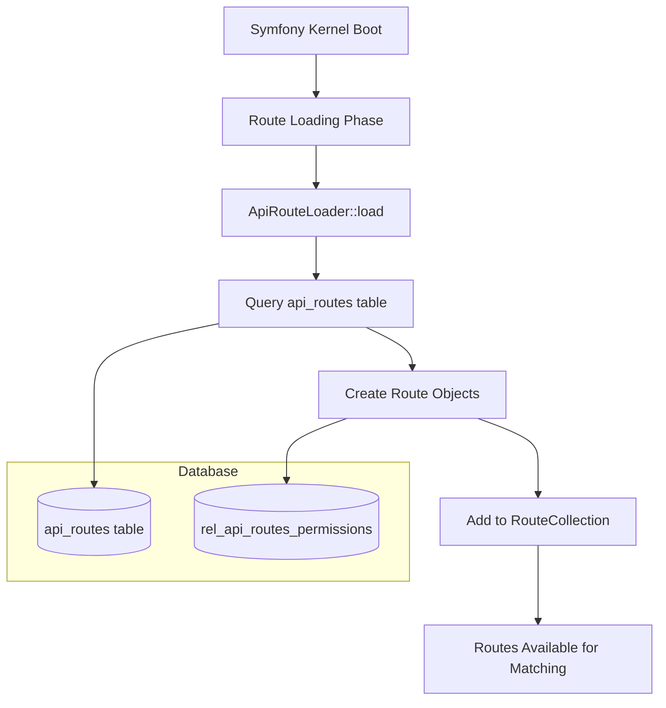

# Dynamic Routing System

## 🔄 Overview

The SelfHelp Symfony Backend uses a revolutionary database-driven routing system that loads all API routes dynamically from the database instead of traditional YAML or PHP route definitions. This provides unprecedented flexibility for runtime route management.

## 🏗️ Architecture Components

### Core Components
1. **`ApiRouteLoader`** (`src/Routing/ApiRouteLoader.php`) — custom Symfony route loader that builds the `RouteCollection` from the database.
2. **`ApiRouteRepository`** (`src/Repository/ApiRouteRepository.php`) — database access for route definitions (one optimized query that also joins each route's permissions).
3. **`api_routes` + `rel_api_routes_permissions` tables** — database storage for route definitions and their permission links.
4. **`ApiSecurityListener`** (`src/EventListener/ApiSecurityListener.php`) — enforces each route's required permissions on the `kernel.controller` event.

> There is **no** custom "dynamic controller" dispatcher. Once
> `ApiRouteLoader` has put the resolved `class::method` into the route's
> `_controller` default, Symfony's standard HttpKernel + controller resolver
> instantiate the controller (an autowired service) and call the method like
> any other Symfony route.

## 📊 Database-Driven Route Loading



## 🗃️ Database Schema

### `api_routes` Table Structure
```sql
CREATE TABLE `api_routes` (
  `id`           INT             NOT NULL AUTO_INCREMENT,
  `route_name`   VARCHAR(100)    NOT NULL,
  `version`      VARCHAR(10)     NOT NULL DEFAULT 'v1',
  `path`         VARCHAR(255)    NOT NULL,
  `controller`   VARCHAR(255)    NOT NULL,
  `methods`      VARCHAR(50)     NOT NULL,
  `requirements` JSON            NULL,
  `params`       JSON            NULL,
  `id_plugins`   INT             NULL,  -- NULL = core route; set = plugin-owned
  PRIMARY KEY (`id`),
  UNIQUE KEY `uq_api_routes_route_name_version` (`route_name`, `version`),
  UNIQUE KEY `uq_api_routes_version_path_methods` (`version`, `path`, `methods`),
  KEY `idx_api_routes_id_plugins` (`id_plugins`),
  CONSTRAINT `fk_api_routes_id_plugins` FOREIGN KEY (`id_plugins`)
    REFERENCES `plugins` (`id`) ON DELETE SET NULL
) ENGINE=InnoDB DEFAULT CHARSET=utf8mb4 COLLATE=utf8mb4_unicode_ci;
```

> The canonical definition is the Doctrine entity `App\Entity\ApiRoute`
> (mapped to `api_routes`); the SQL above is illustrative. `id_plugins`
> links a route to its owning plugin (`App\Entity\Plugin\Plugin`); core
> routes leave it `NULL`. `ApiRouteLoader` filters out routes whose owning
> plugin is disabled, so disabling a plugin instantly takes its API offline
> without deleting the route metadata.

### Field Descriptions
- **`route_name`**: Unique identifier for the route (e.g., `admin_get_pages`)
- **`version`**: API version (e.g., `v1`, `v2`)
- **`path`**: URL path pattern (e.g., `/admin/pages`)
- **`controller`**: Controller class and method (e.g., `App\\Controller\\AdminPageController::getPages`)
- **`methods`**: HTTP methods (e.g., `GET`, `POST`, `GET,POST`)
- **`requirements`**: JSON object with route parameter requirements
- **`params`**: JSON object describing expected parameters

### Example Route Record
```sql
INSERT INTO `api_routes` (`route_name`, `version`, `path`, `controller`, `methods`, `params`) VALUES
('admin_get_pages', 'v1', '/admin/pages', 'App\\Controller\\AdminPageController::getPages', 'GET', 
'{"locale": {"in": "query", "required": false, "description": "Language locale"}}');
```

## 🔧 ApiRouteLoader Implementation

### Route Loading Process

`load()` is called once during route loading. Outside `dev` it caches the
whole `RouteCollection` under the `api_routes` cache category; in `dev` it
rebuilds every time for instant feedback. `buildRouteCollection()` fetches
**all** routes and their permissions in a single query, then registers them:

```php
<?php
// ApiRouteLoader::load() (abridged — see src/Routing/ApiRouteLoader.php)
public function load(mixed $resource, ?string $type = null): RouteCollection
{
    $useCache = $this->env !== 'dev';

    return $useCache
        ? $this->cache
            ->withCategory(CacheService::CATEGORY_API_ROUTES)
            ->getList('api_routes_collection', fn() => $this->buildRouteCollection())
        : $this->buildRouteCollection();
}

private function buildRouteCollection(): RouteCollection
{
    $routes = new RouteCollection();

    // One optimized query returns every route row + its permission names.
    $allRoutesData = $this->apiRouteRepository->findAllRoutesWithPermissionsAsArray();

    // Register STATIC paths (no `{placeholder}`) before DYNAMIC ones: the
    // UrlMatcher takes the first match in collection order, so a static
    // `/admin/plugins/available` must win over `/admin/plugins/{pluginId}`.
    usort($allRoutesData, /* version, then static-before-dynamic, then id */ ...);

    foreach ($allRoutesData as $row) {
        $version    = (string) $row['version'];
        $path       = '/' . $version . (string) $row['path'];
        $controller = $this->mapControllerToVersionedNamespace((string) $row['controller'], $version);

        $route = new Route(
            $path,
            [
                '_controller' => $controller,
                '_version'    => $version,
                '_params'     => $row['params'] ?? [],
            ],
            $row['requirements'] ?? [],                 // requirements
            ['permissions' => $row['permission_names'] ?? []], // options
            '', [],                                     // host, schemes
            explode(',', (string) $row['methods'])      // methods
        );

        $routes->add($row['route_name'] . '_' . $version, $route);
    }

    return $routes;
}
```

### Controller Namespace Mapping
The system automatically maps database controller references to versioned namespaces:

```php
// Database: App\Controller\AdminPageController::getPages
// Maps to: App\Controller\Api\V1\Admin\AdminPageController::getPages

// The mapping logic:
// 1. Skip if already using versioned namespace
// 2. Parse controller string (e.g., "App\Controller\AuthController::login")
// 3. Extract controller name and determine domain
// 4. Map to versioned namespace: App\Controller\Api\{Version}\{Domain}\{Domain}Controller
```

## 🎯 Controller Dispatch & Security

There is no custom dispatcher. The DB route stores a `_controller` value
(`Class::method`); Symfony's standard kernel resolves and invokes it. The
only SelfHelp-specific step is **`ApiSecurityListener`**, which runs on the
`kernel.controller` event (priority 10), *after* `JWTTokenAuthenticator` has
decoded the bearer token onto the request attributes:

```php
<?php
// ApiSecurityListener::onKernelController() (abridged)
public function onKernelController(ControllerEvent $event): void
{
    $request = $event->getRequest();
    if (!str_starts_with($request->getPathInfo(), '/cms-api/')) {
        return;                       // only guards DB-backed API routes
    }
    if ($request->getMethod() === 'OPTIONS') {
        return;                       // CORS preflight
    }

    // (1) Impersonation: block high-risk routes + audit every mutation
    //     performed under an impersonation JWT.
    $this->handleImpersonation($request);

    // (2) Permission check by route name (cached lookups).
    $routeName = $request->attributes->get('_route');
    $required  = $this->permissionService->getRoutePermissions($routeName);
    if ($required === []) {
        return;                       // public route, nothing to enforce
    }

    $user = $this->userContextService->getCurrentUser()
        ?? throw new AccessDeniedException('User not authenticated.');

    $userPerms = $this->permissionService->getUserPermissions($user);
    if (!array_intersect($required, $userPerms)) {
        throw new AccessDeniedException('You do not have permission to access this API endpoint.');
    }
}
```

Notes:

- Route-level access uses **permissions** (`rel_api_routes_permissions`),
  not page ACL. Page/content ACL is a separate concern handled in the CMS
  layer (`ACLService`, `PageService`) — see
  [Authentication & Authorization](./03-authentication-authorization.md) and
  [ACL System](./13-acl-system.md).
- Any `AccessDeniedException` (and any other API error) is turned into the
  standard JSON envelope by `ApiExceptionListener`.

## 🔐 Permission Integration

### Route-Permission Association
Routes can be associated with permissions through the `rel_api_routes_permissions` table:

```sql
CREATE TABLE `rel_api_routes_permissions` (
  `id_api_routes`   INT NOT NULL,
  `id_permissions`  INT NOT NULL,
  PRIMARY KEY (`id_api_routes`, `id_permissions`),
  CONSTRAINT `fk_rel_api_routes_permissions_id_api_routes`  FOREIGN KEY (`id_api_routes`)
    REFERENCES `api_routes` (`id`) ON DELETE CASCADE,
  CONSTRAINT `fk_rel_api_routes_permissions_id_permissions` FOREIGN KEY (`id_permissions`)
    REFERENCES `permissions` (`id`) ON DELETE CASCADE
) ENGINE=InnoDB DEFAULT CHARSET=utf8mb4 COLLATE=utf8mb4_unicode_ci;
```

### Permission Loading in Routes
At **load** time, `findAllRoutesWithPermissionsAsArray()` returns each
route's permission names alongside the row, and the loader stores them in the
route options (`['permissions' => [...]]`). At **request** time the
enforcement does not read that option directly: `ApiSecurityListener` looks
the required permissions up by route name through
`UserPermissionService::getRoutePermissions($routeName)`, which is cached
(see [Global Cache System](./17-global-cache-system.md)).

## 📋 Route Management Workflow

This section describes the workflow for **core host routes**.

Plugin routes are intentionally handled differently:

- plugin packages declare routes in `plugin.json#apiRoutes`;
- the host persists those rows into `api_routes` through
  `PluginApiRouteSynchronizer` during install / update;
- plugin migrations still own plugin-created permission rows, but they
  do **not** insert `api_routes` rows directly.

The reason for the split is lifecycle:

- core routes are baseline host application data, so host Doctrine
  migrations are the natural source of truth;
- plugin routes belong to separately installed packages, so the host
  must reconcile them on update and remove or hide them cleanly on
  uninstall / disable.

### Adding New Routes
1. **Insert into Database**:
```sql
INSERT INTO `api_routes` (`route_name`, `version`, `path`, `controller`, `methods`, `params`) 
VALUES ('admin_create_user', 'v1', '/admin/users', 'App\\Controller\\AdminUserController::createUser', 'POST', 
'{"user": {"in": "body", "required": true, "description": "User data"}}');
```

2. **Add to Update Script**:
For core routes, add a Doctrine migration that inserts the route into
`api_routes` and links it in `rel_api_routes_permissions`.

Do **not** use this workflow for plugin package routes; those are
declared in the plugin manifest and synchronized by the host.

3. **Create Controller**:
```php
<?php
namespace App\Controller\Api\V1\Admin;

class AdminUserController extends AbstractController
{
    public function createUser(Request $request): JsonResponse
    {
        // Implementation
    }
}
```

4. **Associate Permissions** (if needed):
```sql
INSERT INTO `rel_api_routes_permissions` (`id_api_routes`, `id_permissions`)
SELECT ar.id, p.id 
FROM `api_routes` ar, `permissions` p
WHERE ar.route_name = 'admin_create_user' 
  AND p.name = 'admin.user.create';
```

### Route Caching
Caching happens at two levels, both through the Redis-backed `CacheService`:

- **Route collection** — outside `dev`, `ApiRouteLoader::load()` caches the
  entire built `RouteCollection` under the `api_routes` cache category
  (`CacheService::CATEGORY_API_ROUTES`). In `dev` it rebuilds on every load
  so route changes appear immediately. Invalidate it explicitly with
  `php bin/console cache:clear-api-routes` after editing route rows.
- **Route → permissions** — at request time `UserPermissionService`
  caches the permission lookups used by `ApiSecurityListener`, so the
  per-request permission check does not hit the database on every call.

## 🔄 Request Processing Flow

```mermaid
sequenceDiagram
    participant Client
    participant Kernel as Symfony HttpKernel
    participant Loader as ApiRouteLoader
    participant DB as Database
    participant Auth as JWTTokenAuthenticator
    participant Sec as ApiSecurityListener
    participant Controller

    Note over Client,Controller: Route loading (once; cached outside dev)
    Kernel->>Loader: Load routes (type api_database)
    Loader->>DB: findAllRoutesWithPermissionsAsArray()
    DB-->>Loader: Rows + permission names
    Loader-->>Kernel: RouteCollection (_controller per route)

    Note over Client,Controller: Request processing
    Client->>Kernel: HTTP request (/cms-api/...)
    Kernel->>Kernel: Match route -> _controller
    Kernel->>Auth: Decode bearer JWT -> request attrs
    Kernel->>Sec: kernel.controller (permission + impersonation guard)
    Sec-->>Kernel: allow (or throw AccessDeniedException)
    Kernel->>Controller: Invoke resolved Class::method
    Controller-->>Client: ApiResponseFormatter JSON envelope
```

## ⚡ Performance Optimizations

### Route Loading Optimization
- Routes loaded once during application bootstrap
- Symfony's route matching cache used for performance
- Route information cached during request processing

### Database Query Optimization
- Single query to load all routes per version
- Proper indexes on `route_name`, `version`, and `path`
- Connection pooling for database efficiency

### Memory Management
- Route cache cleared between requests in development
- Production route cache persisted across requests
- Minimal memory footprint for route storage

## 🚨 Error Handling

Because dispatch is plain Symfony, errors surface through the framework and
are normalised into the standard JSON envelope by **`ApiExceptionListener`**
(`src/EventListener/ApiExceptionListener.php`):

- **No route matches** the request path/method → Symfony throws
  `NotFoundHttpException` / `MethodNotAllowedHttpException`, which the
  exception listener renders as a `404` / `405` envelope.
- **Permission denied** → `ApiSecurityListener` throws `AccessDeniedException`
  → rendered as a `403` envelope.
- **Controller cannot be resolved** — only possible if a stored
  `controller` string points at a class/method that does not exist. Core
  rows are kept correct by migrations; plugin rows are validated by
  `PluginApiRouteSynchronizer` at install/update time, and disabled-plugin
  rows are filtered out at load. `ApiRouteLoader::mapControllerToVersionedNamespace()`
  dispatches already-autoloadable classes (plugin or versioned controllers)
  as-is and only rewrites legacy flat `App\Controller\XController::m` strings
  to the versioned namespace.

## 🔧 Configuration

### Route Loader Registration
```yaml
# config/services.yaml
services:
    App\Routing\ApiRouteLoader:
        arguments:
            $env: '%kernel.environment%'
        tags:
            - { name: routing.loader }
```

### Route Loading Configuration
```yaml
# config/routes/dynamic_api.yaml
api_dynamic:
    resource: .
    type: api_database      # matches ApiRouteLoader::supports()
    prefix: /cms-api        # every DB route is served under /cms-api
```

## 🧪 Testing Dynamic Routes

### Unit Testing Route Loader
```php
public function testRouteLoading(): void
{
    $routes = $this->apiRouteLoader->load('.', 'api_database');
    $this->assertInstanceOf(RouteCollection::class, $routes);
    $this->assertGreaterThan(0, $routes->count());
}
```

### Integration Testing Routes
```php
public function testDynamicRouteExecution(): void
{
    $this->client->request('GET', '/cms-api/v1/admin/pages');
    $this->assertResponseIsSuccessful();
    $this->assertJson($this->client->getResponse()->getContent());
}
```

## 🔮 Future Enhancements

### Planned Features
- **Route Versioning**: Support for route deprecation and migration
- **Route Analytics**: Track route usage and performance
- **Dynamic Middleware**: Database-configurable middleware per route
- **Route Templates**: Reusable route patterns
- **Hot Reloading**: Runtime route updates without restart

---

**Next**: [Authentication & Authorization](./03-authentication-authorization.md)
