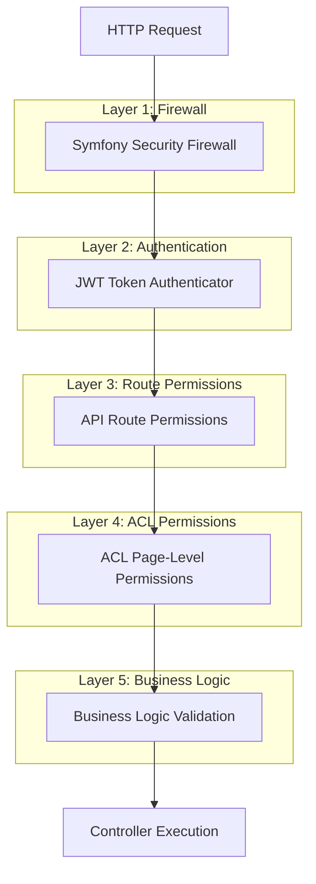
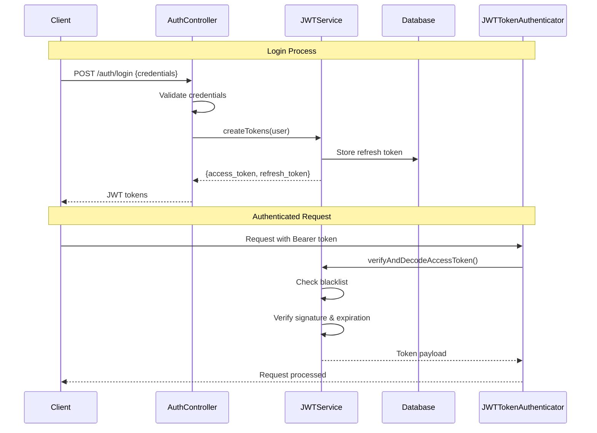
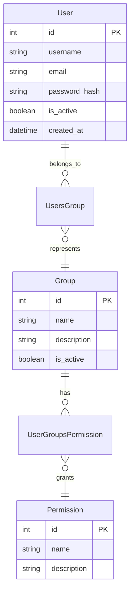

# Authentication & Authorization

## 🔐 Security Architecture Overview

The SelfHelp Symfony Backend implements a comprehensive multi-layer security system combining JWT authentication with database-driven authorization and fine-grained Access Control Lists (ACL).

## 🏗️ Security Layers



## 🎟️ JWT Authentication System

### Authentication Components
- **`JWTService`**: Token lifecycle management
- **`JWTTokenAuthenticator`**: Symfony authenticator implementation
- **`UserContextService`**: Current user context management
- **`RefreshToken` entity**: Refresh token persistence

### JWT Token Structure
```json
{
  "header": {
    "typ": "JWT",
    "alg": "RS256"
  },
  "payload": {
    "iat": 1642680000,
    "exp": 1642683600,
    "id_users": 1
  },
  "signature": "..."
}
```

**Security Note**: JWT tokens contain only the minimal required user identifier (`id_users`) for security best practices. User roles, permissions, and other context are fetched from the database on each request rather than being embedded in the token.

### Authentication Flow


### JWTService Implementation
```php
<?php
namespace App\Service\Auth;

class JWTService
{
    public function createToken(User $user): string
    {
        // Create payload with minimal claims - no roles/permissions for security
        $payload = [
            'id_users' => $user->getId()
        ];

        // Note: Token TTL is configured in lexik_jwt_authentication.yaml
        // using the JWT_TOKEN_TTL environment variable

        // Create token with minimal payload
        $user->setUserName($user->getEmail());
        return $this->jwtManager->createFromPayload($user, $payload);
    }

    public function createRefreshToken(User $user): RefreshToken
    {
        $refreshToken = new RefreshToken();
        $refreshToken->setUser($user);
        $refreshToken->setTokenHash(bin2hex(random_bytes(32)));

        // Get refresh token TTL from environment (in seconds) and convert to DateInterval
        $refreshTokenTtl = $this->params->get('jwt_refresh_token_ttl');
        $expiresAt = new \DateTime();
        $expiresAt->modify('+' . $refreshTokenTtl . ' seconds');

        $refreshToken->setExpiresAt($expiresAt);

        $this->entityManager->persist($refreshToken);
        $this->entityManager->flush();

        return $refreshToken;
    }

    public function verifyAndDecodeAccessToken(string $token, bool $checkBlacklist = true): array
    {
        // Check blacklist first
        if ($checkBlacklist) {
            $cacheKey = self::BLACKLIST_PREFIX . md5($token);
            $cachedValue = $this->cache->get($cacheKey, function(ItemInterface $item) use ($cacheKey) {
                return false; // Default value if not found (meaning not blacklisted)
            });

            if ($cachedValue === true) {
                throw new AuthenticationException('Token has been blacklisted.');
            }
        }

        try {
            $payload = $this->jwtEncoder->decode($token);
            if (!$payload) {
                throw new AuthenticationException('Invalid token payload.');
            }
            return $payload;
        } catch (JWTDecodeFailureException $e) {
            throw new AuthenticationException('Invalid token: ' . $e->getReason(), 0, $e);
        } catch (\Exception $e) {
            throw new AuthenticationException('Token validation failed: ' . $e->getMessage(), 0, $e);
        }
    }

    public function blacklistAccessToken(string $accessToken): void
    {
        try {
            $payload = $this->jwtEncoder->decode($accessToken);
            $tokenTtl = $this->params->get('jwt_token_ttl');
            $expiresAt = $payload['exp'] ?? (time() + $tokenTtl);
            $remainingLifetime = $expiresAt - time();

            if ($remainingLifetime > 0) {
                $cacheKey = self::BLACKLIST_PREFIX . md5($accessToken);
                $this->cache->delete($cacheKey);
                $this->cache->get($cacheKey, function (ItemInterface $item) use ($remainingLifetime) {
                    $item->expiresAfter($remainingLifetime);
                    return true; // Store true to mark as blacklisted
                });
            }
        } catch (\Exception $e) {
            // Not adding to blacklist if it's already invalid might be acceptable.
        }
    }
}
```

## 🔑 JWT Key Generation & Configuration

### RSA Key Pair Setup

The JWT system uses RSA key pairs for token signing and verification. You must generate these keys before the authentication system will work.

### Generate Production Keys (with passphrase)

```bash
# Create JWT directory
mkdir -p config/jwt

# Generate private key with AES256 encryption (4096-bit RSA)
openssl genrsa -out config/jwt/private.pem -aes256 4096

# Generate corresponding public key
openssl rsa -pubout -in config/jwt/private.pem -out config/jwt/public.pem
```

### Generate Test Keys (no passphrase for easier development)

```bash
# Create test JWT directory
mkdir -p config/jwt/test

# Generate private key without passphrase (4096-bit RSA)
openssl genrsa -out config/jwt/test/private.pem 4096

# Generate corresponding public key
openssl rsa -pubout -in config/jwt/test/private.pem -out config/jwt/test/public.pem
```

### Environment Configuration

Update your `.env` file with the correct key paths:

```env
# Production keys (with passphrase)
JWT_SECRET_KEY=%kernel.project_dir%/config/jwt/private.pem
JWT_PUBLIC_KEY=%kernel.project_dir%/config/jwt/public.pem
JWT_PASSPHRASE=your-passphrase-here

# Test keys (no passphrase - easier for development)
# JWT_SECRET_KEY=%kernel.project_dir%/config/jwt/test/private.pem
# JWT_PUBLIC_KEY=%kernel.project_dir%/config/jwt/test/public.pem
# JWT_PASSPHRASE=
```

### Security Best Practices

1. **Never commit private keys** to version control
2. **Use strong passphrases** for production private keys
3. **Regularly rotate keys** for security
4. **Use different keys** for different environments
5. **Store keys securely** with proper file permissions (`chmod 600`)

### LexikJWTBundle Configuration

The keys are configured in `config/packages/lexik_jwt_authentication.yaml`:

```yaml
lexik_jwt_authentication:
    secret_key: '%env(resolve:JWT_SECRET_KEY)%'
    public_key: '%env(resolve:JWT_PUBLIC_KEY)%'
    pass_phrase: '%env(JWT_PASSPHRASE)%'
    token_ttl: '%env(int:JWT_TOKEN_TTL)%'
```

### Troubleshooting

**Common Issues:**
- **"Unable to load private key"**: Check file paths and permissions
- **"Bad passphrase"**: Verify JWT_PASSPHRASE in .env file
- **"Invalid signature"**: Ensure public/private key pair match
- **"Key file not found"**: Check config/jwt directory structure

### Token Refresh Process
```php
public function processRefreshToken(string $refreshTokenString): array
{
    $tokenEntity = $this->entityManager->getRepository(RefreshToken::class)
        ->findOneBy(['tokenHash' => $refreshTokenString]);

    if (!$tokenEntity || $tokenEntity->getExpiresAt() < new \DateTime()) {
        throw new AuthenticationException('Invalid or expired refresh token.');
    }

    $user = $tokenEntity->getUser();
    
    // Generate new tokens
    $newAccessToken = $this->createToken($user);
    $this->entityManager->remove($tokenEntity); // Invalidate old refresh token
    $newRefreshToken = $this->createRefreshToken($user);

    return [
        'access_token' => $newAccessToken,
        'refresh_token' => $newRefreshToken->getTokenHash(),
    ];
}
```

## 👥 User & Group System

### Entity Relationships


### User Permission Resolution
```php
<?php
// User entity method
public function getPermissionNames(): array
{
    $permissions = [];
    
    foreach ($this->getUsersGroups() as $userGroup) {
        $group = $userGroup->getGroup();
        foreach ($group->getUserGroupsPermissions() as $groupPermission) {
            $permissions[] = $groupPermission->getPermission()->getName();
        }
    }
    
    return array_unique($permissions);
}
```

## 🛡️ Route-Level Permissions

### Database-Driven Route Permissions
Routes are associated with permissions through the `api_routes_permissions` table:

```sql
CREATE TABLE `api_routes_permissions` (
  `id_api_routes`   INT NOT NULL,
  `id_permissions`  INT NOT NULL,
  PRIMARY KEY (`id_api_routes`, `id_permissions`),
  FOREIGN KEY (`id_api_routes`) REFERENCES `api_routes` (`id`) ON DELETE CASCADE,
  FOREIGN KEY (`id_permissions`) REFERENCES `permissions` (`id`) ON DELETE CASCADE
);
```

### Permission Loading in Routes
```php
// ApiRouteLoader loads permissions into route options
foreach ($dbRoutes as $dbRoute) {
    $route = new Route($path, $defaults, $requirements);
    
    // Load associated permissions
    $permissions = $this->getRoutePermissions($dbRoute->getId());
    $route->setOption('permissions', $permissions);
    
    $routes->add($routeName, $route);
}
```

### ApiSecurityListener
```php
<?php
namespace App\EventListener;

class ApiSecurityListener
{
    public function onKernelController(ControllerEvent $event): void
    {
        $request = $event->getRequest();
        $routeName = $request->attributes->get('_route');
        
        // Get route permissions
        $route = $this->router->getRouteCollection()->get($routeName);
        $requiredPermissions = $route->getOption('permissions') ?? [];
        
        if (empty($requiredPermissions)) {
            return; // No permissions required
        }
        
        // Check user permissions
        $user = $this->userContextService->getCurrentUser();
        $userPermissions = $user->getPermissionNames();
        
        // Verify user has at least one required permission
        $hasPermission = !empty(array_intersect($requiredPermissions, $userPermissions));
        
        if (!$hasPermission) {
            throw new AccessDeniedException('Insufficient permissions');
        }
    }
}
```

## 🔒 Access Control Lists (ACL)

### Fine-Grained Page Access Control
The ACL system provides page-level access control with CRUD operations:

```sql
CREATE TABLE `acl_users` (
  `id_users`    INT NOT NULL,
  `id_pages`    INT NOT NULL,
  `acl_select`  TINYINT(1) NOT NULL DEFAULT '1',
  `acl_insert`  TINYINT(1) NOT NULL DEFAULT '0',
  `acl_update`  TINYINT(1) NOT NULL DEFAULT '0',
  `acl_delete`  TINYINT(1) NOT NULL DEFAULT '0',
  PRIMARY KEY (`id_users`, `id_pages`)
);

CREATE TABLE `acl_groups` (
  `id_groups`   INT NOT NULL,
  `id_pages`    INT NOT NULL,
  `acl_select`  TINYINT(1) NOT NULL DEFAULT '1',
  `acl_insert`  TINYINT(1) NOT NULL DEFAULT '0',
  `acl_update`  TINYINT(1) NOT NULL DEFAULT '0',
  `acl_delete`  TINYINT(1) NOT NULL DEFAULT '0',
  PRIMARY KEY (`id_groups`, `id_pages`)
);
```

### ACL Repository Implementation
The ACL system uses a repository-based approach with cached database queries for performance:

```php
<?php
class AclRepository
{
    public function getUserAcl(int $userId, int $pageId = null): array
    {
        // Build complex query to get user ACL permissions
        // Includes both user-specific and group-based permissions
        // Returns array of pages with their ACL permissions
    }
}
```

The ACL logic combines user-specific permissions with group permissions, where user permissions take precedence over group permissions.

### ACLService Implementation
```php
<?php
namespace App\Service\ACL;

class ACLService
{
    public function hasAccess(int|string|null $userId, int $pageId, string $accessType = 'select'): bool
    {
        $cacheKey = "user_acl_{$pageId}";
        return $this->cache
            ->withCategory(CacheService::CATEGORY_PERMISSIONS)
            ->withEntityScope(CacheService::ENTITY_SCOPE_USER, $userId)
            ->getItem($cacheKey, function () use ($userId, $pageId, $accessType) {
                // Handle null or non-integer userId
                if ($userId === null) {
                    $userId = 1; // Guest user ID
                } elseif (!is_int($userId)) {
                    $userId = (int) $userId;
                }

                // Map accessType to column
                $modeMap = [
                    'select' => 'acl_select',
                    'insert' => 'acl_insert',
                    'update' => 'acl_update',
                    'delete' => 'acl_delete',
                ];
                $aclColumn = $modeMap[$accessType];

                // Get ACL for specific page using repository (cached)
                $results = $this->cache
                    ->withCategory(CacheService::CATEGORY_PERMISSIONS)
                    ->getItem("user_acl_{$userId}_{$pageId}", fn() => $this->aclRepository->getUserAcl($userId, $pageId));

                // If no results or empty array, deny access
                if (empty($results)) {
                    return false;
                }

                $result = $results[0] ?? null;

                // If no result or ACL column doesn't exist, deny access
                if (!$result || !array_key_exists($aclColumn, $result)) {
                    return false;
                }

                // Grant if column is 1
                return (int) $result[$aclColumn] === 1;
            });
    }

    public function getAllUserAcls(int|string|null $userId): array
    {
        // Handle null or non-integer userId
        if ($userId === null) {
            $userId = 1; // Guest user ID
        } elseif (!is_int($userId)) {
            $userId = (int) $userId;
        }

        // Use the repository to get all ACLs (cached)
        return $this->cache
            ->withCategory(CacheService::CATEGORY_PERMISSIONS)
            ->getList("user_acl_{$userId}", fn() => $this->aclRepository->getUserAcl($userId));
    }
}
```

### ACL Integration in Controllers
```php
<?php
public function updatePage(Request $request, string $pageKeyword): JsonResponse
{
    // Get page
    $page = $this->pageRepository->findOneBy(['keyword' => $pageKeyword]);
    
    // Check ACL permissions
    $userId = $this->userContextService->getCurrentUser()->getId();
    if (!$this->aclService->hasAccess($userId, $page->getId(), 'update')) {
        return $this->responseFormatter->formatError('Access denied', 403);
    }
    
    // Proceed with update
    return $this->adminPageService->updatePage($page, $requestData);
}
```

## 🔧 Permission Management

### Adding New Permissions
1. **Create Permission**:
```sql
INSERT INTO `permissions` (`name`, `description`) 
VALUES ('admin.asset.upload', 'Can upload new assets');
```

2. **Assign to Groups**:
```sql
INSERT INTO `user_groups_permissions` (`id_user_groups`, `id_permissions`)
SELECT ug.id, p.id 
FROM `user_groups` ug, `permissions` p
WHERE ug.name = 'admin' AND p.name = 'admin.asset.upload';
```

3. **Associate with Routes**:
```sql
INSERT INTO `api_routes_permissions` (`id_api_routes`, `id_permissions`)
SELECT ar.id, p.id 
FROM `api_routes` ar, `permissions` p
WHERE ar.route_name = 'admin_upload_asset' AND p.name = 'admin.asset.upload';
```

### Permission Naming Convention
- **Format**: `{area}.{resource}.{action}`
- **Examples**:
  - `admin.page.create` - Create pages in admin
  - `admin.user.delete` - Delete users in admin
  - `frontend.page.view` - View pages on frontend

## 🚨 Security Best Practices

### Token Security
- **Short-lived access tokens** (1 hour default)
- **Long-lived refresh tokens** (2 weeks default)
- **Token blacklisting** on logout
- **Secure token storage** in HTTP-only cookies (recommended)

### Password Security
- **BCrypt hashing** with appropriate cost factor
- **Password complexity** requirements
- **Account lockout** after failed attempts
- **Password reset** with secure tokens

### ACL Security
- **Principle of least privilege** - Default deny
- **User-specific overrides** take precedence over group permissions
- **Audit logging** for all permission changes
- **Regular permission reviews**

### API Security
- **HTTPS only** in production
- **CORS configuration** for browser requests
- **Rate limiting** to prevent abuse
- **Input validation** on all endpoints

## 🧪 Testing Security

### Authentication Testing
```php
public function testLoginWithValidCredentials(): void
{
    $response = $this->client->request('POST', '/cms-api/v1/auth/login', [
        'json' => [
            'username' => 'admin',
            'password' => 'password123'
        ]
    ]);
    
    $this->assertResponseIsSuccessful();
    $data = json_decode($response->getContent(), true);
    $this->assertArrayHasKey('access_token', $data['data']);
    $this->assertArrayHasKey('refresh_token', $data['data']);
}
```

### Permission Testing
```php
public function testAdminRouteRequiresPermission(): void
{
    // Test without permission
    $this->client->request('GET', '/cms-api/v1/admin/pages');
    $this->assertResponseStatusCodeSame(403);
    
    // Test with permission
    $this->loginAsAdmin();
    $this->client->request('GET', '/cms-api/v1/admin/pages');
    $this->assertResponseIsSuccessful();
}
```

### ACL Testing
```php
public function testPageAccessControl(): void
{
    $user = $this->createUser();
    $page = $this->createPage();
    
    // Test default deny
    $this->assertFalse($this->aclService->hasAccess($user->getId(), $page->getId(), 'update'));
    
    // Grant permission
    $this->grantPageAccess($user, $page, 'update');
    $this->assertTrue($this->aclService->hasAccess($user->getId(), $page->getId(), 'update'));
}
```

---

**Next**: [Database Design](./04-database-design.md)