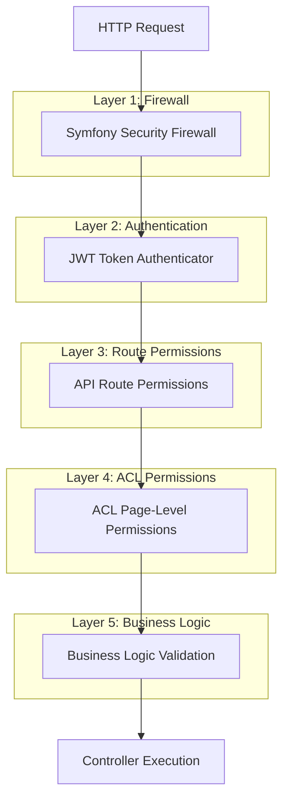
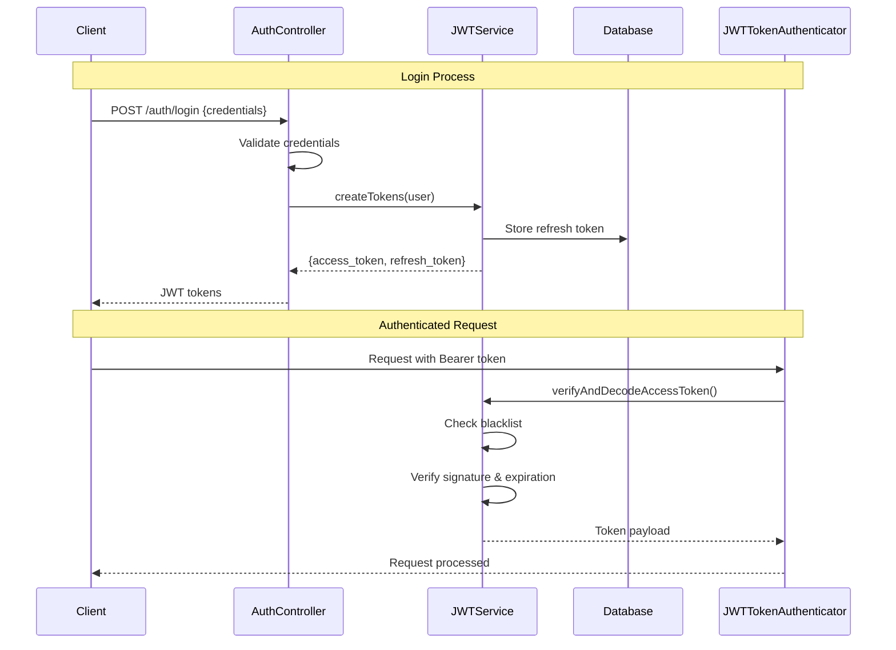
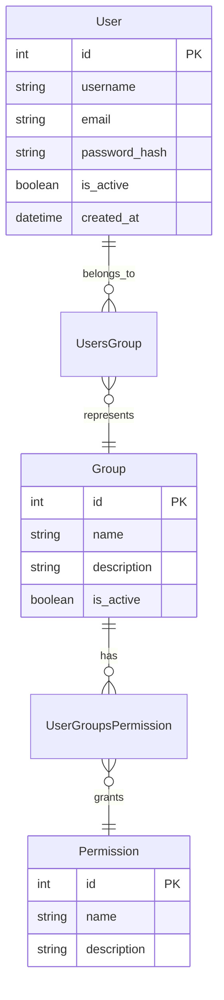
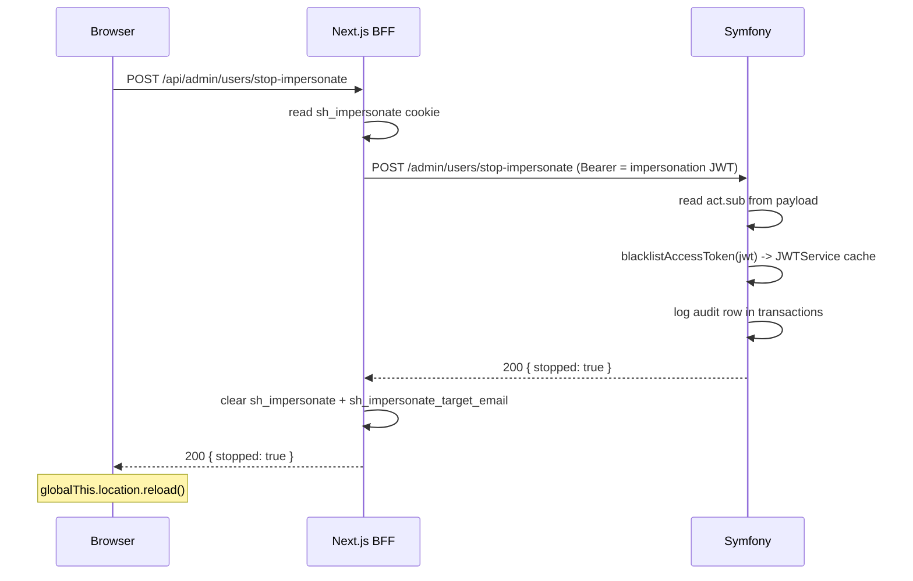

# Authentication & Authorization

Audience: Developers and technical operators.
Status: active.
Applies to: SelfHelp2 Symfony backend.
Last verified: 2026-06-03.
Source of truth: Runtime code, configuration, migrations, and tests in this repository.

## Security Architecture Overview

The SelfHelp Symfony Backend implements a comprehensive multi-layer security system combining JWT authentication with database-driven authorization and fine-grained Access Control Lists (ACL).

## Security Layers


```mermaid
graph TD
    A[HTTP Request] --> B[Symfony Security Firewall]
    B --> C[JWT Token Authenticator]
    C --> D[API Route Permissions]
    D --> E[ACL Page-Level Permissions]
    E --> F[Business Logic Validation]
    F --> G[Controller Execution]
    
    subgraph "Layer 1: Firewall"
        B
    end
    
    subgraph "Layer 2: Authentication"
        C
    end
    
    subgraph "Layer 3: Route Permissions"
        D
    end
    
    subgraph "Layer 4: ACL Permissions"
        E
    end
    
    subgraph "Layer 5: Business Logic"
        F
    end
```

## JWT Authentication System

### Authentication Components
- **`JWTService`**: Token lifecycle management
- **`JWTTokenAuthenticator`**: Symfony authenticator implementation
- **`UserContextService`**: Current user context management
- **`RefreshToken` entity**: Refresh token persistence

### JWT Token Structure
```json
{
  "header": {
    "typ": "JWT",
    "alg": "RS256"
  },
  "payload": {
    "iat": 1642680000,
    "exp": 1642683600,
    "id_users": 1
  },
  "signature": "..."
}
```

**Security Note**: JWT tokens contain only the minimal required user identifier (`id_users`) for security best practices. User roles, permissions, and other context are fetched from the database on each request rather than being embedded in the token.

### User Data Endpoint

Since JWT tokens contain minimal information for security, user context (roles, permissions, language, timezone) is provided through a dedicated API endpoint:

```http
GET /cms-api/v1/auth/user-data
Authorization: Bearer {access_token}
```

**Response Format**:
```json
{
  "status": 200,
  "message": "OK",
  "error": null,
  "logged_in": true,
  "meta": {
    "version": "v1",
    "timestamp": "2025-11-26T09:37:22+01:00"
  },
  "data": {
    "id": 9,
    "email": "user@example.com",
    "name": "John Doe",
    "user_name": "user@example.com",
    "blocked": false,
    "language": {
      "id": 2,
      "locale": "de-CH",
      "name": "Deutsch (Schweiz)"
    },
    "timezone": {
      "id": 123,
      "code": "Europe/Zurich",
      "name": "Central European Time (CET)",
      "description": "Central European Time - UTC+1/+2"
    },
    "roles": [
      {
        "id": 1,
        "name": "admin",
        "description": "Administrator role with full access"
      }
    ],
    "permissions": [
      "admin.access",
      "admin.user.read",
      "admin.user.create"
    ],
    "groups": [
      {
        "id": 1,
        "name": "admin",
        "description": "full access"
      }
    ]
  }
}
```

**Fields**:
- `id`: User ID
- `email`: User email address
- `name`: Display name (nullable)
- `user_name`: Username (nullable, defaults to email)
- `blocked`: Whether the user account is blocked
- `language`: User's language preference (id, locale, name)
- `timezone`: User's timezone preference (id, code, name, description) - nullable if not set
- `roles`: Array of user roles with id, name, description
- `permissions`: Array of permission strings the user has
- `groups`: Array of user groups with id, name, description

### User Timezone Management

The User entity includes timezone support through a relationship with the `lookups` table (type_code = 'timezones'):

```php
// User entity timezone relationship
#[ORM\ManyToOne(targetEntity: Lookup::class)]
#[ORM\JoinColumn(name: 'id_timezones', referencedColumnName: 'id', nullable: true, onDelete: 'CASCADE')]
private ?Lookup $timezone = null;
```

#### Timezone in Account Creation
Currently, timezone can be set during account creation but is not exposed through the API endpoints. The database schema supports timezone assignment, but the user creation endpoints do not include timezone parameters.

#### Timezone in Profile Management
Users can update their timezone preference through profile endpoints. The ProfileController supports timezone updates alongside name and password changes.

**Available Timezones**: The system includes comprehensive timezone data in the lookups table with over 400 timezone entries, including:
- Major world timezones (UTC offsets, DST support)
- IANA timezone identifiers (America/New_York, Europe/Zurich, etc.)
- Display names and descriptions for user-friendly selection

### Authentication Flow

```mermaid
sequenceDiagram
    participant Client
    participant AuthController
    participant JWTService
    participant Database
    participant JWTTokenAuthenticator
    
    Note over Client,JWTTokenAuthenticator: Login Process
    Client->>AuthController: POST /auth/login {credentials}
    AuthController->>AuthController: Validate credentials
    AuthController->>JWTService: createTokens(user)
    JWTService->>Database: Store refresh token
    JWTService-->>AuthController: {access_token, refresh_token}
    AuthController-->>Client: JWT tokens
    
    Note over Client,JWTTokenAuthenticator: Authenticated Request
    Client->>JWTTokenAuthenticator: Request with Bearer token
    JWTTokenAuthenticator->>JWTService: verifyAndDecodeAccessToken()
    JWTService->>JWTService: Check blacklist
    JWTService->>JWTService: Verify signature & expiration
    JWTService-->>JWTTokenAuthenticator: Token payload
    JWTTokenAuthenticator-->>Client: Request processed
```

### JWTService Implementation
```php
<?php
namespace App\Service\Auth;

class JWTService
{
    public function createToken(User $user): string
    {
        // Create payload with minimal claims - no roles/permissions for security
        $payload = [
            'id_users' => $user->getId()
        ];

        // Note: Token TTL is configured in lexik_jwt_authentication.yaml
        // using the JWT_TOKEN_TTL environment variable

        // Create token with minimal payload
        $user->setUserName($user->getEmail());
        return $this->jwtManager->createFromPayload($user, $payload);
    }

    public function createRefreshToken(User $user): RefreshToken
    {
        $refreshToken = new RefreshToken();
        $refreshToken->setUser($user);
        $refreshToken->setTokenHash(bin2hex(random_bytes(32)));

        // Get refresh token TTL from environment (in seconds) and convert to DateInterval
        $refreshTokenTtl = $this->params->get('jwt_refresh_token_ttl');
        $expiresAt = new \DateTime();
        $expiresAt->modify('+' . $refreshTokenTtl . ' seconds');

        $refreshToken->setExpiresAt($expiresAt);

        $this->entityManager->persist($refreshToken);
        $this->entityManager->flush();

        return $refreshToken;
    }

    public function verifyAndDecodeAccessToken(string $token, bool $checkBlacklist = true): array
    {
        // Check blacklist first
        if ($checkBlacklist) {
            $cacheKey = self::BLACKLIST_PREFIX . md5($token);
            $cachedValue = $this->cache->get($cacheKey, function(ItemInterface $item) use ($cacheKey) {
                return false; // Default value if not found (meaning not blacklisted)
            });

            if ($cachedValue === true) {
                throw new AuthenticationException('Token has been blacklisted.');
            }
        }

        try {
            $payload = $this->jwtEncoder->decode($token);
            if (!$payload) {
                throw new AuthenticationException('Invalid token payload.');
            }
            return $payload;
        } catch (JWTDecodeFailureException $e) {
            throw new AuthenticationException('Invalid token: ' . $e->getReason(), 0, $e);
        } catch (\Exception $e) {
            throw new AuthenticationException('Token validation failed: ' . $e->getMessage(), 0, $e);
        }
    }

    public function blacklistAccessToken(string $accessToken): void
    {
        try {
            $payload = $this->jwtEncoder->decode($accessToken);
            $tokenTtl = $this->params->get('jwt_token_ttl');
            $expiresAt = $payload['exp'] ?? (time() + $tokenTtl);
            $remainingLifetime = $expiresAt - time();

            if ($remainingLifetime > 0) {
                $cacheKey = self::BLACKLIST_PREFIX . md5($accessToken);
                $this->cache->delete($cacheKey);
                $this->cache->get($cacheKey, function (ItemInterface $item) use ($remainingLifetime) {
                    $item->expiresAfter($remainingLifetime);
                    return true; // Store true to mark as blacklisted
                });
            }
        } catch (\Exception $e) {
            // Not adding to blacklist if it's already invalid might be acceptable.
        }
    }
}
```

## JWT Key Generation & Configuration

### RSA Key Pair Setup

The JWT system uses RSA key pairs for token signing and verification. You must generate these keys before the authentication system will work.

### Generate Production Keys (with passphrase)

```bash
# Create JWT directory
mkdir -p config/jwt

# Generate private key with AES256 encryption (4096-bit RSA)
openssl genrsa -out config/jwt/private.pem -aes256 4096

# Generate corresponding public key
openssl rsa -pubout -in config/jwt/private.pem -out config/jwt/public.pem
```

### Generate Test Keys (no passphrase for easier development)

```bash
# Create test JWT directory
mkdir -p config/jwt/test

# Generate private key without passphrase (4096-bit RSA)
openssl genrsa -out config/jwt/test/private.pem 4096

# Generate corresponding public key
openssl rsa -pubout -in config/jwt/test/private.pem -out config/jwt/test/public.pem
```

### Environment Configuration

Update your `.env` file with the correct key paths:

```env
# Production keys (with passphrase)
JWT_SECRET_KEY=%kernel.project_dir%/config/jwt/private.pem
JWT_PUBLIC_KEY=%kernel.project_dir%/config/jwt/public.pem
JWT_PASSPHRASE=your-passphrase-here

# Test keys (no passphrase - easier for development)
# JWT_SECRET_KEY=%kernel.project_dir%/config/jwt/test/private.pem
# JWT_PUBLIC_KEY=%kernel.project_dir%/config/jwt/test/public.pem
# JWT_PASSPHRASE=
```

### Security Best Practices

1. **Never commit private keys** to version control
2. **Use strong passphrases** for production private keys
3. **Regularly rotate keys** for security
4. **Use different keys** for different environments
5. **Store keys securely** with proper file permissions (`chmod 600`)

### LexikJWTBundle Configuration

The keys are configured in `config/packages/lexik_jwt_authentication.yaml`:

```yaml
lexik_jwt_authentication:
    secret_key: '%env(resolve:JWT_SECRET_KEY)%'
    public_key: '%env(resolve:JWT_PUBLIC_KEY)%'
    pass_phrase: '%env(JWT_PASSPHRASE)%'
    token_ttl: '%env(int:JWT_TOKEN_TTL)%'
```

### Token TTL configuration

Both token lifetimes are driven from environment variables (in seconds).
**Access tokens** are signed JWTs and their TTL is enforced client-side by
LexikJWTBundle (the `exp` claim). **Refresh tokens** are opaque strings backed
by the `refresh_tokens` DB table (entity `App\Entity\RefreshToken`); their TTL
is written into the `expires_at` column when the row is created.

| Variable                  | Default               | Meaning                                                            | Wired in                                                                                                                       |
|---------------------------|-----------------------|--------------------------------------------------------------------|--------------------------------------------------------------------------------------------------------------------------------|
| `JWT_TOKEN_TTL`           | `3600` (1 hour)       | Lifetime of a newly minted access JWT.                             | `config/packages/lexik_jwt_authentication.yaml` → `token_ttl` + `config/services.yaml` → `jwt_token_ttl`.                      |
| `JWT_REFRESH_TOKEN_TTL`   | `2592000` (30 days)   | Lifetime of a newly minted refresh token row.                      | `config/services.yaml` → `jwt_refresh_token_ttl`, consumed by `JWTService::createRefreshToken()`.                              |
| `IMPERSONATION_TOKEN_TTL` | `900` (15 minutes)    | Lifetime of an impersonation JWT issued via `/admin/users/{id}/impersonate`. The container has a hard-coded fallback (`900`) so booting without setting the var still works. | `config/services.yaml` → `jwt_impersonation_token_ttl`, consumed by `JWTService::createImpersonationToken()`.                  |

Defaults live in `.env` / `.env.dev`. To override for your local machine
without committing changes, set them in **`.env.local`** (not tracked by git):

```bash
# .env.local (gitignored)
JWT_TOKEN_TTL=60         # 1-minute access token — exposes the refresh flow fast
JWT_REFRESH_TOKEN_TTL=600 # 10-minute refresh token — shortens the logout cycle too
```

Symfony loads env files in the order `.env → .env.local → .env.<env> → .env.<env>.local`,
so `.env.local` wins over `.env` but `.env.dev` wins over `.env.local` for
dev-only settings. If you are on `APP_ENV=dev` and want the override to stick,
use **`.env.dev.local`** instead.

After changing the values you **must clear the Symfony container cache**,
because `lexik_jwt_authentication.token_ttl` is compiled into the container:

```bash
php bin/console cache:clear
```

Existing JWTs keep whatever `exp` they were minted with; only tokens created
**after** the change pick up the new TTL. If you want to guarantee the next
login uses the new TTL, also drop the `refresh_tokens` table rows you no
longer need (otherwise old refresh tokens remain valid for their original
window):

```sql
DELETE FROM refreshTokens;  -- forces every client to log in again
```

#### Testing the access-token expiry / silent-refresh flow

The Next.js frontend refreshes transparently on **two** independent paths so
users never see a login flicker while the refresh token is still valid:

1. **Client-side XHRs** go through the BFF catch-all
   `src/app/api/[...path]/route.ts`. On a 401 from Symfony it calls
   `/cms-api/v1/auth/refresh-token` via `refreshInternal()` and replays the
   buffered original request with the new Bearer.
2. **SSR page navigations** go through `src/proxy.ts` — the Next.js
   middleware. It decodes the `sh_auth` JWT's `exp` claim preemptively
   *before* Server Components run and refreshes when the access token is
   past or within a 10 s safety window. The new tokens are written both
   to the outgoing response (for the browser) *and* back onto
   `req.cookies` (so the RSC read via `server-fetch.ts::authHeaders()`
   picks up the fresh Bearer within the same request).

Without (2), a user navigating to a new slug after the access-token TTL had
elapsed would land on a 404 — the direct Symfony call from the RSC would 401,
`fetchJson()` would return `null`, and `[[...slug]]/page.tsx` would trigger
`notFound()`. (2) makes every navigation feel seamless as long as the
refresh token itself is still valid.

To exercise both paths locally:

1. Set `JWT_TOKEN_TTL=10` in `.env.local` (or `.env.dev.local`), leave
   `JWT_REFRESH_TOKEN_TTL` at its default.
2. `php bin/console cache:clear`.
3. Log in via the frontend (`POST /cms-api/v1/auth/login` via the BFF).
4. **Test path (2) — SSR navigation.** Wait > 10 seconds, then click a
   navigation link. The Next.js proxy detects the expired `sh_auth`,
   calls `/cms-api/v1/auth/refresh-token`, rotates both cookies, and
   renders the page normally. You'll see `[proxy] silent refresh
   succeeded` in the Next.js dev log.
5. **Test path (1) — client XHR.** On the same page, trigger any form
   submit / admin mutation after the 10 s window. The `/api/*` catch-all
   rotates tokens, replays the buffered body, and the action succeeds.
6. **Test the logged-out branch.** Additionally set
   `JWT_REFRESH_TOKEN_TTL=60` and wait out both windows. The refresh
   call returns 401, the proxy (and/or BFF catch-all) clears both
   cookies, and the frontend redirects to `/auth/login` — but *only*
   when the user was on an `/admin/*` path or made a mutation; public
   pages render as anonymous instead of bouncing to login.

Dev-only log lines you'll see in the Next.js terminal:

```
[proxy] silent refresh succeeded { pathname: '/some/slug' }
[proxy] silent refresh failed — clearing session { pathname: '/admin/...' }
```

Never logged in production (gated by `process.env.NODE_ENV !== 'production'`).

### Troubleshooting

**Common Issues:**
- **"Unable to load private key"**: Check file paths and permissions
- **"Bad passphrase"**: Verify JWT_PASSPHRASE in .env file
- **"Invalid signature"**: Ensure public/private key pair match
- **"Key file not found"**: Check config/jwt directory structure

### Token Refresh Process
```php
public function processRefreshToken(string $refreshTokenString): array
{
    $tokenEntity = $this->entityManager->getRepository(RefreshToken::class)
        ->findOneBy(['tokenHash' => $refreshTokenString]);

    if (!$tokenEntity || $tokenEntity->getExpiresAt() < new \DateTime()) {
        throw new AuthenticationException('Invalid or expired refresh token.');
    }

    $user = $tokenEntity->getUser();
    
    // Generate new tokens
    $newAccessToken = $this->createToken($user);
    $this->entityManager->remove($tokenEntity); // Invalidate old refresh token
    $newRefreshToken = $this->createRefreshToken($user);

    return [
        'access_token' => $newAccessToken,
        'refresh_token' => $newRefreshToken->getTokenHash(),
    ];
}
```

## User & Group System

### Entity Relationships

```mermaid
erDiagram
    User ||--o{ UsersGroup : belongs_to
    UsersGroup }o--|| Group : represents
    Group ||--o{ UserGroupsPermission : has
    UserGroupsPermission }o--|| Permission : grants
    
    User {
        int id PK
        string username
        string email
        string password_hash
        boolean is_active
        datetime created_at
    }
    
    Group {
        int id PK
        string name
        string description
        boolean is_active
    }
    
    Permission {
        int id PK
        string name
        string description
    }
```

### User Permission Resolution
```php
<?php
// User entity method
public function getPermissionNames(): array
{
    $permissions = [];
    
    foreach ($this->getUsersGroups() as $userGroup) {
        $group = $userGroup->getGroup();
        foreach ($group->getUserGroupsPermissions() as $groupPermission) {
            $permissions[] = $groupPermission->getPermission()->getName();
        }
    }
    
    return array_unique($permissions);
}
```

## Route-Level Permissions

### Database-Driven Route Permissions
Routes are associated with permissions through the `rel_api_routes_permissions` table:

```sql
CREATE TABLE `rel_api_routes_permissions` (
  `id_api_routes`   INT NOT NULL,
  `id_permissions`  INT NOT NULL,
  PRIMARY KEY (`id_api_routes`, `id_permissions`),
  CONSTRAINT `fk_rel_api_routes_permissions_id_api_routes`  FOREIGN KEY (`id_api_routes`)  REFERENCES `api_routes`  (`id`) ON DELETE CASCADE,
  CONSTRAINT `fk_rel_api_routes_permissions_id_permissions` FOREIGN KEY (`id_permissions`) REFERENCES `permissions` (`id`) ON DELETE CASCADE
);
```

### Permission Loading in Routes
```php
// ApiRouteLoader loads permissions into route options
foreach ($dbRoutes as $dbRoute) {
    $route = new Route($path, $defaults, $requirements);
    
    // Load associated permissions
    $permissions = $this->getRoutePermissions($dbRoute->getId());
    $route->setOption('permissions', $permissions);
    
    $routes->add($routeName, $route);
}
```

### ApiSecurityListener
```php
<?php
namespace App\EventListener;

class ApiSecurityListener
{
    public function onKernelController(ControllerEvent $event): void
    {
        $request = $event->getRequest();
        $routeName = $request->attributes->get('_route');
        
        // Get route permissions
        $route = $this->router->getRouteCollection()->get($routeName);
        $requiredPermissions = $route->getOption('permissions') ?? [];
        
        if (empty($requiredPermissions)) {
            return; // No permissions required
        }
        
        // Check user permissions
        $user = $this->userContextService->getCurrentUser();
        $userPermissions = $user->getPermissionNames();
        
        // Verify user has at least one required permission
        $hasPermission = !empty(array_intersect($requiredPermissions, $userPermissions));
        
        if (!$hasPermission) {
            throw new AccessDeniedException('Insufficient permissions');
        }
    }
}
```

## Impersonation

The "view as another user" feature lets an admin diagnose user-specific
problems without ever asking the user for their password. The
implementation is **stateless** (no session table) and **state-of-the-art**
in three respects:

1. **RFC 8693 Token Exchange shape.** The impersonation JWT carries
   `sub` (and the project alias `id_users`) set to the *target*
   (effective principal), with the original admin id preserved in the
   `act` claim:

   ```json
   {
     "sub": "42",
     "id_users": 42,
     "act": { "sub": "1", "id_users": 1 },
     "purpose": "impersonation",
     "impersonation": true,
     "exp": 1715170800
   }
   ```

   `act.sub` is the OAuth 2.0 Token Exchange standard for "actor"
   claims. `purpose: "impersonation"` is the RFC-recommended way of
   declaring the token type for any introspection gateway. The boolean
   `impersonation` is redundant on purpose — it's a fast-path flag the
   `ApiSecurityListener` reads on every request without parsing `act`.

   `UserContextService` exposes typed accessors so domain code does not
   touch the raw payload:

   - `isImpersonating(): bool`
   - `getImpersonatedByUserId(): ?int` (the admin behind `act.sub`)
   - `getActualUserId(): ?int` (use for audit trails — "who really did this?")
   - `getEffectiveUserId(): ?int` (use for authorisation checks)

2. **Token never reaches the browser DOM.** The Symfony response carries
   the JWT exactly once, in JSON. The Next.js BFF route
   `src/app/api/admin/users/[userId]/impersonate/route.ts` strips it,
   parks it in an **httpOnly** cookie (`sh_impersonate`), and returns
   only `{target_email, expires_in}` to React. A separate non-httpOnly
   hint cookie (`sh_impersonate_target_email`) carries just the email
   so the impersonation banner can render — no secret material is
   readable from JavaScript. This mirrors the existing `sh_auth` /
   `sh_refresh` pattern and is what lets us claim "tokens never touch
   the DOM".

3. **Audit, don't block.** The `ApiSecurityListener::handleImpersonation`
   method is the single place where impersonation policy lives:

   - The route name is checked against
     `IMPERSONATION_FORBIDDEN_ROUTES` — a small allow-list of high-risk
     mutations (delete user, change roles/groups, block/unblock, clean
     data, start another impersonation chain). These return 403 with a
     clear message.
   - Every other mutation is **allowed** but writes a row to
     `transactions` recording the admin id (`act.sub`), the target id
     (`id_users`), the HTTP method, the path, and the route name.
     Reads do not generate noise — only mutations.
   - The single route `admin_users_stop_impersonate_v1` is always
     allowed even under impersonation, so the admin can always exit.

The `JWTTokenAuthenticator` writes the decoded payload to
`$request->attributes` (`_jwt_payload`, `_jwt_token`), so the listener
and the stop-impersonate controller never re-parse the JWT — that would
both waste CPU and bypass the blacklist check.

### Stop-impersonate flow


```mermaid
sequenceDiagram
    participant Browser
    participant BFF as Next.js BFF
    participant Symfony

    Browser->>BFF: POST /api/admin/users/stop-impersonate
    BFF->>BFF: read sh_impersonate cookie
    BFF->>Symfony: POST /admin/users/stop-impersonate (Bearer = impersonation JWT)
    Symfony->>Symfony: read act.sub from payload
    Symfony->>Symfony: blacklistAccessToken(jwt) -> JWTService cache
    Symfony->>Symfony: log audit row in transactions
    Symfony-->>BFF: 200 { stopped: true }
    BFF->>BFF: clear sh_impersonate + sh_impersonate_target_email
    BFF-->>Browser: 200 { stopped: true }
    Note over Browser: globalThis.location.reload()
```

The blacklist is the same one `JWTService::blacklistAccessToken()` uses
on logout — Symfony caches the token hash with a TTL equal to the
remaining JWT lifetime, so even if the impersonation cookie was leaked,
the token is unusable the moment "Stop" is pressed.

### Effective-identity rule (BFF + SSR)

The single rule that drives the impersonation token routing across all
three layers (Symfony, the Next.js BFF proxy, and the SSR helpers) is:

> An impersonation cookie wins over the admin cookie for **every**
> upstream call **except** the routes that operate on the admin's own
> session lifecycle.

Concretely:

| Path                       | Token sent       | Why                                   |
|----------------------------|------------------|---------------------------------------|
| `/auth/login`              | none / admin     | Pre-impersonation auth flow.          |
| `/auth/refresh-token`      | admin            | Refreshes the admin's `sh_auth`.       |
| `/auth/logout`             | admin            | Logs out the admin's session.          |
| `/auth/two-factor-*`       | admin            | Continues the admin's auth flow.       |
| `/auth/set-language`       | admin            | Sets the admin's preferred language.   |
| `/auth/user-data`          | impersonation    | "Who am I right now?" must reflect the impersonated identity. |
| `/auth/events` (Mercure)   | impersonation    | Subscriber JWT must be minted for the effective principal. |
| `/lookups`                 | impersonation    | System reference data — see endpoint note below. |
| `/admin/*`                 | impersonation    | Anything the impersonated user is allowed to do. Mutations are still audit-logged via `ApiSecurityListener::handleImpersonation`. |
| `/pages/*`                 | impersonation    | Public site rendered as the target.    |

Both `Next.js BFF proxy` (`src/app/api/_lib/proxy.ts::pickUpstreamToken`)
and `SSR helpers` (`src/app/_lib/server-fetch.ts::authHeaders`) implement
the same exclusion list (`ADMIN_SESSION_ROUTE_PREFIXES` /
`isAdminSessionRoute`). Keeping the two in lock-step is what prevents
the "SSR rendered as admin while client refetched as target" hydration
mismatch we saw before this rule was made consistent.

> **Note on `/lookups` (route name `system_lookups`).** The canonical
> `Version20260601000300` API-routes seed (a) ships the route as
> `system_lookups` at `/lookups` (no longer under `/admin/`), and
> (b) does NOT attach the `admin.access` permission to it.
> The endpoint exposes pure reference data (timezones, type codes,
> weekdays, audit categories) that public frontend styles such as
> `ProfileStyle` rely on. Gating it on `admin.access` was the cause of
> the impersonation 403 on profile pages — and the same regression bit
> any non-admin authenticated user. The endpoint still requires
> authentication via the JWT firewall (anonymous → 401).

### Real-time banner via Mercure

The "You are impersonating ..." banner is **not polled**. It rides on
the same Mercure SSE infrastructure the ACL change push uses:

- Every authenticated browser session opens exactly one SSE stream via
  the frontend BFF route `/api/auth/events`.
- `MercureTopicResolver::userImpersonationTopic($id)` defines the
  topic IRI `https://selfhelp.app/users/{id}/impersonation`.
- `AuthEventsController::events()` mints a single subscriber JWT scoped
  to *both* the caller's ACL topic and impersonation topic. The BFF
  multiplexes both event streams over one upstream Mercure socket
  (Mercure accepts repeated `topic=` query params).
- The stream is scoped to the session's **effective identity**:
  normal sessions bootstrap `/auth/events` with `sh_auth`, while active
  impersonation sessions bootstrap it with `sh_impersonate`. That means
  the impersonating tab subscribes to the target user's topics, exactly
  like the rest of its API traffic runs as the target user.
- `AdminUserService::impersonateUser()` and `stopImpersonateUser()`
  publish an `impersonation-status` update on the target's topic. The
  payload schema is:

  ```json
  {
    "active": true,
    "targetEmail": "user@example.com",
    "targetUserId": 42,
    "adminUserId": 1,
    "expiresAt": 1715170800,
    "expiresIn": 900
  }
  ```

  (`active: false` events omit `targetEmail`, `expiresAt`, `expiresIn`.)
- Failures publishing to Mercure are logged but never roll back the JWT
  state change. The frontend has a `setTimeout(expires_in)` safety-net,
  so the banner disappears at the JWT TTL even if a single Mercure event
  is dropped.
- When impersonation expires naturally, the `sh_impersonate` cookie
  expires with the same TTL as the JWT. The next EventSource reconnect
  therefore falls back to `sh_auth` and re-subscribes as the original
  admin automatically.
- The original admin identity is still preserved inside the
  impersonation JWT (`act.sub`) and remains the source of truth for
  audit logging and the restricted-route guard that blocks a small set
  of high-risk actions during impersonation.

The frontend hook `useAclEventStream` (despite the name — it's the
single SSE subscription for the user) listens for both events and drives
the Zustand `impersonation.store.ts`. Net result: clicking "Stop" in one
admin tab clears the banner in every other open tab and on the target
user's own sessions within milliseconds, with no polling.

## Access Control Lists (ACL)

### Fine-Grained Page Access Control
The ACL system provides page-level access control with CRUD operations:

```sql
CREATE TABLE `page_acl_groups` (
  `id_groups`   INT NOT NULL,
  `id_pages`    INT NOT NULL,
  `acl_select`  TINYINT(1) NOT NULL DEFAULT '1',
  `acl_insert`  TINYINT(1) NOT NULL DEFAULT '0',
  `acl_update`  TINYINT(1) NOT NULL DEFAULT '0',
  `acl_delete`  TINYINT(1) NOT NULL DEFAULT '0',
  PRIMARY KEY (`id_groups`, `id_pages`)
);
```

### ACL Repository Implementation
The ACL system uses a repository-based approach with cached database queries for performance:

```php
<?php
class AclRepository
{
    public function getUserAcl(int $userId, int $pageId = null): array
    {
        // Build complex query to get user ACL permissions
        // Includes both user-specific and group-based permissions
        // Returns array of pages with their ACL permissions
    }
}
```

The ACL logic combines user-specific permissions with group permissions, where user permissions take precedence over group permissions.

### ACLService Implementation
```php
<?php
namespace App\Service\ACL;

class ACLService
{
    public function hasAccess(int|string|null $userId, int $pageId, string $accessType = 'select'): bool
    {
        $cacheKey = "user_acl_{$pageId}";
        return $this->cache
            ->withCategory(CacheService::CATEGORY_PERMISSIONS)
            ->withEntityScope(CacheService::ENTITY_SCOPE_USER, $userId)
            ->getItem($cacheKey, function () use ($userId, $pageId, $accessType) {
                // Handle null or non-integer userId
                if ($userId === null) {
                    $userId = 1; // Guest user ID
                } elseif (!is_int($userId)) {
                    $userId = (int) $userId;
                }

                // Map accessType to column
                $modeMap = [
                    'select' => 'acl_select',
                    'insert' => 'acl_insert',
                    'update' => 'acl_update',
                    'delete' => 'acl_delete',
                ];
                $aclColumn = $modeMap[$accessType];

                // Get ACL for specific page using repository (cached)
                $results = $this->cache
                    ->withCategory(CacheService::CATEGORY_PERMISSIONS)
                    ->getItem("user_acl_{$userId}_{$pageId}", fn() => $this->aclRepository->getUserAcl($userId, $pageId));

                // If no results or empty array, deny access
                if (empty($results)) {
                    return false;
                }

                $result = $results[0] ?? null;

                // If no result or ACL column doesn't exist, deny access
                if (!$result || !array_key_exists($aclColumn, $result)) {
                    return false;
                }

                // Grant if column is 1
                return (int) $result[$aclColumn] === 1;
            });
    }

    public function getAllUserAcls(int|string|null $userId): array
    {
        // Handle null or non-integer userId
        if ($userId === null) {
            $userId = 1; // Guest user ID
        } elseif (!is_int($userId)) {
            $userId = (int) $userId;
        }

        // Use the repository to get all ACLs (cached)
        return $this->cache
            ->withCategory(CacheService::CATEGORY_PERMISSIONS)
            ->getList("user_acl_{$userId}", fn() => $this->aclRepository->getUserAcl($userId));
    }
}
```

### ACL Integration in Controllers
```php
<?php
public function updatePage(Request $request, string $pageKeyword): JsonResponse
{
    // Get page
    $page = $this->pageRepository->findOneBy(['keyword' => $pageKeyword]);
    
    // Check ACL permissions
    $userId = $this->userContextService->getCurrentUser()->getId();
    if (!$this->aclService->hasAccess($userId, $page->getId(), 'update')) {
        return $this->responseFormatter->formatError('Access denied', 403);
    }
    
    // Proceed with update
    return $this->adminPageService->updatePage($page, $requestData);
}
```

## Permission Management

### Adding New Permissions
1. **Create Permission**:
```sql
INSERT INTO `permissions` (`name`, `description`) 
VALUES ('admin.asset.upload', 'Can upload new assets');
```

2. **Assign to Groups**:
```sql
INSERT INTO `user_groups_permissions` (`id_user_groups`, `id_permissions`)
SELECT ug.id, p.id 
FROM `user_groups` ug, `permissions` p
WHERE ug.name = 'admin' AND p.name = 'admin.asset.upload';
```

3. **Associate with Routes**:
```sql
INSERT INTO `rel_api_routes_permissions` (`id_api_routes`, `id_permissions`)
SELECT ar.id, p.id 
FROM `api_routes` ar, `permissions` p
WHERE ar.route_name = 'admin_upload_asset' AND p.name = 'admin.asset.upload';
```

### Permission Naming Convention
- **Format**: `{area}.{resource}.{action}`
- **Examples**:
  - `admin.page.create` - Create pages in admin
  - `admin.user.delete` - Delete users in admin
  - `frontend.page.view` - View pages on frontend

## Security Best Practices

### Token Security
- **Short-lived access tokens** (1 hour default)
- **Long-lived refresh tokens** (2 weeks default)
- **Token blacklisting** on logout
- **Secure token storage** in HTTP-only cookies (recommended)

### Password Security
- **BCrypt hashing** with appropriate cost factor
- **Password complexity** requirements
- **Account lockout** after failed attempts
- **Password reset** with secure tokens

### ACL Security
- **Principle of least privilege** - Default deny
- **User-specific overrides** take precedence over group permissions
- **Audit logging** for all permission changes
- **Regular permission reviews**

### API Security
- **HTTPS only** in production
- **CORS configuration** for browser requests
- **Rate limiting** to prevent abuse
- **Input validation** on all endpoints

## Testing Security

### Authentication Testing
```php
public function testLoginWithValidCredentials(): void
{
    $response = $this->client->request('POST', '/cms-api/v1/auth/login', [
        'json' => [
            'username' => 'admin',
            'password' => 'password123'
        ]
    ]);
    
    $this->assertResponseIsSuccessful();
    $data = json_decode($response->getContent(), true);
    $this->assertArrayHasKey('access_token', $data['data']);
    $this->assertArrayHasKey('refresh_token', $data['data']);
}
```

### Permission Testing
```php
public function testAdminRouteRequiresPermission(): void
{
    // Test without permission
    $this->client->request('GET', '/cms-api/v1/admin/pages');
    $this->assertResponseStatusCodeSame(403);
    
    // Test with permission
    $this->loginAsAdmin();
    $this->client->request('GET', '/cms-api/v1/admin/pages');
    $this->assertResponseIsSuccessful();
}
```

### ACL Testing
```php
public function testPageAccessControl(): void
{
    $user = $this->createUser();
    $page = $this->createPage();
    
    // Test default deny
    $this->assertFalse($this->aclService->hasAccess($user->getId(), $page->getId(), 'update'));
    
    // Grant permission
    $this->grantPageAccess($user, $page, 'update');
    $this->assertTrue($this->aclService->hasAccess($user->getId(), $page->getId(), 'update'));
}
```

---

**Next**: [Database Design](./04-database-design.md)
