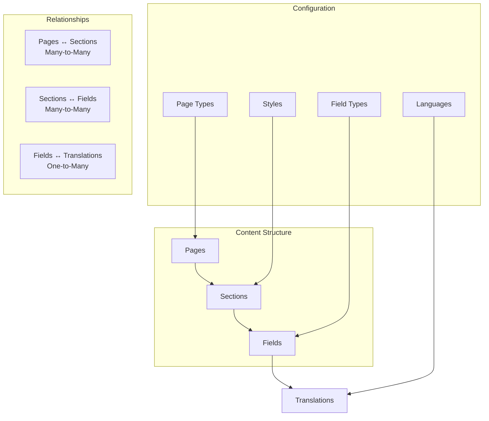
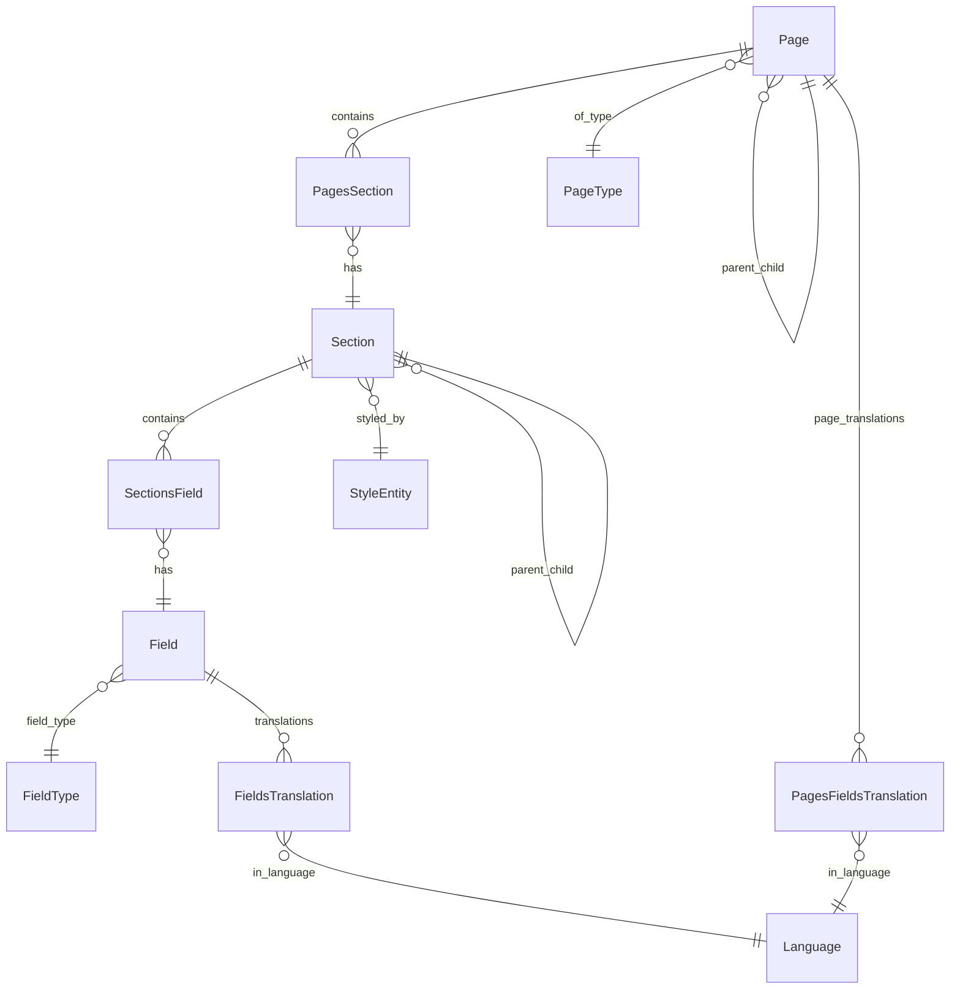
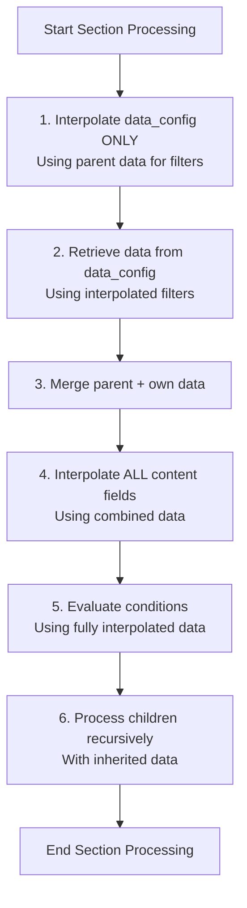
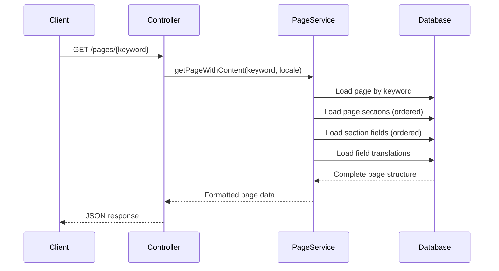

# CMS Architecture

## 📄 Overview

The SelfHelp Symfony Backend includes a sophisticated Content Management System (CMS) built on a hierarchical structure of Pages, Sections, and Fields. This architecture provides flexible content organization with multi-language support, dynamic styling, and fine-grained access control.

## 🏗️ CMS Hierarchy



## 📊 Entity Relationships

### Core CMS Entities


## 📄 Page Management

### Page Entity Structure
```php
<?php
namespace App\Entity;

#[ORM\Entity]
#[ORM\Table(name: 'pages')]
#[ORM\Index(name: 'IDX_pages_published_version_id', columns: ['published_version_id'])]
class Page
{
    #[ORM\Id]
    #[ORM\GeneratedValue]
    #[ORM\Column(type: 'integer')]
    private ?int $id = null;

    #[ORM\Column(name: 'keyword', type: 'string', length: 100, unique: true)]
    private ?string $keyword = null;

    #[ORM\Column(name: 'url', type: 'string', length: 255, nullable: true)]
    private ?string $url = null;

    #[ORM\ManyToOne(targetEntity: Page::class)]
    #[ORM\JoinColumn(name: 'parent', referencedColumnName: 'id', nullable: true, onDelete: 'CASCADE')]
    private ?Page $parentPage = null;

    #[ORM\ManyToOne(targetEntity: PageType::class)]
    #[ORM\JoinColumn(name: 'id_type', referencedColumnName: 'id', nullable: false, onDelete: 'CASCADE')]
    private ?PageType $pageType = null;

    #[ORM\ManyToOne(targetEntity: Lookup::class)]
    #[ORM\JoinColumn(name: 'id_pageAccessTypes', referencedColumnName: 'id', nullable: true, onDelete: 'CASCADE')]
    private ?Lookup $pageAccessType = null;

    #[ORM\Column(name: 'is_headless', type: 'boolean', options: ['default' => 0])]
    private bool $is_headless = false;

    #[ORM\Column(name: 'nav_position', type: 'integer', nullable: true)]
    private ?int $nav_position = null;

    #[ORM\Column(name: 'footer_position', type: 'integer', nullable: true)]
    private ?int $footer_position = null;

    #[ORM\Column(name: 'is_open_access', type: 'boolean', options: ['default' => 0], nullable: true)]
    private ?bool $is_open_access = false;

    #[ORM\Column(name: 'is_system', type: 'boolean', options: ['default' => 0], nullable: true)]
    private ?bool $is_system = false;

    /**
     * Reference to the currently published version of this page
     */
    #[ORM\ManyToOne(targetEntity: PageVersion::class)]
    #[ORM\JoinColumn(name: 'published_version_id', referencedColumnName: 'id', nullable: true)]
    private ?PageVersion $publishedVersion = null;

    // ... getters and setters ...
}
// ENTITY RULE
```

### Page Types
Pages are categorized by types stored in the `pageTypes` table:

```sql
CREATE TABLE `pageTypes` (
  `id` int NOT NULL AUTO_INCREMENT,
  `name` varchar(100) NOT NULL,
  `description` varchar(255) DEFAULT NULL,
  `is_active` tinyint(1) NOT NULL DEFAULT '1',
  PRIMARY KEY (`id`)
) ENGINE=InnoDB DEFAULT CHARSET=utf8mb3;

-- Common page types
INSERT INTO `pageTypes` (`name`, `description`) VALUES
('standard', 'Standard content page'),
('landing', 'Landing page with special layout'),
('system', 'System-generated page'),
('redirect', 'Redirect to another URL');
```

### Page Features
- **Hierarchical Structure**: Pages can have parent-child relationships
- **URL Management**: Custom URLs with protocol specification
- **Access Control**: Open access vs. authenticated access
- **Navigation Integration**: Position in navigation and footer menus
- **Headless Support**: API-only pages without header and footer rendering (content only)
- **System Pages**: Special pages managed by the system

#### Page Types and Rendering
- **Standard Pages**: Full page with header, footer, and navigation
- **Headless Pages**: Content-only rendering without header/footer (for modals, embedded content)
- **Landing Pages**: Special layout pages with custom styling
- **System Pages**: Auto-generated pages (login, error pages)
- **Redirect Pages**: Pages that redirect to other URLs

## 📋 Section Management

### Section Entity Structure
```php
<?php
namespace App\Entity;

#[ORM\Entity]
#[ORM\Table(name: 'sections')]
class Section
{
    #[ORM\Id]
    #[ORM\GeneratedValue]
    #[ORM\Column(type: 'integer')]
    private ?int $id = null;

    #[ORM\Column(name: 'name', type: 'string', length: 100)]
    private ?string $name = null;

    #[ORM\ManyToOne(targetEntity: Style::class)]
    #[ORM\JoinColumn(name: 'id_styles', referencedColumnName: 'id', nullable: false, onDelete: 'CASCADE')]
    private ?Style $style = null;

    #[ORM\ManyToOne(targetEntity: Section::class)]
    #[ORM\JoinColumn(name: 'parent', referencedColumnName: 'id', nullable: true, onDelete: 'CASCADE')]
    private ?Section $parent = null;

    #[ORM\Column(name: 'position', type: 'integer', nullable: true)]
    private ?int $position = null;
}
// ENTITY RULE
```

### Pages-Sections Relationship
```php
<?php
namespace App\Entity;

#[ORM\Entity]
#[ORM\Table(name: 'pages_sections')]
class PagesSection
{
    #[ORM\Id]
    #[ORM\ManyToOne(targetEntity: Page::class)]
    #[ORM\JoinColumn(name: 'id_pages', referencedColumnName: 'id', onDelete: 'CASCADE')]
    private ?Page $page = null;

    #[ORM\Id]
    #[ORM\ManyToOne(targetEntity: Section::class)]
    #[ORM\JoinColumn(name: 'id_sections', referencedColumnName: 'id', onDelete: 'CASCADE')]
    private ?Section $section = null;

    #[ORM\Column(name: 'position', type: 'integer', nullable: true)]
    private ?int $position = null;
}
// ENTITY RULE
```

### Section Features
- **Hierarchical Sections**: Sections can contain child sections
- **Style Integration**: Each section has an associated style
- **Position Management**: Ordered positioning within pages and parent sections
- **Limited Reusability**: Only sections with style `refContainer` can be reused across multiple pages
- **Content Flexibility**: Within a `refContainer` section, any content can be added and styled

#### Section Reusability Rules
- **`refContainer` Style**: These sections can be added to multiple pages
- **Other Styles**: Regular sections are typically page-specific
- **Content Management**: Reusable sections maintain their content across all pages where used
- **Style Consistency**: The `refContainer` style ensures consistent appearance across pages

## 🔄 **CRITICAL: Section Processing Order**

### ⚠️ **Architectural Requirement**

The section processing order in `PageService::processSectionsRecursively()` is **critically important** for correct functionality. This order **MUST NOT** be changed without thorough understanding of the data flow dependencies.

### 📋 **Processing Sequence**



### 🔍 **Detailed Step-by-Step Explanation**

#### **Step 1: Data Config Interpolation (Parent Data Only)**
```php
// CRITICAL: Only data_config fields are interpolated here
$this->interpolateDataConfigInSection($section, $parentData);
```
- **Purpose**: Allows data filters to reference parent data
- **Example**: Filter `"record_id = {{parent.record_id}}"` becomes `"record_id = '38'"`
- **Why**: Data retrieval depends on correctly interpolated filters
- **Data Available**: Only parent data at this stage

#### **Step 2: Data Retrieval**
```php
// Now retrieve data using properly interpolated filters
$this->retrieveSectionData($section, $parentData, $languageId);
```
- **Purpose**: Fetch data from configured sources (database, APIs, etc.)
- **Why Order Matters**: Must happen after filter interpolation
- **Result**: Section now has its own data in `$section['retrieved_data']`

#### **Step 3: Data Merging**
```php
// Combine parent and own data efficiently
$sectionData = $this->mergeDataEfficiently($parentData, $section['retrieved_data'] ?? []);
```
- **Purpose**: Create complete data context for the section
- **Inheritance**: Child sections can access all ancestor data
- **Efficiency**: Avoids unnecessary array operations

#### **Step 4: Full Content Interpolation**
```php
// CRITICAL: Now interpolate ALL content using combined data
$this->applyOptimizedInterpolationPass($section, $sectionData);
```
- **Purpose**: Replace variables in content, styles, conditions, etc.
- **Why After Data Retrieval**: Needs both parent and own data
- **Data Available**: Complete merged dataset

#### **Step 5: Condition Evaluation**
```php
// Evaluate conditions using fully interpolated data
$conditionResult = $this->evaluateSectionCondition($section, $userId);
```
- **Purpose**: Determine if section should be displayed
- **Why Last**: Conditions may reference interpolated content and data
- **Result**: Section is included/excluded from final output

#### **Step 6: Recursive Processing**
```php
// Process children with inherited data
$section['children'] = $this->processSectionsRecursively($section['children'], $sectionData, $userId, $languageId);
```
- **Purpose**: Apply same processing to child sections
- **Inheritance**: Children receive parent's merged data
- **Recursion**: Maintains hierarchical processing

### 🚨 **Why This Order Is Critical**

1. **Data Dependencies**: Filters need parent data before data retrieval
2. **Interpolation Dependencies**: Content needs complete data context
3. **Condition Dependencies**: Conditions need fully interpolated values
4. **Performance**: Early data operations avoid redundant processing
5. **Correctness**: Wrong order breaks data filtering and inheritance

### 💡 **Common Pitfalls to Avoid**

- **Interpolating content before data retrieval**: Variables won't have values
- **Evaluating conditions before full interpolation**: Conditions may fail incorrectly
- **Processing children before parent data is complete**: Inheritance breaks
- **Changing the order without understanding dependencies**: Breaks functionality

### 🔧 **Implementation Location**

This logic is implemented in:
- **File**: `src/Service/CMS/Frontend/PageService.php`
- **Method**: `processSectionsRecursively()`
- **Critical**: Order must be maintained when modifying this code

### 📚 **Related Components**

- **Interpolation Service**: Handles `{{variable}}` replacement
- **Data Service**: Retrieves data from various sources
- **Condition Service**: Evaluates display conditions
- **Section Utility Service**: Handles section hierarchy and data

## 🎨 Style System

### Style Entity
```php
<?php
namespace App\Entity;

#[ORM\Entity]
#[ORM\Table(name: 'styles')]
class Style
{
    #[ORM\Id]
    #[ORM\GeneratedValue]
    #[ORM\Column(type: 'integer')]
    private ?int $id = null;

    #[ORM\Column(name: 'name', type: 'string', length: 100)]
    private ?string $name = null;

    #[ORM\Column(name: 'description', type: 'string', length: 255, nullable: true)]
    private ?string $description = null;

    #[ORM\Column(name: 'css_class', type: 'string', length: 255, nullable: true)]
    private ?string $cssClass = null;

    #[ORM\Column(name: 'template', type: 'string', length: 255, nullable: true)]
    private ?string $template = null;

    #[ORM\Column(name: 'is_active', type: 'boolean', options: ['default' => 1])]
    private bool $isActive = true;
}
// ENTITY RULE
```

### Style Features
- **CSS Integration**: Styles define CSS classes for frontend rendering
- **Template Association**: Link to specific templates for complex layouts
- **Reusability**: Styles can be applied to multiple sections
- **Active State**: Enable/disable styles system-wide

## 📝 Field Management

### Field Entity Structure
```php
<?php
namespace App\Entity;

#[ORM\Entity]
#[ORM\Table(name: 'fields')]
class Field
{
    #[ORM\Id]
    #[ORM\GeneratedValue]
    #[ORM\Column(type: 'integer')]
    private ?int $id = null;

    #[ORM\Column(name: 'name', type: 'string', length: 100)]
    private ?string $name = null;

    #[ORM\ManyToOne(targetEntity: Lookup::class)]
    #[ORM\JoinColumn(name: 'id_fieldTypes', referencedColumnName: 'id', nullable: false, onDelete: 'CASCADE')]
    private ?Lookup $fieldType = null;

    #[ORM\Column(name: 'default_value', type: 'text', nullable: true)]
    private ?string $defaultValue = null;

    #[ORM\Column(name: 'help', type: 'string', length: 1000, nullable: true)]
    private ?string $help = null;

    #[ORM\Column(name: 'disabled', type: 'boolean', options: ['default' => 0])]
    private bool $disabled = false;

    #[ORM\Column(name: 'hidden', type: 'boolean', options: ['default' => 0])]
    private bool $hidden = false;
}
// ENTITY RULE
```

### Field Types
Field types are managed through the dedicated `fieldTypes` table:

```sql
CREATE TABLE `fieldTypes` (
  `id` int NOT NULL AUTO_INCREMENT,
  `name` varchar(100) NOT NULL,
  `description` varchar(255) DEFAULT NULL,
  `input_type` varchar(50) NOT NULL,
  `validation_rules` json DEFAULT NULL,
  `is_active` tinyint(1) NOT NULL DEFAULT '1',
  PRIMARY KEY (`id`),
  UNIQUE KEY `UNIQ_FIELD_TYPE_NAME` (`name`)
) ENGINE=InnoDB DEFAULT CHARSET=utf8mb4;

-- Field types for CMS content management
INSERT INTO `fieldTypes` (`name`, `description`, `input_type`) VALUES
('TEXT', 'Single line text input', 'text'),
('TEXTAREA', 'Multi-line text area', 'textarea'),
('HTML', 'Rich text HTML editor', 'html'),
('SELECT', 'Dropdown selection', 'select'),
('CHECKBOX', 'Checkbox input', 'checkbox'),
('RADIO', 'Radio button group', 'radio'),
('IMAGE', 'Image upload field', 'file'),
('FILE', 'File upload field', 'file'),
('DATE', 'Date picker', 'date'),
('NUMBER', 'Numeric input', 'number');
```

### Sections-Fields Relationship
```php
<?php
namespace App\Entity;

#[ORM\Entity]
#[ORM\Table(name: 'sections_fields')]
class SectionsField
{
    #[ORM\Id]
    #[ORM\ManyToOne(targetEntity: Section::class)]
    #[ORM\JoinColumn(name: 'id_sections', referencedColumnName: 'id', onDelete: 'CASCADE')]
    private ?Section $section = null;

    #[ORM\Id]
    #[ORM\ManyToOne(targetEntity: Field::class)]
    #[ORM\JoinColumn(name: 'id_fields', referencedColumnName: 'id', onDelete: 'CASCADE')]
    private ?Field $field = null;

    #[ORM\Column(name: 'position', type: 'integer', nullable: true)]
    private ?int $position = null;

    #[ORM\Column(name: 'display', type: 'boolean', options: ['default' => 1])]
    private bool $display = true;
}
// ENTITY RULE
```

## 🌍 Multi-language Support

### Translation System
```php
<?php
namespace App\Entity;

#[ORM\Entity]
#[ORM\Table(name: 'fieldsTranslations')]
class FieldsTranslation
{
    #[ORM\Id]
    #[ORM\GeneratedValue]
    #[ORM\Column(type: 'integer')]
    private ?int $id = null;

    #[ORM\ManyToOne(targetEntity: Field::class)]
    #[ORM\JoinColumn(name: 'id_fields', referencedColumnName: 'id', nullable: false, onDelete: 'CASCADE')]
    private ?Field $field = null;

    #[ORM\ManyToOne(targetEntity: Language::class)]
    #[ORM\JoinColumn(name: 'id_languages', referencedColumnName: 'id', nullable: false, onDelete: 'CASCADE')]
    private ?Language $language = null;

    #[ORM\Column(name: 'content', type: 'text', nullable: true)]
    private ?string $content = null;

    #[ORM\Column(name: 'meta', type: 'text', nullable: true)]
    private ?string $meta = null;
}
// ENTITY RULE
```

### Language Management
```php
<?php
namespace App\Entity;

#[ORM\Entity]
#[ORM\Table(name: 'languages')]
class Language
{
    #[ORM\Id]
    #[ORM\GeneratedValue]
    #[ORM\Column(type: 'integer')]
    private ?int $id = null;

    #[ORM\Column(name: 'language', type: 'string', length: 100)]
    private ?string $language = null;

    #[ORM\Column(name: 'locale', type: 'string', length: 10, unique: true)]
    private ?string $locale = null;

    #[ORM\Column(name: 'is_active', type: 'boolean', options: ['default' => 1])]
    private bool $isActive = true;

    #[ORM\Column(name: 'is_default', type: 'boolean', options: ['default' => 0])]
    private bool $isDefault = false;
}
// ENTITY RULE
```

### Page Title Translations
```php
<?php
namespace App\Entity;

#[ORM\Entity]
#[ORM\Table(name: 'pagesFieldsTranslations')]
class PagesFieldsTranslation
{
    #[ORM\Id]
    #[ORM\GeneratedValue]
    #[ORM\Column(type: 'integer')]
    private ?int $id = null;

    #[ORM\ManyToOne(targetEntity: Page::class)]
    #[ORM\JoinColumn(name: 'id_pages', referencedColumnName: 'id', nullable: false, onDelete: 'CASCADE')]
    private ?Page $page = null;

    #[ORM\ManyToOne(targetEntity: Language::class)]
    #[ORM\JoinColumn(name: 'id_languages', referencedColumnName: 'id', nullable: false, onDelete: 'CASCADE')]
    private ?Language $language = null;

    #[ORM\Column(name: 'title', type: 'string', length: 255, nullable: true)]
    private ?string $title = null;

    #[ORM\Column(name: 'meta_description', type: 'text', nullable: true)]
    private ?string $metaDescription = null;
}
// ENTITY RULE
```

## 🔧 CMS Services

### AdminPageService
```php
<?php
namespace App\Service\CMS\Admin;

class AdminPageService extends BaseService
{
    public function getPageWithFields(int $pageId): array
    {
        return $this->pageFieldService->getPageWithFields($pageId);
    }

    public function createPage(
        string $keyword,
        string $pageAccessTypeCode,
        bool $headless = false,
        bool $openAccess = false,
        ?string $url = null,
        ?int $navPosition = null,
        ?int $footerPosition = null,
        ?int $parent = null
    ): Page {
        // Implementation handles page creation with proper validation and ACL checks
        // Includes transaction logging and cache invalidation
    }

    public function updatePage(int $pageId, array $pageData, array $fields): void
    {
        // Implementation handles page and field updates with versioning support
        // Includes ACL checks and transaction logging
    }

    public function addSectionToPage(int $pageId, int $sectionId, ?int $position = null, ?int $oldParentSectionId = null): PagesSection
    {
        // Implementation manages section positioning and hierarchy
        // Includes position normalization and cache invalidation
    }
}
```

### PageVersionService
```php
<?php
namespace App\Service\CMS\Admin;

class PageVersionService extends BaseService
{
    public function createVersion(int $pageId, ?string $versionName = null, ?array $metadata = null, ?int $languageId = null): PageVersion
    {
        // Creates a new version from current page state
        // Stores complete page JSON with all languages and configurations
    }

    public function publishVersion(int $pageId, int $versionId): PageVersion
    {
        // Publishes a specific version, unpublishing any currently published version
        // Updates page.published_version_id reference
    }

    public function createAndPublishVersion(int $pageId, ?string $versionName = null, ?array $metadata = null): PageVersion
    {
        // Atomic operation: create version and publish it in one transaction
    }

    public function hasUnpublishedChanges(int $pageId): bool
    {
        // Fast hash-based comparison (< 50ms) to detect unpublished changes
        // Compares normalized JSON structures of draft vs published version
    }

    public function compareVersions(int $version1Id, int $version2Id, string $format = 'unified'): array
    {
        // Supports multiple diff formats: unified, side-by-side, json_patch, summary
        // Uses Jfcherng\Diff\DiffHelper for high-quality comparisons
    }
}
```

### SectionCreationService
```php
<?php
namespace App\Service\CMS\Admin;

class SectionCreationService extends BaseService
{
    public function createPageSection(string $pageKeyword, int $styleId, ?int $position): array
    {
        // Permission check
       $this->userContextAwareService->checkAccess($pageKeyword, 'update');
        $page = $this->pageRepository->findOneBy(['keyword' => $pageKeyword]);
        
        $this->entityManager->beginTransaction();
        try {
            $style = $this->styleRepository->find($styleId);
            
            // Create new section
            $section = new Section();
            $section->setName(time() . '-' . $style->getName());
            $section->setStyle($style);
            $this->entityManager->persist($section);
            $this->entityManager->flush();

            // Add section to page
            $pagesSection = new PagesSection();
            $pagesSection->setPage($page);
            $pagesSection->setSection($section);
            $pagesSection->setPosition($position);
            $this->entityManager->persist($pagesSection);
            $this->entityManager->flush();

            // Normalize positions
            $this->positionManagementService->normalizePageSectionPositions($page->getId(), true);

            $this->entityManager->commit();
            
            return [
                'id' => $section->getId(),
                'position' => $pagesSection->getPosition()
            ];
            
        } catch (\Exception $e) {
            $this->entityManager->rollback();
            throw $e;
        }
    }
}
```

## 📊 Content Loading Process

### Frontend Page Loading


### Content Response Formats

#### Frontend Response (User-facing)
Returns content with translated values in the selected language only:

```json
{
  "page": {
    "id": 1,
    "keyword": "welcome",
    "url": "/welcome",
    "title": "Welcome to SelfHelp",
    "sections": [
      {
        "id": 10,
        "name": "header-section",
        "style": {
          "name": "hero",
          "cssClass": "hero-section",
          "template": "hero.html.twig"
        },
        "position": 1,
        "fields": [
          {
            "name": "title",
            "type": "TEXT",
            "content": "Welcome to Our Platform"
          },
          {
            "name": "subtitle", 
            "type": "TEXTAREA",
            "content": "Discover amazing features..."
          }
        ]
      }
    ]
  }
}
```

#### CMS Response (Admin editing)
Returns all field IDs, values, and translations for editing:

```json
{
  "page": {
    "id": 1,
    "keyword": "welcome",
    "url": "/welcome",
    "title": {
      "en": "Welcome to SelfHelp",
      "de-CH": "Willkommen bei SelfHelp"
    },
    "sections": [
      {
        "id": 10,
        "name": "header-section",
        "style": {
          "id": 5,
          "name": "hero",
          "cssClass": "hero-section",
          "template": "hero.html.twig"
        },
        "position": 1,
        "fields": [
          {
            "id": 100,
            "name": "title",
            "fieldType": {
              "id": 1,
              "name": "TEXT",
              "inputType": "text"
            },
            "position": 1,
            "disabled": false,
            "hidden": false,
            "translations": [
              {
                "id": 200,
                "language": {"id": 1, "locale": "en"},
                "content": "Welcome to Our Platform"
              },
              {
                "id": 201,
                "language": {"id": 2, "locale": "de-CH"},
                "content": "Willkommen auf unserer Plattform"
              }
            ]
          }
        ]
      }
    ]
  }
}
```

## 🔄 Section Export/Import System

### Export Functionality
```php
<?php
namespace App\Service\CMS\Admin;

class AdminSectionService extends BaseService
{
    public function exportPageSections(string $pageKeyword): array
    {
        $page = $this->pageRepository->findOneBy(['keyword' => $pageKeyword]);
        $sections = $this->getSectionsWithFieldsAndTranslations($page->getId());
        
        return $this->buildExportStructure($sections);
    }
    
    private function buildExportStructure(array $sections): array
    {
        $exportData = [];
        
        foreach ($sections as $section) {
            $sectionData = [
                'name' => $section->getName(),
                'style_name' => $section->getStyle()->getName(),
                'fields' => $this->exportSectionFields($section),
                'children' => $this->exportChildSections($section)
            ];
            
            $exportData[] = $sectionData;
        }
        
        return $exportData;
    }
}
```

### Import Functionality
```php
public function importSectionsToPage(string $pageKeyword, array $sectionsData, ?int $position = null): array
{
    $page = $this->pageRepository->findOneBy(['keyword' => $pageKeyword]);
    
    $this->entityManager->beginTransaction();
    try {
        $importedSections = [];
        
        foreach ($sectionsData as $sectionData) {
            $section = $this->createSectionFromImportData($sectionData);
            $this->addSectionToPage($page, $section, $position);
            $importedSections[] = $section;
        }
        
        $this->entityManager->commit();
        return $importedSections;
        
    } catch (\Exception $e) {
        $this->entityManager->rollback();
        throw $e;
    }
}
```

### Section Restoration from Published Versions

The CMS supports restoring page sections from published versions, allowing users to revert their current draft to any previously published state. This is particularly useful for iterative development and content versioning.

#### API Endpoint
```http
POST /cms-api/v1/admin/pages/{page_id}/sections/restore-from-version/{version_id}
```

#### Restoration Process
1. **Version Validation**: Ensures the specified version exists and is published
2. **Structure Conversion**: Transforms complex published version JSON into import-compatible format
3. **Content Clearing**: Removes all existing sections from the target page
4. **Data Import**: Imports sections, fields, and translations from the published version
5. **Position Normalization**: Ensures proper section ordering
6. **Cache Invalidation**: Updates relevant caches after restoration

#### Key Implementation Details

**Structure Conversion Logic:**
- Published versions store data in a complex format with translations organized by language ID
- Restoration converts this to the simpler export format expected by import logic
- Preserves all multilingual content, conditions, data configurations, and styling

**Data Preservation:**
- ✅ Multilingual field translations
- ✅ Section conditions and data configurations
- ✅ CSS styling (both regular and mobile)
- ✅ Debug settings and global section properties
- ✅ Hierarchical section relationships

#### Usage Example
```javascript
// Restore page 88 sections from published version 115
const response = await fetch('/cms-api/v1/admin/pages/88/sections/restore-from-version/115', {
  method: 'POST',
  headers: {
    'Authorization': 'Bearer your-jwt-token'
  }
});

const result = await response.json();
// Returns restoration confirmation with section details
```

#### Service Implementation
```php
<?php
namespace App\Service\CMS\Admin;

class SectionExportImportService extends BaseService
{
    public function restoreSectionsFromVersion(int $pageId, int $versionId): array
    {
        // Convert published version to export format
        $sectionsToRestore = $this->convertPublishedSectionsToExportFormat($publishedSections);

        // Clear existing sections and import new ones
        $this->clearPageSections($page);
        return $this->importSections($sectionsToRestore, $page, null, null);
    }
}
```

## ⚙️ CMS Preferences System

### Overview
The CMS includes a comprehensive preferences system that manages global application settings through a page-based configuration. This system handles default language, timezone settings, anonymous user access, and Firebase configuration.

### Page-Based Configuration
CMS preferences are stored using the existing page-based content management system with the reserved keyword `sh-cms-preferences`. This approach leverages the existing multi-language field system while providing a unified interface for global application settings.

### Core Components
- **CmsPreferenceService**: Centralized service for accessing CMS preferences with intelligent caching
- **AdminCmsPreferenceService**: Admin-specific service with enhanced caching for the admin interface
- **Timezone Management**: Comprehensive timezone support with IANA compliance and user preferences
- **Multi-language Integration**: Preferences respect the system's multi-language architecture

### Key Features
- **Default Language**: System-wide default language setting with fallback support
- **Timezone Configuration**: Global and user-specific timezone preferences
- **Anonymous User Control**: Configurable anonymous user access levels
- **Firebase Integration**: Centralized Firebase configuration management
- **Advanced Caching**: Entity-scoped caching with automatic invalidation

### API Endpoints
- `GET /admin/cms-preferences` - Retrieve current CMS preferences
- `PUT /auth/user/timezone` - Update user timezone preference

### Services Integration
Services throughout the application use `CmsPreferenceService` for accessing global settings:

```php
class SomeService extends BaseService
{
    public function __construct(
        private readonly CmsPreferenceService $cmsPreferences
    ) {}

    public function doSomething(): void
    {
        $defaultLanguage = $this->cmsPreferences->getDefaultLanguageId();
        $timezone = $this->cmsPreferences->getDefaultTimezone();
        $anonymousAllowed = $this->cmsPreferences->getAnonymousUsers() > 0;
        // Use preferences in business logic
    }
}
```

### Caching Strategy
The preferences system uses advanced caching with entity scope dependencies to ensure high performance and consistency across the application.

For detailed information about CMS preferences and timezone management, see: **[CMS Preferences and Timezone Management](./20-cms-preferences-timezones.md)**

## 🔒 Access Control Integration

### Page-Level ACL
- Users and groups can have specific permissions for each page
- Permissions include: select (view), insert (create), update (modify), delete (remove)
- ACL rules are checked using stored procedures for performance

### Permission Checking in Services
```php
protected function checkAccess(string $pageKeyword, string $accessType): void
{
    $page = $this->pageRepository->findOneBy(['keyword' => $pageKeyword]);
    $userId = $this->userContextService->getCurrentUser()->getId();

    if (!$this->aclService->hasAccess($userId, $page->getId(), $accessType)) {
        throw new AccessDeniedException('Insufficient permissions for page: ' . $pageKeyword);
    }
}
```

## 🎯 Best Practices

### Content Organization
1. **Hierarchical Structure**: Use parent-child relationships for logical content organization
2. **Reusable Sections**: Create sections that can be used across multiple pages
3. **Consistent Styling**: Use standardized styles for consistent appearance
4. **Position Management**: Maintain proper ordering for content presentation

### Performance Optimization
1. **Eager Loading**: Load related entities in single queries
2. **Caching**: Cache frequently accessed content
3. **Pagination**: Implement pagination for large content lists
4. **Index Optimization**: Proper database indexing for content queries

### Multi-language Considerations
1. **Default Language**: Always provide content in the default language
2. **Fallback Strategy**: Show default language content when translations are missing
3. **Translation Management**: Provide tools for managing translations
4. **Locale-Aware URLs**: Support locale-specific URLs where needed

---

**Next**: [Asset Management](./09-asset-management.md)