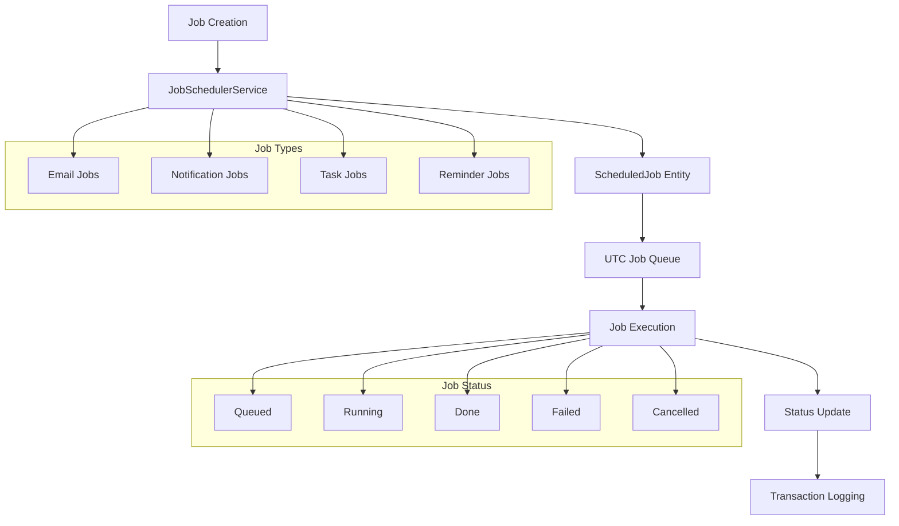
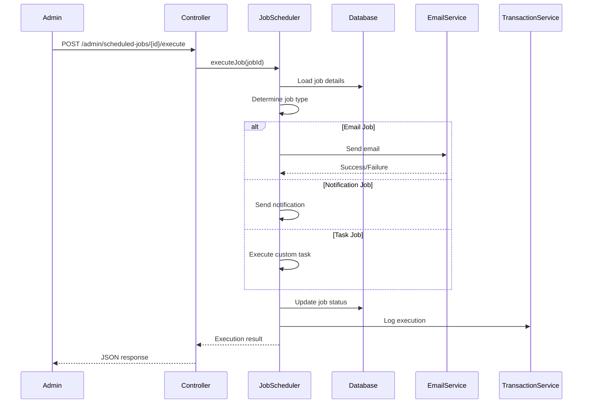

# Scheduled Jobs System

## ⚡ Overview

The SelfHelp Symfony Backend includes a streamlined scheduled jobs system for managing background tasks using JSON-based configuration. The system provides UTC-based job scheduling, execution tracking, and comprehensive audit trails.

## 🏗️ Simplified Job Architecture



## 🗄️ Database Schema

### Simplified ScheduledJob Entity
```php
<?php
namespace App\Entity;

#[ORM\Entity]
#[ORM\Table(name: 'scheduledJobs', indexes: [
    new ORM\Index(name: 'IDX_3E186B37FA06E4D9', columns: ['id_users']),
    new ORM\Index(name: 'IDX_3E186B37DBD5589F', columns: ['id_actions']),
    new ORM\Index(name: 'IDX_3E186B37E2E6A7C3', columns: ['id_dataTables']),
    new ORM\Index(name: 'IDX_3E186B37F3854F45', columns: ['id_dataRows']),
    new ORM\Index(name: 'IDX_3E186B3777FD8DE1', columns: ['id_jobStatus']),
    new ORM\Index(name: 'IDX_3E186B3712C34CFB', columns: ['id_jobTypes']),
    new ORM\Index(name: 'IDX_3E186B37B1E3B97B', columns: ['date_to_be_executed']),
    new ORM\Index(name: 'index_id_users_date_to_be_executed', columns: ['id_users', 'date_to_be_executed']),
    new ORM\Index(name: 'IDX_3E186B3712C34CFB77FD8DE1', columns: ['id_jobTypes', 'id_jobStatus']),
    new ORM\Index(name: 'IDX_3E186B37E2E6A7C3A76ED395', columns: ['id_dataTables', 'id_users']),
])]
class ScheduledJob
{
    #[ORM\Id]
    #[ORM\GeneratedValue]
    #[ORM\Column(name: 'id', type: 'integer')]
    private ?int $id = null;

    // Core relationships (nullable for system jobs)
    #[ORM\ManyToOne(targetEntity: User::class)]
    #[ORM\JoinColumn(name: 'id_users', nullable: true, onDelete: 'CASCADE')]
    private ?User $user = null;

    #[ORM\ManyToOne(targetEntity: Action::class)]
    #[ORM\JoinColumn(name: 'id_actions', nullable: true, onDelete: 'CASCADE')]
    private ?Action $action = null;

    #[ORM\ManyToOne(targetEntity: DataTable::class)]
    #[ORM\JoinColumn(name: 'id_dataTables', nullable: true, onDelete: 'CASCADE')]
    private ?DataTable $dataTable = null;

    #[ORM\ManyToOne(targetEntity: DataRow::class)]
    #[ORM\JoinColumn(name: 'id_dataRows', nullable: true, onDelete: 'CASCADE')]
    private ?DataRow $dataRow = null;

    // Job classification (lookup-based)
    #[ORM\ManyToOne(targetEntity: Lookup::class)]
    #[ORM\JoinColumn(name: 'id_jobTypes', nullable: false, onDelete: 'CASCADE')]
    private Lookup $jobType;

    #[ORM\ManyToOne(targetEntity: Lookup::class)]
    #[ORM\JoinColumn(name: 'id_jobStatus', nullable: false, onDelete: 'CASCADE')]
    private Lookup $status;

    #[ORM\Column(name: 'date_create', type: 'datetime')]
    private \DateTimeInterface $dateCreate;

    #[ORM\Column(name: 'date_to_be_executed', type: 'datetime')]
    private \DateTimeInterface $dateToBeExecuted;

    #[ORM\Column(name: 'date_executed', type: 'datetime', nullable: true)]
    private ?\DateTimeInterface $dateExecuted = null;

    // Job details
    #[ORM\Column(name: 'description', type: 'string', length: 1000, nullable: true)]
    private ?string $description = null;

    #[ORM\Column(name: 'config', type: 'json', nullable: true)]
    private ?array $config = null;

    public function __construct()
    {
        $this->dateCreate = new \DateTime('now', new \DateTimeZone('UTC'));
    }

    // Getters and setters...
}
// ENTITY RULE
```

### Job Types and Statuses (Lookup System)
```sql
-- Job Types (simplified)
INSERT INTO lookups (type_code, lookup_code, lookup_value, lookup_description) VALUES
('jobTypes', 'email', 'Email', 'Email sending job'),
('jobTypes', 'notification', 'Notification', 'Push notification job'),
('jobTypes', 'task', 'Task', 'Custom task execution'),
('jobTypes', 'reminder', 'Reminder', 'Scheduled reminder job')
ON DUPLICATE KEY UPDATE lookup_value = VALUES(lookup_value), lookup_description = VALUES(lookup_description);

-- Job Statuses (simplified)
INSERT INTO lookups (type_code, lookup_code, lookup_value, lookup_description) VALUES
('scheduledJobsStatus', 'queued', 'Queued', 'Job is queued for execution'),
('scheduledJobsStatus', 'running', 'Running', 'Job is currently running'),
('scheduledJobsStatus', 'done', 'Done', 'Job completed successfully'),
('scheduledJobsStatus', 'failed', 'Failed', 'Job execution failed'),
('scheduledJobsStatus', 'cancelled', 'Cancelled', 'Job was manually cancelled')
ON DUPLICATE KEY UPDATE lookup_value = VALUES(lookup_value), lookup_description = VALUES(lookup_description);
```

## 🔧 JobSchedulerService

### Simplified JSON-Based Implementation
```php
<?php
namespace App\Service\Core;

use App\Entity\ScheduledJob;
use App\Entity\User;
use App\Entity\Action;
use App\Service\Cache\Core\CacheService;
use App\Service\CMS\CmsPreferenceService;
use App\Service\Auth\UserDataService;
use App\Service\Core\TransactionService;
use App\Service\Core\LookupService;
use Doctrine\ORM\EntityManagerInterface;
use Psr\Log\LoggerInterface;

/**
 * Service responsible for scheduling and executing jobs with timezone awareness
 */
class JobSchedulerService extends BaseService
{
    public function __construct(
        private readonly EntityManagerInterface $em,
        private readonly TransactionService $transactionService,
        private readonly LookupService $lookupService,
        private readonly UserDataService $userDataService,
        private readonly CmsPreferenceService $cmsPreferences,
        private readonly LoggerInterface $logger,
        private readonly CacheService $cache
    ) {}

    /**
     * Schedule a job for a user
     */
    public function scheduleJob(array $jobData, string $transactionBy): ScheduledJob|false
    {
        try {
            // Determine the user for this job
            $user = $this->getUserForJob($jobData);

            $job = $this->createScheduledJob($jobData, $user);
            if (!$job) {
                throw new \Exception('Failed to create scheduled job');
            }

            // Store job-specific configuration
            $this->storeJobConfig($job, $jobData);

            // Log the transaction
            $this->transactionService->logTransaction(
                $this->lookupService::TRANSACTION_TYPES_INSERT,
                $transactionBy,
                'scheduledJobs',
                $job->getId(),
                $job,
                'Job scheduled: ' . ($jobData['description'] ?? $jobData['type'])
            );

            $this->cache
                ->withCategory(CacheService::CATEGORY_SCHEDULED_JOBS)
                ->invalidateAllListsInCategory();

            return $job;

        } catch (\Exception $e) {
            $this->logger->error('Failed to schedule job', [
                'error' => $e->getMessage(),
                'jobData' => $jobData
            ]);
            return false;
        }
    }

    /**
     * Execute a scheduled job
     */
    public function executeJob(int $jobId, string $transactionBy): ScheduledJob|false
    {
        try {
            $this->em->beginTransaction();

            $job = $this->em->getRepository(ScheduledJob::class)->find($jobId);
            if (!$job) {
                throw new \Exception('Job not found: ' . $jobId);
            }

            // Set job status to running to prevent double execution
            $runningStatus = $this->em->getRepository(Lookup::class)->findOneBy([
                'typeCode' => $this->lookupService::SCHEDULED_JOBS_STATUS,
                'lookupCode' => $this->lookupService::SCHEDULED_JOBS_STATUS_RUNNING
            ]);
            $job->setStatus($runningStatus);
            $this->em->flush();

            // Determine job type and execute accordingly
            $jobTypeName = $job->getJobType()->getLookupCode();

            $success = match ($jobTypeName) {
                $this->lookupService::JOB_TYPES_EMAIL => $this->executeEmailJob($job, $transactionBy),
                $this->lookupService::JOB_TYPES_NOTIFICATION => $this->executeNotificationJob($job, $transactionBy),
                default => throw new \Exception('Unknown job type: ' . $jobTypeName)
            };

            // Update job status to final result
            $finalStatus = $this->em->getRepository(Lookup::class)->findOneBy([
                'typeCode' => $this->lookupService::SCHEDULED_JOBS_STATUS,
                'lookupCode' => $success ? $this->lookupService::SCHEDULED_JOBS_STATUS_DONE : $this->lookupService::SCHEDULED_JOBS_STATUS_FAILED
            ]);

            $job->setStatus($finalStatus);
            $job->setDateExecuted(new \DateTime('now', new \DateTimeZone('UTC')));
            $this->em->flush();

            // Log the execution
            $this->transactionService->logTransaction(
                LookupService::TRANSACTION_TYPES_UPDATE,
                $transactionBy,
                'scheduledJobs',
                $jobId,
                false,
                'Job executed: ' . ($success ? 'executed' : 'failed')
            );

            $this->cache
                ->withCategory(CacheService::CATEGORY_SCHEDULED_JOBS)
                ->invalidateItemAndLists("scheduledJob_{$jobId}");

            $this->em->commit();
            return $job;

        } catch (\Exception $e) {
            $this->em->rollback();
            $this->logger->error('Failed to execute job', [
                'jobId' => $jobId,
                'error' => $e->getMessage()
            ]);
            return false;
        }
    }

    /**
     * Create a scheduled job entity
     */
    private function createScheduledJob(array $jobData, ?User $user): ScheduledJob|false
    {
        try {
            // Get job type using constants
            $jobType = $this->em->getRepository(Lookup::class)->findOneBy([
                'typeCode' => $this->lookupService::JOB_TYPES,
                'lookupCode' => $jobData['type']
            ]);

            if (!$jobType) {
                throw new \Exception('Invalid job type: ' . $jobData['type']);
            }

            // Get status using constants
            $status = $this->em->getRepository(Lookup::class)->findOneBy([
                'typeCode' => $this->lookupService::SCHEDULED_JOBS_STATUS,
                'lookupCode' => $this->lookupService::SCHEDULED_JOBS_STATUS_QUEUED
            ]);

            $scheduledJob = new ScheduledJob();
            $scheduledJob->setUser($user);
            $scheduledJob->setJobType($jobType);
            $scheduledJob->setStatus($status);
            $scheduledJob->setDescription($jobData['description'] ?? '');
            $scheduledJob->setDateToBeExecuted($jobData['date_to_be_executed'] ?? new \DateTime('now', new \DateTimeZone('UTC')));

            // Set relationships if provided (nullable for system jobs)
            if (isset($jobData['action']) && $jobData['action'] instanceof Action) {
                $action = $jobData['action'];
                $scheduledJob->setAction($action);
                $scheduledJob->setDataTable($action->getDataTable());
                $scheduledJob->setDataRow($jobData['dataRow'] ?? null);
            }

            $this->em->persist($scheduledJob);
            $this->em->flush();

            return $scheduledJob;

        } catch (\Exception $e) {
            $this->logger->error('Failed to create scheduled job', ['error' => $e->getMessage()]);
            return false;
        }
    }

    /**
     * Store job-specific configuration in JSON format
     */
    private function storeJobConfig(ScheduledJob $job, array $jobData): void
    {
        $config = [];

        // Store job-specific configuration based on type
        switch ($job->getJobType()->getLookupCode()) {
            case $this->lookupService::JOB_TYPES_EMAIL:
                $config['email'] = $jobData['email_config'] ?? [];
                break;
            case $this->lookupService::JOB_TYPES_NOTIFICATION:
                $config['notification'] = $jobData['notification_config'] ?? [];
                break;
        }

        $job->setConfig($config);
        $this->em->flush();
    }

    /**
     * Execute an email job using JSON config
     */
    private function executeEmailJob(ScheduledJob $job, string $transactionBy): bool
    {
        try {
            $config = $job->getConfig()['email'] ?? [];

            // Execute email sending logic here
            $this->logger->info('Email job executed', [
                'jobId' => $job->getId(),
                'config' => $config
            ]);

            return true;

        } catch (\Exception $e) {
            $this->logger->error('Email job execution failed', [
                'jobId' => $job->getId(),
                'error' => $e->getMessage()
            ]);
            return false;
        }
    }

    /**
     * Execute a notification job using JSON config
     */
    private function executeNotificationJob(ScheduledJob $job, string $transactionBy): bool
    {
        try {
            $config = $job->getConfig()['notification'] ?? [];

            // Execute notification logic here
            $this->logger->info('Notification job executed', [
                'jobId' => $job->getId(),
                'config' => $config
            ]);

            return true;

        } catch (\Exception $e) {
            $this->logger->error('Notification job execution failed', [
                'jobId' => $job->getId(),
                'error' => $e->getMessage()
            ]);
            return false;
        }
    }
}
```

## 🎮 AdminScheduledJobController

### Controller Implementation
```php
<?php
namespace App\Controller\Api\V1\Admin;

class AdminScheduledJobController extends AbstractController
{
    use RequestValidatorTrait;

    public function __construct(
        private readonly AdminScheduledJobService $adminScheduledJobService,
        private readonly JobSchedulerService $jobSchedulerService,
        private readonly ApiResponseFormatter $responseFormatter,
        private readonly JsonSchemaValidationService $jsonSchemaValidationService
    ) {}

    /**
     * Get scheduled jobs with filtering and pagination
     * @route /admin/scheduled-jobs
     * @method GET
     */
    public function getScheduledJobs(Request $request): JsonResponse
    {
        try {
            $filters = [
                'status' => $request->query->get('status'),
                'job_type' => $request->query->get('job_type'),
                'date_type' => $request->query->get('date_type', 'create'),
                'date_from' => $request->query->get('date_from'),
                'date_to' => $request->query->get('date_to'),
                'search' => $request->query->get('search')
            ];

            $page = (int)$request->query->get('page', 1);
            $perPage = min((int)$request->query->get('per_page', 20), 100);
            $sort = $request->query->get('sort', 'dateCreate');
            $order = $request->query->get('order', 'desc');

            $result = $this->adminScheduledJobService->getScheduledJobs(
                $filters, 
                $page, 
                $perPage, 
                $sort, 
                $order
            );

            return $this->responseFormatter->formatSuccess(
                $result['data'],
                'responses/admin/scheduled_jobs/scheduled_jobs'
            );
        } catch (\Exception $e) {
            return $this->responseFormatter->formatError(
                $e->getMessage(),
                $e->getCode() ?: Response::HTTP_INTERNAL_SERVER_ERROR
            );
        }
    }

    /**
     * Get specific scheduled job details
     * @route /admin/scheduled-jobs/{jobId}
     * @method GET
     */
    public function getScheduledJob(int $jobId): JsonResponse
    {
        try {
            $job = $this->adminScheduledJobService->getScheduledJobById($jobId);
            return $this->responseFormatter->formatSuccess(
                $job,
                'responses/admin/scheduled_jobs/scheduled_job'
            );
        } catch (\Exception $e) {
            return $this->responseFormatter->formatError(
                $e->getMessage(),
                $e->getCode() ?: Response::HTTP_INTERNAL_SERVER_ERROR
            );
        }
    }

    /**
     * Execute a scheduled job
     * @route /admin/scheduled-jobs/{jobId}/execute
     * @method POST
     */
    public function executeScheduledJob(int $jobId): JsonResponse
    {
        try {
            $job = $this->jobSchedulerService->executeJob(
                $jobId, 
                LookupService::TRANSACTION_BY_BY_USER
            );

            if (!$job) {
                return $this->responseFormatter->formatError(
                    'Failed to execute job',
                    Response::HTTP_INTERNAL_SERVER_ERROR
                );
            }

            return $this->responseFormatter->formatSuccess(
                $this->adminScheduledJobService->formatJobForResponse($job),
                'responses/admin/scheduled_jobs/scheduled_job'
            );
        } catch (\Exception $e) {
            return $this->responseFormatter->formatError(
                $e->getMessage(),
                $e->getCode() ?: Response::HTTP_INTERNAL_SERVER_ERROR
            );
        }
    }

    /**
     * Delete (soft delete) a scheduled job
     * @route /admin/scheduled-jobs/{jobId}
     * @method DELETE
     */
    public function deleteScheduledJob(int $jobId): JsonResponse
    {
        try {
            $this->adminScheduledJobService->deleteScheduledJob($jobId);
            return $this->responseFormatter->formatSuccess(
                null,
                null,
                Response::HTTP_NO_CONTENT
            );
        } catch (\Exception $e) {
            return $this->responseFormatter->formatError(
                $e->getMessage(),
                $e->getCode() ?: Response::HTTP_INTERNAL_SERVER_ERROR
            );
        }
    }

    /**
     * Get job statuses for filtering
     * @route /admin/scheduled-jobs/statuses
     * @method GET
     */
    public function getJobStatuses(): JsonResponse
    {
        try {
            $statuses = $this->adminScheduledJobService->getJobStatuses();
            return $this->responseFormatter->formatSuccess(
                $statuses,
                'responses/admin/lookups'
            );
        } catch (\Exception $e) {
            return $this->responseFormatter->formatError(
                $e->getMessage(),
                $e->getCode() ?: Response::HTTP_INTERNAL_SERVER_ERROR
            );
        }
    }

    /**
     * Get job types for filtering
     * @route /admin/scheduled-jobs/types
     * @method GET
     */
    public function getJobTypes(): JsonResponse
    {
        try {
            $types = $this->adminScheduledJobService->getJobTypes();
            return $this->responseFormatter->formatSuccess(
                $types,
                'responses/admin/lookups'
            );
        } catch (\Exception $e) {
            return $this->responseFormatter->formatError(
                $e->getMessage(),
                $e->getCode() ?: Response::HTTP_INTERNAL_SERVER_ERROR
            );
        }
    }
}
```

## 📊 Job Management Features

### Timezone-Aware SQL Query Implementation
```php
public function getScheduledJobs(
    array $filters = [],
    int $page = 1,
    int $perPage = 20,
    string $sort = 'adjusted_execution_time',
    string $order = 'asc'
): array {
    $cacheKey = "scheduled_jobs_timezone_aware_{$page}_{$perPage}_" . md5(
        json_encode($filters) . $sort . $order
    );

    return $this->cache
        ->withCategory(CacheService::CATEGORY_SCHEDULED_JOBS)
        ->getList($cacheKey, function () use ($filters, $page, $perPage, $sort, $order) {
            $sql = $this->buildTimezoneAwareQuery($filters, $sort, $order, $perPage, ($page - 1) * $perPage);
            $conn = $this->entityManager->getConnection();
            $result = $conn->executeQuery($sql, $this->buildCountParameters($filters));

            $jobs = [];
            while ($row = $result->fetchAssociative()) {
                $jobs[] = $this->hydrateJobFromRow($row);
            }

            // Get total count
            $countSql = $this->buildCountQuery($filters);
            $countResult = $conn->executeQuery($countSql, $this->buildCountParameters($filters));
            $totalItems = (int) $countResult->fetchOne();

            return [
                'scheduledJobs' => $jobs,
                'totalCount' => $totalItems,
                'page' => $page,
                'pageSize' => $perPage,
                'totalPages' => (int) ceil($totalItems / $perPage)
            ];
        });
}

private function buildTimezoneAwareQuery(array $filters, string $sort, string $order, int $limit, int $offset): string
{
    $orderBy = match($sort) {
        'adjusted_execution_time' => 'sj.date_to_be_executed',
        'date_create' => 'sj.date_create',
        'description' => 'sj.description',
        default => 'sj.date_to_be_executed'
    };

    // Get CMS default timezone
    $cmsTimezone = $this->cmsPreferenceService->getDefaultTimezoneCode();

    return "
        SELECT
            sj.id,
            sj.id_users,
            u.email as user_email,
            a.name as action_name,
            dt.displayName as data_table_name,
            sj.id_dataRows as data_row,
            jt.lookup_value as job_types,
            js.lookup_value as status,
            sj.description,
            CONVERT_TZ(
                sj.date_to_be_executed,
                '+00:00',
                '{$cmsTimezone}'
            ) as date_scheduled,
            CONVERT_TZ(
                sj.date_create,
                '+00:00',
                '{$cmsTimezone}'
            ) as date_created,
            CONVERT_TZ(
                sj.date_to_be_executed,
                '+00:00',
                '{$cmsTimezone}'
            ) as date_to_be_executed,
            CONVERT_TZ(
                sj.date_executed,
                '+00:00',
                '{$cmsTimezone}'
            ) as date_executed,
            sj.description as description,
            sj.config

        FROM scheduledJobs sj
        INNER JOIN users u ON u.id = sj.id_users
        INNER JOIN lookups jt ON jt.id = sj.id_jobTypes
        INNER JOIN lookups js ON js.id = sj.id_jobStatus

        LEFT JOIN actions a ON a.id = sj.id_actions
        LEFT JOIN dataTables dt ON dt.id = sj.id_dataTables

        WHERE 1=1
        " . $this->buildWhereClause($filters) . "

        ORDER BY {$orderBy} {$order}
        LIMIT {$limit} OFFSET {$offset}";
}

private function hydrateJobFromRow(array $row): array
{
    return [
        'id' => $row['id'],
        'id_users' => $row['id_users'],
        'user_email' => $row['user_email'],
        'action_name' => $row['action_name'],
        'data_table_name' => $row['data_table_name'],
        'data_row' => $row['data_row'],
        'job_types' => $row['job_types'],
        'status' => $row['status'],
        'description' => $row['description'],
        'date_scheduled' => $row['date_scheduled'],
        'date_created' => $row['date_created'],
        'date_to_be_executed' => $row['date_to_be_executed'],
        'date_executed' => $row['date_executed'],
        'config' => json_decode($row['config'] ?? '{}', true)
    ];
}
```

## 🔄 Job Execution Process

### Job Execution Flow


## 📋 JSON Schema Examples

### Scheduled Job Item Schema (Admin API Response)
```json
{
  "$schema": "http://json-schema.org/draft-07/schema#",
  "type": "object",
  "properties": {
    "id": { "type": "integer", "description": "Job ID" },
    "id_users": { "type": "integer", "description": "User ID" },
    "user_email": { "type": "string", "description": "User email" },
    "action_name": { "type": ["string", "null"], "description": "Action name" },
    "data_table_name": { "type": ["string", "null"], "description": "Data table display name" },
    "data_row": { "type": ["integer", "null"], "description": "Data row ID" },
    "job_types": { "type": "string", "description": "Job type name" },
    "status": { "type": "string", "description": "Job status name" },
    "description": { "type": "string", "description": "Job description" },
    "date_scheduled": { "type": ["string", "null"], "description": "Date when job should be executed (adjusted to CMS timezone)" },
    "date_created": { "type": "string", "description": "Date when job was created (adjusted to CMS timezone)" },
    "date_to_be_executed": { "type": ["string", "null"], "description": "Date when job should be executed (adjusted to CMS timezone)" },
    "date_executed": { "type": ["string", "null"], "description": "Date when job was actually executed (adjusted to CMS timezone)" },
    "config": { "type": "object", "description": "Job configuration" }
  },
  "required": ["id", "id_users", "user_email", "action_name", "data_table_name", "data_row", "job_types", "status", "description", "date_scheduled", "date_created", "date_to_be_executed", "date_executed", "config"]
}
```

### Scheduled Jobs List Response Schema
```json
{
  "$schema": "http://json-schema.org/draft-07/schema#",
  "title": "Scheduled Jobs List Response",
  "type": "object",
  "properties": {
    "scheduledJobs": {
      "type": "array",
      "items": { "$ref": "#/definitions/scheduledJobItem" }
    },
    "totalCount": { "type": "integer" },
    "page": { "type": "integer" },
    "pageSize": { "type": "integer" },
    "totalPages": { "type": "integer" }
  },
  "definitions": {
    "scheduledJobItem": {
      "type": "object",
      "properties": {
        "id": { "type": "integer" },
        "id_users": { "type": "integer" },
        "user_email": { "type": "string" },
        "action_name": { "type": ["string", "null"] },
        "data_table_name": { "type": ["string", "null"] },
        "data_row": { "type": ["integer", "null"] },
        "job_types": { "type": "string" },
        "status": { "type": "string" },
        "description": { "type": "string" },
        "date_scheduled": { "type": ["string", "null"] },
        "date_created": { "type": "string" },
        "date_to_be_executed": { "type": ["string", "null"] },
        "date_executed": { "type": ["string", "null"] },
        "config": { "type": "object" }
      },
      "required": ["id", "id_users", "user_email", "action_name", "data_table_name", "data_row", "job_types", "status", "description", "date_scheduled", "date_created", "date_to_be_executed", "date_executed", "config"]
    }
  }
}
```

## 🚀 Job Scheduling Examples

### Email Job Scheduling
```php
$jobData = [
    'type' => 'email',
    'description' => 'Welcome email for new user',
    'date_to_be_executed' => new \DateTime('+1 hour', new \DateTimeZone('UTC')),
    'email_config' => [
        'to_email' => 'user@example.com',
        'from_email' => 'welcome@selfhelp.com',
        'subject' => 'Welcome to SelfHelp!',
        'body' => '<h1>Welcome!</h1><p>Thank you for joining us.</p>',
        'is_html' => true
    ]
];

$job = $this->jobSchedulerService->scheduleJob($jobData, LookupService::TRANSACTION_BY_BY_USER);
```

### Notification Job Scheduling
```php
$jobData = [
    'type' => 'notification',
    'description' => 'System maintenance notification',
    'date_to_be_executed' => new \DateTime('+30 minutes', new \DateTimeZone('UTC')),
    'notification_config' => [
        'title' => 'Scheduled Maintenance',
        'message' => 'System will be undergoing maintenance in 30 minutes.',
        'type' => 'warning'
    ]
];

$job = $this->jobSchedulerService->scheduleJob($jobData, LookupService::TRANSACTION_BY_SYSTEM);
```

### Reminder Job Scheduling
```php
$jobData = [
    'type' => 'reminder',
    'description' => 'Appointment reminder',
    'date_to_be_executed' => new \DateTime('2024-02-01 14:00:00', new \DateTimeZone('UTC')),
    'action' => $actionEntity, // Optional: related Action entity
    'dataRow' => $dataRowEntity // Optional: related DataRow entity
];

$job = $this->jobSchedulerService->scheduleJob($jobData, LookupService::TRANSACTION_BY_BY_USER);
```

## 🔒 Security and Permissions

### Job Access Control
- Only admin users can view and manage scheduled jobs
- Job execution requires appropriate permissions
- All job operations are logged via TransactionService
- Sensitive job configurations are properly handled

### Job Validation
- Job types must be valid lookup values
- Execution dates must be in the future (for new jobs)
- Job configurations are validated based on job type
- User assignments are validated against existing users

## 🧪 Testing Scheduled Jobs

### Unit Tests
```php
<?php
namespace App\Tests\Service\Core;

class JobSchedulerServiceTest extends KernelTestCase
{
    public function testScheduleEmailJob(): void
    {
        $jobData = [
            'type' => 'email',
            'description' => 'Test email job',
            'date_to_be_executed' => new \DateTime('+1 hour', new \DateTimeZone('UTC')),
            'email_config' => [
                'to_email' => 'test@example.com',
                'subject' => 'Test Subject',
                'body' => 'Test Body'
            ]
        ];

        $job = $this->jobSchedulerService->scheduleJob($jobData, 'test');

        $this->assertInstanceOf(ScheduledJob::class, $job);
        $this->assertEquals('Test email job', $job->getDescription());
        $this->assertEquals('email', $job->getJobType()->getLookupCode());
        $this->assertArrayHasKey('email', $job->getConfig());
    }

    public function testExecuteJob(): void
    {
        $job = $this->createTestJob();
        $executedJob = $this->jobSchedulerService->executeJob($job->getId(), 'test');

        $this->assertNotNull($executedJob->getDateExecuted());
        $this->assertEquals('done', $executedJob->getStatus()->getLookupCode());
    }
}
```

### Integration Tests
```php
public function testScheduledJobsEndpoint(): void
{
    $this->client->request('GET', '/cms-api/v1/admin/scheduled-jobs', [], [
        'Authorization' => 'Bearer ' . $this->getAuthToken()
    ]);

    $this->assertResponseIsSuccessful();
    $data = json_decode($this->client->getResponse()->getContent(), true);
    $this->assertArrayHasKey('data', $data);
    $this->assertArrayHasKey('pagination', $data['meta']);
}
```

---

**Next**: [Transaction Logging](./12-transaction-logging.md)