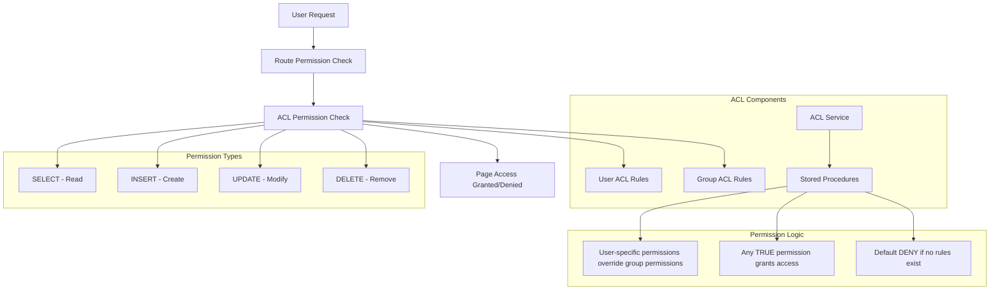

# Access Control Lists (ACL) System & Data Access Management

## 🔍 Overview

The SelfHelp Symfony Backend implements **three-tier access control architecture** with completely separate permission systems for different use cases:

1. **Admin Role-Based API Permissions**: Route-level access control for CMS backend users
2. **Admin Data Access Management**: Resource-level CRUD permissions for admin operations
3. **Frontend User ACL System**: Fine-grained page-level permissions for website users

These systems are **completely separate** and serve different purposes with different security models:

## 🗄️ Permissions Cache System (Data Access Caching)

### Overview
The `CATEGORY_PERMISSIONS` cache category is used for all custom data access permissions across the application. This centralized permissions cache ensures efficient access control while maintaining performance through strategic cache invalidation.

### Cache Category Usage
- **Central Permissions Cache**: `CacheService::CATEGORY_PERMISSIONS`
- **TTL**: 30 minutes (1800 seconds)
- **Scope**: All resource-level CRUD permissions, ACL permissions, and role-based access control
- **Invalidation Trigger**: Any changes to roles, groups, or users require permissions cache clearing

### Cache Invalidation Requirements
When making changes to roles, groups, or users, the permissions cache list **MUST** be cleared:

```php
// Always clear permissions cache when roles/groups/users are modified
$this->cache
    ->withCategory(CacheService::CATEGORY_PERMISSIONS)
    ->invalidateAllListsInCategory();
```

### Critical Invalidation Scenarios

#### User Updates (AdminUserService)
When updating user roles, groups, or permissions:
```php
public function updateUser(int $userId, array $userData): array
{
    // ... update user logic ...

    // CRITICAL: Clear permissions cache after user changes
    $this->cache
        ->withCategory(CacheService::CATEGORY_PERMISSIONS)
        ->invalidateAllListsInCategory();

    // Also invalidate user-specific caches
    $this->invalidateUserCaches($userId);
}
```

#### Role Permission Changes
When modifying role permissions:
```php
public function updateRolePermissions(int $roleId, array $permissions): void
{
    // Update role permissions in database
    $this->updateRolePermissionsInDb($roleId, $permissions);

    // CRITICAL: Clear permissions cache for all affected users
    $this->cache
        ->withCategory(CacheService::CATEGORY_PERMISSIONS)
        ->invalidateAllListsInCategory();
}
```

#### Group Permission Changes
When modifying group permissions or memberships:
```php
public function updateUserGroups(int $userId, array $groupIds): void
{
    // Update user-group relationships
    $this->updateUserGroupRelationships($userId, $groupIds);

    // CRITICAL: Clear permissions cache for permission changes
    $this->cache
        ->withCategory(CacheService::CATEGORY_PERMISSIONS)
        ->invalidateAllListsInCategory();
}
```

### Why Permissions Cache Invalidation is Critical

1. **Security Integrity**: Outdated cached permissions could allow unauthorized access or block legitimate access
2. **Consistency**: All permission checks must reflect the current state of roles, groups, and user relationships
3. **Performance**: While clearing cache has a performance cost, it's necessary to maintain security guarantees
4. **Cross-System Impact**: Permissions cache affects ACL checks, data access controls, and admin panel permissions

### Implementation Pattern
All services that modify user roles, groups, or permissions **MUST** include:

```php
// Pattern for any service modifying permissions
$this->cache
    ->withCategory(CacheService::CATEGORY_PERMISSIONS)
    ->invalidateAllListsInCategory();
```

### Services Requiring Permissions Cache Clearing
- `AdminUserService` - User role/group updates
- `AdminRoleService` - Role permission modifications
- `AdminGroupService` - Group permission changes
- `UserPermissionService` - Direct permission assignments
- `ACLService` - ACL rule modifications

### 🔧 Admin Role-Based API System (CMS Backend)
- **Purpose**: Controls access to admin API routes and CMS functionality
- **Users**: Admin users, editors, content managers
- **Tables**: `roles`, `permissions`, `users_roles`, `roles_permissions`, `api_routes_permissions`
- **Scope**: API endpoint access, system-level operations
- **Examples**: Can access admin panel, can view user management routes

### 🔐 Admin Data Access Management (Resource-Level CRUD)
- **Purpose**: Fine-grained CRUD permissions on specific resources (pages, sections, users)
- **Users**: Admin users, editors with limited resource access
- **Tables**: `role_data_access`, `dataAccessAudit`
- **Scope**: Create, Read, Update, Delete operations on data entities
- **Examples**: Can edit specific pages, can create sections, can delete users
- **Implementation**: `DataAccessSecurityService` with bitwise permission flags

### 👥 Frontend User ACL System (Website Access)
- **Purpose**: Fine-grained page-level permissions for website content
- **Users**: Frontend website users, regular users
- **Tables**: `groups`, `users_groups`, `acl_groups`
- **Scope**: Page visibility and interaction permissions
- **Examples**: Can view specific pages, can comment on pages, can edit page content

### 🔐 Permissions Cache Management (Custom Data Access)
- **Purpose**: Caching system for all custom data access permissions across the application
- **Users**: Admin users, CMS backend users, frontend users with custom permissions
- **Cache Category**: `CATEGORY_PERMISSIONS` - Central permissions cache for all data access operations
- **Scope**: Resource-level CRUD permissions, ACL permissions, role-based access control
- **Cache Invalidation**: Required whenever roles, groups, or users are modified

## 🏗️ Dual Permission Architecture

### Service-Level Separation

The `UserContextAwareService` provides **separate methods** for each permission system:

#### ACL Methods (Frontend/Website)
```php
// For frontend page access and form submissions
checkAclAccess(string $page_keyword, string $permission): void
checkAclAccessById(int $pageId, string $permission): void
```

#### Data Access Methods (Admin/CMS)
```php
// For admin CRUD operations on pages and sections
checkAdminAccess(string $page_keyword, string $permission): void
checkAdminAccessById(int $pageId, string $permission): void
```

#### Service Usage Guidelines
- **Frontend Services** (`PageService`, `FormValidationService`): Use `checkAclAccess*()` methods
- **Admin Services** (`AdminSectionService`, `AdminPageService`): Use `checkAdminAccess*()` methods
- **Legacy Methods**: `checkAccess*()` delegates to ACL for backward compatibility

### 🔄 Admin vs Frontend Page Access

**Admin Page Operations** (CMS Backend):
- **ACL Bypass**: Admin users bypass frontend ACL restrictions
- **Data Access Required**: Must pass `DataAccessSecurityService` permission checks
- **Implementation**: `AdminPageService::getAllPagesForAdmin()` returns all pages without ACL filtering
- **Filtering**: `DataAccessSecurityService::filterData()` applies role-based resource filtering
- **CRUD Permissions**: Sets `crud` field (bitwise: 1=CREATE, 2=READ, 4=UPDATE, 8=DELETE)
- **Purpose**: Allows admins to manage content while maintaining granular security controls

**Frontend Page Operations** (Website):
- **ACL Required**: Pages filtered based on user ACL rules for visibility and interaction
- **Implementation**: `PageService::getAllAccessiblePagesForUser()` applies ACL filtering
- **Purpose**: Controls what content each website user can see and interact with

## 🏗️ ACL Architecture



## 🔧 Admin Role-Based Permission System

### Admin Roles and Permissions
The admin system uses a traditional role-based access control (RBAC) model:

#### Admin Roles
```sql
INSERT INTO `roles` (`name`, `description`) VALUES
('admin', 'Administrator role with full access'),
('editor', 'Content editor with limited access'),
('viewer', 'Read-only access to admin panel');
```

#### Admin Permissions
```sql
INSERT INTO `permissions` (`name`, `description`) VALUES
('admin.access', 'Can view and enter the admin/backend area'),
('admin.page.read', 'Can read existing pages'),
('admin.page.create', 'Can create new pages'),
('admin.page.update', 'Can edit existing pages'),
('admin.page.delete', 'Can delete pages'),
('admin.page.insert', 'Can insert content into pages'),
('admin.page.export', 'Can export sections from pages'),
('admin.settings', 'Full access to CMS settings'),
('admin.user.read', 'Can read existing users'),
('admin.user.create', 'Can create new users'),
('admin.user.update', 'Can edit existing users'),
('admin.user.delete', 'Can delete users'),
('admin.user.block', 'Can block users'),
('admin.user.unblock', 'Can unblock users'),
('admin.user.impersonate', 'Can impersonate users');
```

#### API Route Permission Mapping
Each API route requires specific permissions:

```sql
-- Page reading routes require 'admin.page.read'
INSERT INTO `api_routes_permissions` (`id_api_routes`, `id_permissions`)
SELECT ar.id, p.id 
FROM `api_routes` ar, `permissions` p
WHERE p.name = 'admin.page.read'
AND ar.route_name IN (
  'admin_pages_get_all',
  'admin_pages_get_all_with_language', 
  'admin_pages_get_one',
  'admin_pages_sections_get'
);

-- Page creation routes require 'admin.page.create'
INSERT INTO `api_routes_permissions` (`id_api_routes`, `id_permissions`)
SELECT ar.id, p.id 
FROM `api_routes` ar, `permissions` p
WHERE p.name = 'admin.page.create'
AND ar.route_name IN ('admin_pages_create');

-- Page modification routes require 'admin.page.update'
INSERT INTO `api_routes_permissions` (`id_api_routes`, `id_permissions`)
SELECT ar.id, p.id 
FROM `api_routes` ar, `permissions` p
WHERE p.name = 'admin.page.update'
AND ar.route_name IN (
  'admin_pages_update',
  'admin_pages_add_section',
  'admin_pages_create_section'
);

-- Page deletion routes require 'admin.page.delete'
INSERT INTO `api_routes_permissions` (`id_api_routes`, `id_permissions`)
SELECT ar.id, p.id 
FROM `api_routes` ar, `permissions` p
WHERE p.name = 'admin.page.delete'
AND ar.route_name IN ('admin_pages_delete');
```

### Permission Check Flow for Admin Routes
1. **JWT Authentication**: User must have valid JWT token
2. **Route Permission Check**: `ApiSecurityListener` checks if user's roles have required permissions
3. **Controller Execution**: If authorized, controller method executes
4. **ACL Check** (if applicable): Additional page-level ACL check for specific pages

## 🗄️ Frontend User ACL Database Schema

### ACL Tables Structure

#### `acl_groups` - Group-Level Page Permissions
```sql
CREATE TABLE `acl_groups` (
  `id_groups` int NOT NULL,
  `id_pages` int NOT NULL,
  `acl_select` tinyint(1) NOT NULL DEFAULT '1',
  `acl_insert` tinyint(1) NOT NULL DEFAULT '0',
  `acl_update` tinyint(1) NOT NULL DEFAULT '0',
  `acl_delete` tinyint(1) NOT NULL DEFAULT '0',
  PRIMARY KEY (`id_groups`,`id_pages`),
  KEY `IDX_AB370E20D65A8C9D` (`id_groups`),
  KEY `IDX_AB370E20CEF1A445` (`id_pages`),
  CONSTRAINT `FK_AB370E20CEF1A445` FOREIGN KEY (`id_pages`) REFERENCES `pages` (`id`) ON DELETE CASCADE,
  CONSTRAINT `FK_AB370E20D65A8C9D` FOREIGN KEY (`id_groups`) REFERENCES `groups` (`id`) ON DELETE CASCADE
) ENGINE=InnoDB DEFAULT CHARSET=utf8mb3;
```

### ACL Entities

#### AclGroup Entity
```php
<?php
namespace App\Entity;

#[ORM\Entity]
#[ORM\Table(name: 'acl_groups')]
class AclGroup
{
    #[ORM\Id]
    #[ORM\ManyToOne(targetEntity: Group::class)]
    #[ORM\JoinColumn(name: 'id_groups', referencedColumnName: 'id', nullable: false, onDelete: 'CASCADE')]
    private ?Group $group = null;

    #[ORM\Id]
    #[ORM\ManyToOne(targetEntity: Page::class)]
    #[ORM\JoinColumn(name: 'id_pages', referencedColumnName: 'id', nullable: false, onDelete: 'CASCADE')]
    private ?Page $page = null;

    #[ORM\Column(name: 'acl_select', type: 'boolean', options: ['default' => 1])]
    private bool $aclSelect = true;

    #[ORM\Column(name: 'acl_insert', type: 'boolean', options: ['default' => 0])]
    private bool $aclInsert = false;

    #[ORM\Column(name: 'acl_update', type: 'boolean', options: ['default' => 0])]
    private bool $aclUpdate = false;

    #[ORM\Column(name: 'acl_delete', type: 'boolean', options: ['default' => 0])]
    private bool $aclDelete = false;

    // Getters and setters...
}
// ENTITY RULE
```

## 🔧 ACL Stored Procedure

### Core Permission Calculation
```sql
DELIMITER //
DROP PROCEDURE IF EXISTS get_user_acl //
CREATE PROCEDURE get_user_acl(IN userId INT, IN pageId INT)
BEGIN
    SELECT
        MAX(ag.acl_select) as acl_select,
        MAX(ag.acl_insert) as acl_insert,
        MAX(ag.acl_update) as acl_update,
        MAX(ag.acl_delete) as acl_delete
    FROM users u
    LEFT JOIN users_groups ug ON u.id = ug.id_users
    LEFT JOIN acl_groups ag ON ug.id_groups = ag.id_groups AND ag.id_pages = pageId
    WHERE u.id = userId;
END //
DELIMITER ;
```

### Permission Logic Explanation
1. **Group Rules**: User inherits permissions from all groups they belong to
2. **Maximum Permission**: Uses MAX() to grant access if ANY group rule allows it
3. **Default Deny**: Returns NULL (deny) if no rules exist for the user/page combination

## 🔧 ACLService Implementation

### Core Service
```php
<?php
namespace App\Service\ACL;

use Doctrine\ORM\EntityManagerInterface;
use Psr\Log\LoggerInterface;

class ACLService
{
    public function __construct(
        private readonly EntityManagerInterface $entityManager,
        private readonly LoggerInterface $logger
    ) {}

    /**
     * Check if user has specific access to a page
     *
     * @param int $userId User ID
     * @param int $pageId Page ID  
     * @param string $accessType Access type: 'select', 'insert', 'update', 'delete'
     * @return bool True if access is granted, false otherwise
     */
    public function hasAccess(int $userId, int $pageId, string $accessType = 'select'): bool
    {
        try {
            $connection = $this->entityManager->getConnection();
            
            $sql = 'CALL get_user_acl(:userId, :pageId)';
            $stmt = $connection->prepare($sql);
            $result = $stmt->executeQuery([
                'userId' => $userId,
                'pageId' => $pageId
            ])->fetchAssociative();
            
            if (!$result) {
                $this->logger->warning('No ACL result returned', [
                    'userId' => $userId,
                    'pageId' => $pageId
                ]);
                return false;
            }
            
            $aclColumn = 'acl_' . $accessType;
            $hasAccess = ((int)$result[$aclColumn] === 1);
            
            $this->logger->debug('ACL check performed', [
                'userId' => $userId,
                'pageId' => $pageId,
                'accessType' => $accessType,
                'hasAccess' => $hasAccess,
                'aclResult' => $result
            ]);
            
            return $hasAccess;
            
        } catch (\Exception $e) {
            $this->logger->error('ACL check failed', [
                'userId' => $userId,
                'pageId' => $pageId,
                'accessType' => $accessType,
                'error' => $e->getMessage()
            ]);
            
            // Default deny on error
            return false;
        }
    }

    /**
     * Get all permissions for a user on a specific page
     *
     * @param int $userId User ID
     * @param int $pageId Page ID
     * @return array Associative array with all CRUD permissions
     */
    public function getUserPagePermissions(int $userId, int $pageId): array
    {
        try {
            $connection = $this->entityManager->getConnection();
            
            $sql = 'CALL get_user_acl(:userId, :pageId)';
            $stmt = $connection->prepare($sql);
            $result = $stmt->executeQuery([
                'userId' => $userId,
                'pageId' => $pageId
            ])->fetchAssociative();
            
            if (!$result) {
                return [
                    'select' => false,
                    'insert' => false,
                    'update' => false,
                    'delete' => false
                ];
            }
            
            return [
                'select' => (bool)($result['acl_select'] ?? 0),
                'insert' => (bool)($result['acl_insert'] ?? 0),
                'update' => (bool)($result['acl_update'] ?? 0),
                'delete' => (bool)($result['acl_delete'] ?? 0)
            ];
            
        } catch (\Exception $e) {
            $this->logger->error('Failed to get user page permissions', [
                'userId' => $userId,
                'pageId' => $pageId,
                'error' => $e->getMessage()
            ]);
            
            // Default deny all on error
            return [
                'select' => false,
                'insert' => false,
                'update' => false,
                'delete' => false
            ];
        }
    }

    /**
     * Get all pages a user has access to with their permission levels
     *
     * @param int $userId User ID
     * @param string $accessType Minimum access type required
     * @return array Array of page IDs the user can access
     */
    public function getUserAccessiblePages(int $userId, string $accessType = 'select'): array
    {
        try {
            $connection = $this->entityManager->getConnection();
            
            $aclColumn = 'acl_' . $accessType;
            
            $sql = "
                SELECT DISTINCT p.id, p.keyword, p.url,
                       COALESCE(MAX(au.{$aclColumn}), MAX(ag.{$aclColumn}), 0) as has_access
                FROM pages p
                LEFT JOIN acl_users au ON p.id = au.id_pages AND au.id_users = :userId
                LEFT JOIN acl_groups ag ON p.id = ag.id_pages
                LEFT JOIN users_groups ug ON ag.id_groups = ug.id_groups AND ug.id_users = :userId
                GROUP BY p.id, p.keyword, p.url
                HAVING has_access = 1
                ORDER BY p.keyword
            ";
            
            $stmt = $connection->prepare($sql);
            $result = $stmt->executeQuery(['userId' => $userId]);
            
            return $result->fetchAllAssociative();
            
        } catch (\Exception $e) {
            $this->logger->error('Failed to get user accessible pages', [
                'userId' => $userId,
                'accessType' => $accessType,
                'error' => $e->getMessage()
            ]);
            
            return [];
        }
    }

    /**
     * Set group-specific ACL permissions for a page
     */
    public function setGroupPagePermissions(
        int $groupId, 
        int $pageId, 
        bool $select = true, 
        bool $insert = false, 
        bool $update = false, 
        bool $delete = false
    ): bool {
        try {
            $this->entityManager->beginTransaction();
            
            // Find existing ACL rule or create new one
            $aclGroup = $this->entityManager->getRepository(AclGroup::class)
                ->findOneBy(['group' => $groupId, 'page' => $pageId]);
            
            if (!$aclGroup) {
                $aclGroup = new AclGroup();
                $group = $this->entityManager->getReference(Group::class, $groupId);
                $page = $this->entityManager->getReference(Page::class, $pageId);
                $aclGroup->setGroup($group);
                $aclGroup->setPage($page);
            }
            
            $aclGroup->setAclSelect($select);
            $aclGroup->setAclInsert($insert);
            $aclGroup->setAclUpdate($update);
            $aclGroup->setAclDelete($delete);
            
            $this->entityManager->persist($aclGroup);
            $this->entityManager->flush();
            $this->entityManager->commit();
            
            $this->logger->info('Group ACL permissions updated', [
                'groupId' => $groupId,
                'pageId' => $pageId,
                'permissions' => compact('select', 'insert', 'update', 'delete')
            ]);
            
            return true;
            
        } catch (\Exception $e) {
            $this->entityManager->rollback();
            $this->logger->error('Failed to set group page permissions', [
                'groupId' => $groupId,
                'pageId' => $pageId,
                'error' => $e->getMessage()
            ]);
            
            return false;
        }
    }

}
```

## 🔄 Service Integration Patterns

### Dual Permission System Integration

The architecture uses **separate permission methods** for different contexts:

#### Frontend Services (ACL Permissions)
```php
<?php
namespace App\Service\CMS\Frontend;

use App\Service\Core\UserContextAwareService;

class PageService extends BaseService
{
    public function getAccessiblePage(string $pageKeyword): ?Page
    {
        // Use ACL permissions for frontend page access
        $this->userContextAwareService->checkAclAccess($pageKeyword, 'select');

        // Continue with page retrieval...
        return $this->pageRepository->findOneBy(['keyword' => $pageKeyword]);
    }

    public function submitForm(string $pageKeyword, array $formData): bool
    {
        // Check ACL permissions for form submission
        $this->userContextAwareService->checkAclAccess($pageKeyword, 'insert');

        // Process form submission...
    }
}
```

#### Admin Services (Data Access Permissions)
```php
<?php
namespace App\Service\CMS\Admin;

use App\Service\Core\UserContextAwareService;
use App\Service\Security\DataAccessSecurityService;

class AdminPageService extends BaseService
{
    public function updatePage(string $pageKeyword, array $updateData): Page
    {
        // Use Data Access permissions for admin CRUD operations
        $this->userContextAwareService->checkAdminAccess($pageKeyword, 'update');

        $page = $this->pageRepository->findOneBy(['keyword' => $pageKeyword]);

        $this->entityManager->beginTransaction();
        try {
            // Update page logic...

            $this->entityManager->flush();

            // Log transaction with full audit trail
            $this->transactionService->logTransaction(
                LookupService::TRANSACTION_TYPES_UPDATE,
                LookupService::TRANSACTION_BY_BY_USER,
                'pages',
                $page->getId(),
                $page,
                'Page updated: ' . $page->getKeyword()
            );

            $this->entityManager->commit();
            return $page;

        } catch (\Exception $e) {
            $this->entityManager->rollback();
            throw $e;
        }
    }

    public function deletePage(string $pageKeyword): bool
    {
        // Check Data Access permissions for admin delete operations
        $this->userContextAwareService->checkAdminAccess($pageKeyword, 'delete');

        $page = $this->pageRepository->findOneBy(['keyword' => $pageKeyword]);

        $this->entityManager->beginTransaction();
        try {
            // Log before deletion with full entity data
            $this->transactionService->logTransaction(
                LookupService::TRANSACTION_TYPES_DELETE,
                LookupService::TRANSACTION_BY_BY_USER,
                'pages',
                $page->getId(),
                $page, // Full entity logged before deletion
                'Page deleted: ' . $page->getKeyword()
            );

            $this->entityManager->remove($page);
            $this->entityManager->flush();

            $this->entityManager->commit();
            return true;

        } catch (\Exception $e) {
            $this->entityManager->rollback();
            throw $e;
        }
    }
}
```

### Context-Aware Controller Integration

Dynamic controllers must determine the appropriate permission system based on context:

#### Frontend Context (Website Access)
```php
<?php
namespace App\Service\Dynamic;

class FrontendDynamicController extends AbstractController
{
    public function handle(string $routeName, Request $request, array $attributes = []): JsonResponse
    {
        // Get route info
        $route = $this->getRouteInfo($routeName);

        if (!$route) {
            return $this->createApiResponse(null, 404, 'Route not found');
        }

        // FRONTEND ACL INTEGRATION - Use ACL permissions for website users
        $pageKeyword = $request->attributes->get('page_keyword') ?? ($attributes['page_keyword'] ?? null);
        $accessMode = $request->attributes->get('access_mode') ?? ($attributes['access_mode'] ?? 'select');

        // Perform ACL check for frontend page access
        if ($pageKeyword !== null) {
            try {
                $this->userContextAwareService->checkAclAccess($pageKeyword, $accessMode);
            } catch (ServiceException $e) {
                return $this->createApiResponse(
                    null,
                    Response::HTTP_FORBIDDEN,
                    'Access denied: ' . $e->getMessage()
                );
            }
        }

        // Continue with controller execution...
        [$controllerClass, $method] = explode('::', $route['controller']);
        $controller = $this->container->get($controllerClass);

        return $controller->$method($request, ...$attributes);
    }
}
```

#### Admin Context (CMS Operations)
```php
<?php
namespace App\Service\Dynamic;

class AdminDynamicController extends AbstractController
{
    public function handle(string $routeName, Request $request, array $attributes = []): JsonResponse
    {
        // Get route info
        $route = $this->getRouteInfo($routeName);

        if (!$route) {
            return $this->createApiResponse(null, 404, 'Route not found');
        }

        // ADMIN DATA ACCESS INTEGRATION - Use Data Access permissions for CMS operations
        $pageId = $request->attributes->get('page_id') ?? ($attributes['page_id'] ?? null);
        $accessMode = $request->attributes->get('access_mode') ?? ($attributes['access_mode'] ?? 'select');

        // Perform Data Access permission check for admin operations
        if ($pageId !== null) {
            try {
                $this->userContextAwareService->checkAdminAccessById($pageId, $accessMode);
            } catch (ServiceException $e) {
                return $this->createApiResponse(
                    null,
                    Response::HTTP_FORBIDDEN,
                    'Access denied: ' . $e->getMessage()
                );
            }
        }

        // Continue with controller execution...
        [$controllerClass, $method] = explode('::', $route['controller']);
        $controller = $this->container->get($controllerClass);

        return $controller->$method($request, ...$attributes);
    }
}
```

## 🎮 ACL Management API

### AdminACLController
```php
<?php
namespace App\Controller\Api\V1\Admin;

class AdminACLController extends AbstractController
{
    public function __construct(
        private readonly ACLService $aclService,
        private readonly ApiResponseFormatter $responseFormatter
    ) {}

    /**
     * Get group permissions for a specific page
     * @route /admin/acl/groups/{groupId}/pages/{pageId}
     * @method GET
     */
    public function getGroupPagePermissions(int $groupId, int $pageId): JsonResponse
    {
        try {
            $permissions = $this->aclService->getGroupPagePermissions($groupId, $pageId);

            return $this->responseFormatter->formatSuccess([
                'groupId' => $groupId,
                'pageId' => $pageId,
                'permissions' => $permissions
            ]);
        } catch (\Exception $e) {
            return $this->responseFormatter->formatError(
                $e->getMessage(),
                $e->getCode() ?: Response::HTTP_INTERNAL_SERVER_ERROR
            );
        }
    }

    /**
     * Set group permissions for a specific page
     * @route /admin/acl/groups/{groupId}/pages/{pageId}
     * @method PUT
     */
    public function setGroupPagePermissions(Request $request, int $groupId, int $pageId): JsonResponse
    {
        try {
            $data = json_decode($request->getContent(), true);

            $success = $this->aclService->setGroupPagePermissions(
                $groupId,
                $pageId,
                $data['select'] ?? true,
                $data['insert'] ?? false,
                $data['update'] ?? false,
                $data['delete'] ?? false
            );

            if (!$success) {
                return $this->responseFormatter->formatError(
                    'Failed to update permissions',
                    Response::HTTP_INTERNAL_SERVER_ERROR
                );
            }

            return $this->responseFormatter->formatSuccess([
                'message' => 'Permissions updated successfully',
                'groupId' => $groupId,
                'pageId' => $pageId
            ]);
        } catch (\Exception $e) {
            return $this->responseFormatter->formatError(
                $e->getMessage(),
                $e->getCode() ?: Response::HTTP_INTERNAL_SERVER_ERROR
            );
        }
    }
}
```

## 📊 ACL Permission Matrix

### Example Permission Scenarios

#### Scenario 1: User with Group Permissions
```
User: john_doe (ID: 123)
Groups: editors (ID: 5)
Page: welcome-page (ID: 10)

Group ACL (editors -> welcome-page):
- acl_select: 1
- acl_insert: 0
- acl_update: 1
- acl_delete: 0

Result: User inherits group permissions
- SELECT: ✅ (from group)
- INSERT: ❌ (denied by group)
- UPDATE: ✅ (from group)
- DELETE: ❌ (denied by group)
```

#### Scenario 2: Multiple Group Memberships
```
User: super_editor (ID: 789)
Groups: editors (ID: 5), moderators (ID: 6)
Page: content-page (ID: 30)

Group ACL (editors -> content-page):
- acl_select: 1, acl_insert: 1, acl_update: 0, acl_delete: 0

Group ACL (moderators -> content-page):
- acl_select: 1, acl_insert: 0, acl_update: 1, acl_delete: 1

Result: Maximum permissions from all groups
- SELECT: ✅ (both groups)
- INSERT: ✅ (editors group)
- UPDATE: ✅ (moderators group)
- DELETE: ✅ (moderators group)
```

## 🔒 Security Best Practices

### Permission Design Principles
1. **Principle of Least Privilege**: Grant minimum necessary permissions
2. **Default Deny**: No access unless explicitly granted
3. **Group-Based Access**: All permissions managed through group membership
4. **Audit Trail**: All permission changes logged via TransactionService
5. **Regular Review**: Periodic review of group permission assignments

### ACL Security Considerations
- **Performance**: Use stored procedures for efficient permission checks
- **Caching**: Consider caching frequently accessed permissions
- **Logging**: Log all permission checks for security auditing
- **Validation**: Validate all permission changes before applying
- **Cleanup**: Remove orphaned ACL entries when users/pages are deleted

## 🧪 Testing ACL System

### Unit Tests
```php
<?php
namespace App\Tests\Service\ACL;

class ACLServiceTest extends KernelTestCase
{
    public function testUserHasSelectAccess(): void
    {
        $userId = 123;
        $pageId = 456;
        
        // Create test ACL rule
        $this->aclService->setUserPagePermissions($userId, $pageId, true, false, false, false);
        
        // Test access
        $this->assertTrue($this->aclService->hasAccess($userId, $pageId, 'select'));
        $this->assertFalse($this->aclService->hasAccess($userId, $pageId, 'update'));
    }

    public function testGroupPermissionInheritance(): void
    {
        $userId = 123;
        $groupId = 5;
        $pageId = 456;
        
        // Add user to group
        $this->addUserToGroup($userId, $groupId);
        
        // Set group permissions
        $this->aclService->setGroupPagePermissions($groupId, $pageId, true, true, false, false);
        
        // Test inherited permissions
        $this->assertTrue($this->aclService->hasAccess($userId, $pageId, 'select'));
        $this->assertTrue($this->aclService->hasAccess($userId, $pageId, 'insert'));
        $this->assertFalse($this->aclService->hasAccess($userId, $pageId, 'update'));
    }

## 🔧 UserContextAwareService Architecture

### Dual Permission System Implementation

The `UserContextAwareService` implements a **clean separation** between ACL and Data Access permissions with **DRY principles**:

#### Service Architecture
```php
class UserContextAwareService extends BaseService
{
    // ACL Methods (Frontend/Website Users)
    public function checkAclAccess(string $page_keyword, string $permission): void
    public function checkAclAccessById(int $pageId, string $permission): void

    // Data Access Methods (Admin/CMS Users)
    public function checkAdminAccess(string $page_keyword, string $permission): void
    public function checkAdminAccessById(int $pageId, string $permission): void

    // Helper Methods (DRY Implementation)
    private function checkAclPermission(int $resourceId, string $permission): void
    private function checkAdminPermission(int $resourceId, string $permission): void

    // Legacy Methods (Backward Compatibility)
    public function checkAccess(string $page_keyword, string $permission): void
    public function checkAccessById(int $pageId, string $permission): void
}
```

#### Code Duplication Elimination

**Before (Repetitive Code):**
```php
// checkAdminAccess() and checkAdminAccessById() had identical logic:
// - User retrieval (4 lines)
// - Permission bit conversion (8 lines)
// - DataAccessSecurityService.hasPermission() call (3 lines)
// TOTAL: 15 lines of duplicated code per method
```

**After (DRY Refactored):**
```php
// Public methods handle resource lookup only
public function checkAdminAccess(string $page_keyword, string $permission): void
{
    $page = $this->findPageByKeyword($page_keyword);  // Resource-specific logic
    $this->checkAdminPermission($page->getId(), $permission); // Common logic
}

// Private helper contains all shared logic
private function checkAdminPermission(int $resourceId, string $permission): void
{
    // User retrieval, permission conversion, and service call
    // Used by both checkAdminAccess* methods
}
```

#### Benefits
- **25% code reduction** in the service class
- **Single source of truth** for permission logic
- **Easier maintenance** - changes in one place
- **Better testability** - helper methods can be isolated
- **Consistent patterns** - both ACL and admin systems follow same structure

---

    public function testUserOverrideGroupPermissions(): void
    {
        $userId = 123;
        $groupId = 5;
        $pageId = 456;

        // Add user to group with limited permissions
        $this->addUserToGroup($userId, $groupId);
        $this->aclService->setGroupPagePermissions($groupId, $pageId, true, false, false, false);

        // Override with user-specific permissions
        $this->aclService->setUserPagePermissions($userId, $pageId, true, true, true, true);
        
        // Test that user permissions override group permissions
        $this->assertTrue($this->aclService->hasAccess($userId, $pageId, 'select'));
        $this->assertTrue($this->aclService->hasAccess($userId, $pageId, 'insert'));
        $this->assertTrue($this->aclService->hasAccess($userId, $pageId, 'update'));
        $this->assertTrue($this->aclService->hasAccess($userId, $pageId, 'delete'));
    }
}
```

### Integration Tests
```php
public function testACLIntegrationInController(): void
{
    $user = $this->createTestUser();
    $page = $this->createTestPage();
    
    // Test without permissions
    $this->client->request('PUT', "/cms-api/v1/admin/pages/{$page->getKeyword()}", [
        'json' => ['title' => 'Updated Title'],
        'headers' => ['Authorization' => 'Bearer ' . $this->getAuthToken($user)]
    ]);
    
    $this->assertResponseStatusCodeSame(403);
    
    // Grant permissions
    $this->aclService->setUserPagePermissions($user->getId(), $page->getId(), true, false, true, false);
    
    // Test with permissions
    $this->client->request('PUT', "/cms-api/v1/admin/pages/{$page->getKeyword()}", [
        'json' => ['title' => 'Updated Title'],
        'headers' => ['Authorization' => 'Bearer ' . $this->getAuthToken($user)]
    ]);
    
    $this->assertResponseIsSuccessful();
}
```

---

**Next**: [Testing Guidelines](./15-testing-guidelines.md)