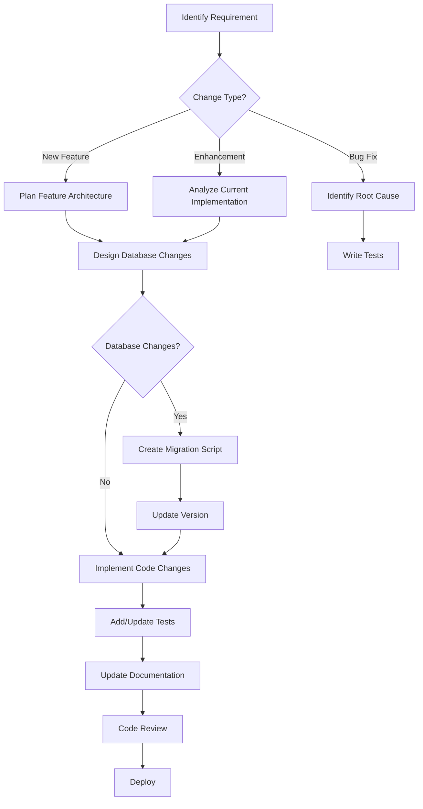

# Development Workflow

## 🚀 Getting Started

This guide outlines the development workflow for adding features, fixing bugs, and maintaining the SelfHelp Symfony Backend.

## 🔄 Development Process Overview



## 📋 Pre-Development Checklist

Before starting any development work:

1. **✅ Understand the Requirements**
   - Review specifications thoroughly
   - Identify affected components
   - Determine if database changes are needed

2. **✅ Check Existing Patterns**
   - Review similar implementations in the codebase
   - Follow established conventions and patterns
   - Reuse existing services and utilities

3. **✅ Plan the Implementation**
   - Identify required entities, services, controllers
   - Plan database schema changes
   - Design API endpoints and schemas

## 🗄️ Database Changes Workflow

### When Database Changes Are Needed

Database changes are made by adding a new Doctrine migration **after** the
canonical baseline (`migrations/Version20260601000000.php` + four
`Version20260601000100..400` seeds). Do **not** edit the baseline / seed
migrations once they have been applied, and do **not** add SQL to
`db/legacy/update_scripts/` — that folder is deprecated reference history,
not consumed by install or upgrade.

1. **Create a new migration**

   ```bash
   php bin/console doctrine:migrations:generate
   # → writes migrations/VersionYYYYMMDDHHMMSS.php
   ```

2. **Migration body — follow canonical naming**

   ```php
   public function up(Schema $schema): void
   {
       $this->addSql(<<<SQL
           CREATE TABLE `user_profiles` (
             `id` INT NOT NULL AUTO_INCREMENT,
             `id_users` INT NOT NULL,
             `profile_data` JSON DEFAULT NULL,
             `created_at` DATETIME NOT NULL DEFAULT CURRENT_TIMESTAMP,
             PRIMARY KEY (`id`),
             KEY `idx_user_profiles_id_users` (`id_users`),
             CONSTRAINT `fk_user_profiles_id_users`
               FOREIGN KEY (`id_users`) REFERENCES `users` (`id`) ON DELETE CASCADE
           ) ENGINE=InnoDB DEFAULT CHARSET=utf8mb4
       SQL);

       $this->addSql(
           "INSERT INTO `lookups` (`type_code`, `lookup_code`, `lookup_value`) VALUES
            ('profile_types', 'personal', 'Personal Profile'),
            ('profile_types', 'business', 'Business Profile')"
       );
   }
   ```

   - Tables: plural `lowercase_snake_case`.
   - Primary key: `id`.
   - Foreign keys: `id_<target_table>` (`id_users`, `id_page_types`, …).
   - Self-references: explicit (`id_parent_page`, `id_child_section`, …).
   - Pure relation tables: `rel_<a>_<b>` in alphabetical order, composite PK.
   - Indexes / FKs / uniques: `idx_*`, `fk_*`, `uq_*` in
     `lowercase_snake_case`.

3. **Adding API routes**

   API routes live in the `api_routes` table and the `rel_api_routes_permissions`
   link table. To add a new route, insert into both from the same migration:

   ```php
   $this->addSql(
       "INSERT INTO `api_routes`
        (`route_name`, `version`, `path`, `controller`, `methods`, `params`)
        VALUES
        ('admin_get_user_profiles', 'v1',
         '/admin/users/{userId}/profiles',
         'App\\\\Controller\\\\AdminUserProfileController::getProfiles',
         'GET',
         '{\\\"userId\\\":{\\\"in\\\":\\\"path\\\",\\\"required\\\":true,\\\"type\\\":\\\"integer\\\"}}')
       "
   );
   $this->addSql(
       "INSERT INTO `rel_api_routes_permissions` (`id_api_routes`, `id_permissions`)
        SELECT r.id, p.id
        FROM `api_routes` r JOIN `permissions` p
        ON r.route_name = 'admin_get_user_profiles' AND p.name = 'admin.user.read'"
   );
   ```

   After the migration runs in your env, refresh the route cache with
   `php bin/console cache:clear-api-routes`.

### When Only Code Changes Are Needed

Code-only changes require a **patch version increment** (e.g., 7.5.1 → 7.5.2):

- Bug fixes
- Performance improvements
- Code refactoring
- New features without database changes

## 🏗️ Entity Development

### Creating New Entities

1. **Follow Entity Rules** (print "ENTITY RULE" when designing):
   ```php
   <?php
   namespace App\Entity;
   
   use Doctrine\ORM\Mapping as ORM;
   
   #[ORM\Entity(repositoryClass: UserProfileRepository::class)]
   #[ORM\Table(name: 'user_profiles')]
   class UserProfile
   {
       #[ORM\Id]
       #[ORM\GeneratedValue]
       #[ORM\Column(type: 'integer')]
       private ?int $id = null;
   
       #[ORM\ManyToOne(targetEntity: User::class)]
       #[ORM\JoinColumn(name: 'id_users', referencedColumnName: 'id', onDelete: 'CASCADE')]
       private ?User $user = null;
   
       #[ORM\Column(type: 'json', nullable: true)]
       private ?array $profileData = null;
   
       // Getters and setters...
   }
   // ENTITY RULE
   ```

2. **Use Association Objects** (not primitive foreign keys):
   ```php
   // ❌ Wrong - primitive foreign key
   private ?int $idUsers = null;
   public function setIdUsers(?int $idUsers): self { }
   
   // ✅ Correct - association object
   private ?User $user = null;
   public function setUser(?User $user): self { }
   ```

3. **Sync with Database Structure**
   - Check `db/structure_db.sql` for table definitions
   - Ensure entity fields match database columns
   - Use correct data types and constraints

## 🔧 Service Development

### Service Architecture Pattern

1. **Extend BaseService**
   ```php
   <?php
   namespace App\Service\CMS\Admin;
   
   use App\Service\Core\BaseService;
   use App\Service\Core\TransactionService;
   
   class AdminUserProfileService extends BaseService
   {
       public function __construct(
           private readonly UserProfileRepository $userProfileRepository,
           private readonly EntityManagerInterface $entityManager,
           private readonly TransactionService $transactionService
       ) {}
   }
   ```

2. **Implement Transaction Management**
   ```php
   public function createUserProfile(User $user, array $profileData): UserProfile
   {
       $this->entityManager->beginTransaction();
       
       try {
           $profile = new UserProfile();
           $profile->setUser($user);
           $profile->setProfileData($profileData);
           
           $this->entityManager->persist($profile);
           $this->entityManager->flush();
           
           // Log transaction
           $this->transactionService->logTransaction(
               LookupService::TRANSACTION_TYPES_INSERT,
               LookupService::TRANSACTION_BY_BY_USER,
               'user_profiles',
               $profile->getId(),
               $profile,
               'User profile created for user: ' . $user->getUsername()
           );
           
           $this->entityManager->commit();
           return $profile;
           
       } catch (\Exception $e) {
           $this->entityManager->rollback();
           throw $e;
       }
   }
   ```

3. **Follow Service Patterns**
   - Wrap CUD operations in transactions
   - Log all transactions
   - Use proper error handling
   - Return entities or arrays, not responses

## 🎮 Controller Development

### Controller Architecture

1. **Follow Existing Patterns**
   ```php
   <?php
   namespace App\Controller\Api\V1\Admin;
   
   use App\Controller\Trait\RequestValidatorTrait;
   use Symfony\Bundle\FrameworkBundle\Controller\AbstractController;
   
   class AdminUserProfileController extends AbstractController
   {
       use RequestValidatorTrait;
       
       public function __construct(
           private readonly AdminUserProfileService $userProfileService,
           private readonly ApiResponseFormatter $responseFormatter,
           private readonly JsonSchemaValidationService $jsonSchemaValidationService
       ) {}
   }
   ```

2. **Implement Standard CRUD Operations**
   ```php
   /**
    * Get user profiles
    * @route /admin/users/{userId}/profiles
    * @method GET
    */
   public function getProfiles(int $userId): JsonResponse
   {
       try {
           $profiles = $this->userProfileService->getProfilesByUserId($userId);
           return $this->responseFormatter->formatSuccess(
               $profiles,
               'responses/admin/users/users'
           );
       } catch (\Exception $e) {
           return $this->responseFormatter->formatError(
               $e->getMessage(),
               $e->getCode() ?: Response::HTTP_INTERNAL_SERVER_ERROR
           );
       }
   }
   
   /**
    * Create user profile
    * @route /admin/users/{userId}/profiles
    * @method POST
    */
   public function createProfile(Request $request, int $userId): JsonResponse
   {
       try {
           $validatedData = $this->validateRequest(
               $request,
               'requests/admin/create_user_profile',
               $this->jsonSchemaValidationService
           );
           
           $profile = $this->userProfileService->createUserProfile($userId, $validatedData);
           
           return $this->responseFormatter->formatSuccess(
               $profile,
               'responses/admin/users/user',
               Response::HTTP_CREATED
           );
           
       } catch (RequestValidationException $e) {
           return $this->responseFormatter->formatError(
               'Validation failed',
               Response::HTTP_BAD_REQUEST,
               $e->getValidationErrors()
           );
       } catch (\Exception $e) {
           return $this->responseFormatter->formatError(
               $e->getMessage(),
               $e->getCode() ?: Response::HTTP_INTERNAL_SERVER_ERROR
           );
       }
   }
   ```

3. **Controller Best Practices**
   - Keep controllers thin (delegate to services)
   - Use consistent error handling
   - Validate all inputs with JSON schemas
   - Return standardized responses
   - Handle exceptions gracefully

## 📋 JSON Schema Development

### Request Schemas
```json
{
  "$schema": "http://json-schema.org/draft-07/schema#",
  "type": "object",
  "required": ["profileType", "profileData"],
  "properties": {
    "profileType": {
      "type": "string",
      "enum": ["PERSONAL", "BUSINESS"]
    },
    "profileData": {
      "type": "object",
      "properties": {
        "firstName": {"type": "string", "maxLength": 100},
        "lastName": {"type": "string", "maxLength": 100},
        "bio": {"type": "string", "maxLength": 1000}
      },
      "required": ["firstName", "lastName"]
    }
  }
}
```

### Response Schemas
```json
{
  "$schema": "http://json-schema.org/draft-07/schema#",
  "type": "object",
  "properties": {
    "id": {"type": "integer"},
    "userId": {"type": "integer"},
    "profileType": {"type": "string"},
    "profileData": {"type": "object"},
    "createdAt": {"type": "string", "format": "date-time"}
  },
  "required": ["id", "userId", "profileType", "createdAt"]
}
```

## 🧪 Testing Strategy

### Test Development Workflow

1. **Write Tests First** (TDD approach)
   ```php
   <?php
   namespace App\Tests\Service\CMS\Admin;
   
   class AdminUserProfileServiceTest extends KernelTestCase
   {
       public function testCreateUserProfile(): void
       {
           $user = $this->createTestUser();
           $profileData = [
               'profileType' => 'PERSONAL',
               'profileData' => [
                   'firstName' => 'John',
                   'lastName' => 'Doe'
               ]
           ];
           
           $profile = $this->userProfileService->createUserProfile($user, $profileData);
           
           $this->assertInstanceOf(UserProfile::class, $profile);
           $this->assertEquals($user->getId(), $profile->getUser()->getId());
           $this->assertEquals('PERSONAL', $profile->getProfileType());
       }
   }
   ```

2. **Test on Real Database** (no mocking data)
   ```php
   public function testApiEndpoint(): void
   {
       $this->client->request('POST', '/cms-api/v1/admin/users/1/profiles', [
           'json' => [
               'profileType' => 'PERSONAL',
               'profileData' => ['firstName' => 'John', 'lastName' => 'Doe']
           ],
           'headers' => ['Authorization' => 'Bearer ' . $this->getAuthToken()]
       ]);
       
       $this->assertResponseStatusCodeSame(201);
       $this->assertResponseHeaderSame('content-type', 'application/json');
   }
   ```

## 📚 Documentation Updates

### Required Documentation Updates

1. **Update API Routes List**
   - Add a new Doctrine migration that inserts the route into `api_routes`
     and links it in `rel_api_routes_permissions` (see "Adding API routes"
     above). Do **not** rely on `db/legacy/update_scripts/api_routes.sql` —
     that file is no longer wired into install/upgrade.
   - Document route parameters and responses.

2. **Update Entity Documentation**
   - Document new entities and relationships
   - Update database schema documentation

3. **Update Service Documentation**
   - Document new service methods
   - Include usage examples

4. **Update README Files**
   - Update feature lists
   - Add migration notes for breaking changes

## 🔍 Code Review Checklist

### Before Submitting for Review

- [ ] **Database Changes**
  - [ ] Migration script created with proper version update
  - [ ] All changes documented in script comments
  - [ ] Indexes added for new columns
  - [ ] Foreign key constraints properly defined

- [ ] **Entity Development**
  - [ ] Entities follow established patterns
  - [ ] Association objects used (not primitive foreign keys)
  - [ ] Proper ORM annotations
  - [ ] "ENTITY RULE" comment added

- [ ] **Service Development**
  - [ ] Transaction management implemented
  - [ ] All CUD operations logged via TransactionService
  - [ ] Proper error handling with rollback
  - [ ] Services return entities/arrays, not responses

- [ ] **Controller Development**
  - [ ] Request validation with JSON schemas
  - [ ] Consistent error handling
  - [ ] Standardized response formatting
  - [ ] Proper HTTP status codes

- [ ] **API Development**
  - [ ] Routes added to database
  - [ ] JSON schemas created for requests/responses
  - [ ] Proper permissions assigned
  - [ ] Documentation updated

- [ ] **Testing**
  - [ ] Unit tests for services
  - [ ] Integration tests for controllers
  - [ ] Tests use real database (no mocking)
  - [ ] All tests pass

## 🚀 Deployment Process

### Pre-Deployment Checklist

1. **Migration Status**
   ```bash
   # Show every Doctrine migration and whether it has been applied
   php bin/console doctrine:migrations:status
   php bin/console doctrine:migrations:list
   ```

2. **Database Migration**
   ```bash
   # Run pending migrations on staging first, then production
   php bin/console doctrine:migrations:migrate --no-interaction

   # Verify schema matches entity mappings
   php bin/console doctrine:schema:validate
   ```

3. **Code Deployment**
   ```bash
   # Deploy code
   git pull origin main
   
   # Clear caches
   php bin/console cache:clear --env=prod
   
   # Verify health
   curl -X GET https://api.example.com/cms-api/v1/health
   ```

### Post-Deployment Verification

1. **API Health Check**
   ```bash
   curl -X GET https://api.example.com/cms-api/v1/health
   ```

2. **Database Migration Check**
   ```bash
   php bin/console doctrine:migrations:status
   php bin/console doctrine:schema:validate
   ```

3. **New Feature Testing**
   ```bash
   # Test new endpoints
   curl -X GET https://api.example.com/cms-api/v1/admin/users/1/profiles \
        -H "Authorization: Bearer $TOKEN"
   ```

## 🔧 Development Tools & Commands

### Useful Symfony Commands
```bash
# Clear cache
php bin/console cache:clear

# Run tests
php bin/phpunit

# Check routes
php bin/console debug:router

# Generate entity
php bin/console make:entity

# Validate database schema
php bin/console doctrine:schema:validate
```

### Database Commands
```bash
# Connect to database
mysql -u username -p database_name

# Export structure
mysqldump -u username -p --no-data database_name > structure.sql

# Run migration
mysql -u username -p database_name < migration_script.sql
```

## 🚨 Common Pitfalls to Avoid

1. **❌ Don't Mock Data in Tests**
   - Always test against real database
   - Use test database for integration tests

2. **❌ Don't Skip Transaction Logging**
   - All CUD operations must be logged
   - Use TransactionService for audit trail

3. **❌ Don't Use Primitive Foreign Keys**
   - Use association objects for relationships
   - Follow established entity patterns

4. **❌ Don't Skip Version Updates**
   - Always update version in migration scripts
   - Follow semantic versioning rules

5. **❌ Don't Skip JSON Schema Validation**
   - Validate all API requests and responses
   - Create schemas for new endpoints

---

This development workflow ensures consistency, maintainability, and quality across the SelfHelp Symfony Backend codebase. Always refer to existing implementations for patterns and follow the established conventions.