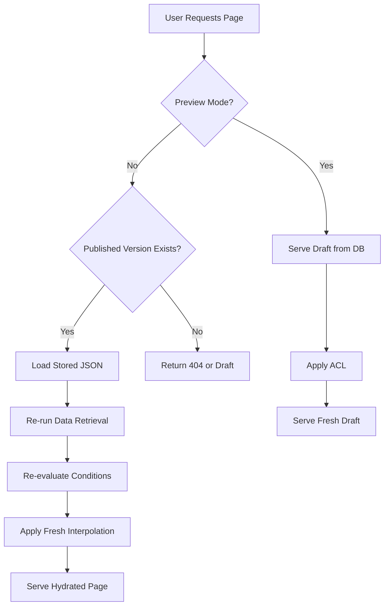

# Page Versioning & Publishing System

## 📋 Overview

The Page Versioning & Publishing System provides a robust, hybrid approach to managing page versions and publishing workflows. This system stores complete page structures while dynamically refreshing data to ensure users always see the most current information.

## 🎯 Key Features

- **Hybrid Versioning**: Store page structure while re-running dynamic elements (data retrieval, conditions)
- **Complete JSON Storage**: Store all languages, conditions, data table configs in published versions
- **Fresh Data**: Data tables are re-queried when serving published versions
- **Version Comparison**: Multiple diff formats (unified, side-by-side, JSON Patch, summary)
- **Retention Policies**: Automated cleanup of old versions
- **Security**: Draft exposure prevention with proper headers

## 🏗️ Architecture

### Hybrid Serving Approach



### What Gets Stored vs. What Gets Re-run

**Stored in Published JSON:**
- Page metadata (id, keyword, url, etc.)
- Section structure and hierarchy
- Field configurations and properties
- Translation content for all languages
- Data table configurations
- Condition definitions
- Style configurations

**Re-run Dynamically:**
- Data retrieval from data tables (using stored configs)
- Condition evaluation (user permissions, business logic)
- Variable interpolation with fresh data
- Cache invalidation logic

## 🗄️ Database Schema

### page_versions Table

```sql
CREATE TABLE `page_versions` (
  `id` INT AUTO_INCREMENT NOT NULL,
  `id_pages` INT NOT NULL,
  `version_number` INT NOT NULL,
  `version_name` VARCHAR(255) DEFAULT NULL,
  `page_json` JSON NOT NULL,
  `created_by` INT DEFAULT NULL,
  `created_at` DATETIME NOT NULL DEFAULT CURRENT_TIMESTAMP,
  `published_at` DATETIME DEFAULT NULL,
  `metadata` JSON DEFAULT NULL,
  PRIMARY KEY (`id`),
  UNIQUE KEY `uniq_page_version_number` (`id_pages`, `version_number`),
  KEY `idx_id_pages` (`id_pages`),
  KEY `idx_created_by` (`created_by`),
  KEY `idx_created_at` (`created_at`),
  KEY `idx_published_at` (`published_at`),
  CONSTRAINT `fk_page_versions_pages` FOREIGN KEY (`id_pages`) REFERENCES `pages` (`id`) ON DELETE CASCADE,
  CONSTRAINT `fk_page_versions_users` FOREIGN KEY (`created_by`) REFERENCES `users` (`id`) ON DELETE SET NULL
) ENGINE=InnoDB DEFAULT CHARSET=utf8mb4 COLLATE=utf8mb4_unicode_ci;
```

### pages Table Update

```sql
ALTER TABLE `pages` 
  ADD COLUMN `published_version_id` INT DEFAULT NULL,
  ADD KEY `idx_published_version_id` (`published_version_id`),
  ADD CONSTRAINT `fk_pages_published_version` FOREIGN KEY (`published_version_id`) REFERENCES `page_versions` (`id`) ON DELETE SET NULL;
```

## 🔌 API Endpoints

### Admin Endpoints

#### Publish New Version
```http
POST /cms-api/v1/admin/pages/{page_id}/versions/publish
Content-Type: application/json

{
  "version_name": "Release v1.2",
  "metadata": {
    "description": "Added new feature X",
    "tags": ["release", "feature-x"]
  }
}
```

#### Publish Specific Version
```http
POST /cms-api/v1/admin/pages/{page_id}/versions/{version_id}/publish
```

#### Unpublish Page
```http
POST /cms-api/v1/admin/pages/{page_id}/versions/unpublish
```

#### List Versions
```http
GET /cms-api/v1/admin/pages/{page_id}/versions?limit=10&offset=0
```

#### Get Version Details
```http
GET /cms-api/v1/admin/pages/{page_id}/versions/{version_id}?include_page_json=true
```

#### Compare Versions
```http
GET /cms-api/v1/admin/pages/{page_id}/versions/compare/{v1}/{v2}?format=unified
```

Supported formats:
- `unified`: Unified diff format (default)
- `side_by_side`: Side-by-side HTML comparison
- `json_patch`: JSON Patch (RFC 6902) format
- `summary`: High-level summary of changes

#### Delete Version
```http
DELETE /cms-api/v1/admin/pages/{page_id}/versions/{version_id}
```

### Frontend Endpoints

#### Get Page (with Versioning Support)
```http
GET /cms-api/v1/pages/{page_id}?preview=false&language_id=1
```

Parameters:
- `preview`: Set to `true` to force draft serving (requires authentication)
- `language_id`: Optional language ID for translations

**Security Headers for Preview Mode:**
- `Cache-Control: no-store, no-cache, must-revalidate, max-age=0`
- `Pragma: no-cache`
- `Expires: 0`
- `X-Robots-Tag: noindex, nofollow`

## 💻 Service Layer

### PageVersionService

```php
use App\Service\CMS\Admin\PageVersionService;

// Create a new version
$version = $pageVersionService->createVersion(
    $pageId,
    'Version Name',
    ['description' => 'Change summary'],
    $languageId
);

// Publish a version
$publishedVersion = $pageVersionService->publishVersion($pageId, $versionId);

// Create and publish in one step
$version = $pageVersionService->createAndPublishVersion(
    $pageId,
    'Release v1.0',
    ['tags' => ['release']]
);

// Unpublish
$pageVersionService->unpublishPage($pageId);

// Get published version
$publishedVersion = $pageVersionService->getPublishedVersion($pageId);

// Get version history
$history = $pageVersionService->getVersionHistory($pageId, $limit, $offset);

// Compare versions
$comparison = $pageVersionService->compareVersions($v1Id, $v2Id, 'unified');

// Apply retention policy
$deletedCount = $pageVersionService->applyRetentionPolicy($pageId, $keepCount = 10);
```

### PageService (Modified)

```php
use App\Service\CMS\Frontend\PageService;

// Get page (respects published version)
$page = $pageService->getPage($pageId, $languageId, $preview = false);

// Force draft serving
$draft = $pageService->getPage($pageId, $languageId, $preview = true);
```

## 🔧 Utilities

### JsonNormalizer

```php
use App\Util\JsonNormalizer;

// Normalize JSON for consistent comparison
$normalized = JsonNormalizer::normalize($data);

// Get difference summary
$summary = JsonNormalizer::getDifferenceSummary($data1, $data2);

// Create diff-friendly structure
$grouped = JsonNormalizer::createDiffFriendlyStructure($pageData);
```

## 🎨 Console Commands

### Retention Policy Command

```bash
# Apply retention policy to all pages (keep last 10 versions)
php bin/console app:page-version:retention --keep=10

# Apply to specific page
php bin/console app:page-version:retention --keep=20 --page=5

# Dry run (show what would be deleted)
php bin/console app:page-version:retention --keep=10 --dry-run
```

## 🔒 Security Considerations

### Access Control
- Admin endpoints require `admin.page_version.*` permissions
- Preview/draft mode requires proper page ACL
- Published pages use standard page ACL

### Draft Exposure Prevention
- Draft content NEVER exposed to public users
- Preview mode sets `no-cache` headers
- `X-Robots-Tag: noindex` prevents search engine indexing
- 404 returned for unpublished pages (no draft fallback for public)

### Data Integrity
- Version numbers are sequential and unique per page
- Only one published version per page at a time
- Published versions cannot be deleted (must unpublish first)
- All operations logged via TransactionService

## 📊 Version Comparison Formats

### Unified Diff
Standard diff format showing line-by-line changes.

### Side-by-Side
HTML diff with side-by-side comparison, highlighting word-level changes.

### JSON Patch (RFC 6902)
Structured patch operations:
```json
[
  {"op": "add", "path": "/sections/0/title", "value": "New Title"},
  {"op": "remove", "path": "/sections/1"},
  {"op": "replace", "path": "/sections/2/content", "value": "Updated"}
]
```

### Summary
High-level change summary:
```json
{
  "are_equal": false,
  "changes": [
    {"path": "sections.0.title", "type": "value_change", "old_value": "Old", "new_value": "New"},
    {"path": "sections.1", "type": "removal"},
    {"path": "sections.3", "type": "addition", "value": {...}}
  ]
}
```

## 🧪 Testing

### Running Tests

```bash
# Run all versioning tests
vendor/bin/phpunit --group versioning

# Run service tests
vendor/bin/phpunit tests/Service/CMS/Admin/PageVersionServiceTest.php

# Run controller tests
vendor/bin/phpunit tests/Controller/Api/V1/Admin/PageVersionControllerTest.php
```

### Test Coverage
- ✅ Version creation
- ✅ Version publishing/unpublishing
- ✅ Version comparison
- ✅ Retention policies
- ✅ Security validation
- ✅ API endpoints
- ✅ Hybrid serving logic

## 📈 Performance Optimization

### Caching Strategy
- Published versions cached with proper entity scopes
- Draft versions cached separately with user/language scopes
- Data table entity scopes for cache invalidation

### Storage Optimization
- MySQL 8 JSON type with native operations
- Indexed columns for fast queries
- Automated retention policies

### Query Optimization
- Batch operations for version history
- Efficient JSON comparisons
- Indexed foreign keys

## 🚀 Best Practices

1. **Version Names**: Use descriptive names and semantic versioning
2. **Metadata**: Include change summaries, tags, and relevant context
3. **Retention**: Set reasonable retention policies (10-20 versions)
4. **Testing**: Always test in preview mode before publishing
5. **Monitoring**: Track version creation frequency and storage usage

## 📝 Example Workflow

```php
// 1. Create and publish a new version
$version = $pageVersionService->createAndPublishVersion(
    $pageId,
    'Homepage Update - Feb 2025',
    [
        'description' => 'Updated hero section and added testimonials',
        'tags' => ['design-update', 'content-refresh'],
        'author' => 'John Doe'
    ]
);

// 2. Verify it's published
$publishedVersion = $pageVersionService->getPublishedVersion($pageId);
assert($publishedVersion->getId() === $version->getId());

// 3. Users now see published version
$page = $pageService->getPage($pageId); // Serves published version

// 4. Developers can preview changes
$draft = $pageService->getPage($pageId, null, true); // Serves draft

// 5. Compare with previous version
$comparison = $pageVersionService->compareVersions(
    $previousVersionId,
    $version->getId(),
    'side_by_side'
);

// 6. Apply retention policy
$deletedCount = $pageVersionService->applyRetentionPolicy($pageId, 10);
```

## 🔍 Troubleshooting

### Version Not Serving
- Check if version is published: `$version->isPublished()`
- Verify page has `published_version_id` set
- Check cache invalidation

### Draft Exposed to Public
- Verify security headers are set
- Check preview parameter handling
- Validate ACL permissions

### High Storage Usage
- Run retention policy command
- Review version creation frequency
- Consider compression for large pages

## 📚 Related Documentation

- [Transaction Logging](./12-transaction-logging.md)
- [API Security Architecture](../api-security-architecture.md)
- [CMS Architecture](./08-cms-architecture.md)
- [Development Workflow](./14-development-workflow.md)

