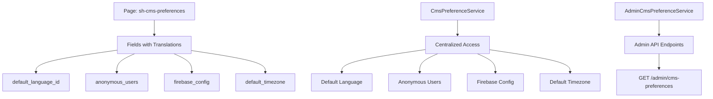

# CMS Preferences and Timezone Management

## 📄 Overview

The SelfHelp Symfony Backend includes a comprehensive CMS preferences system that manages global application settings through a page-based configuration. This system provides centralized management for default language, timezone settings, anonymous user access, and Firebase configuration, ensuring consistent behavior across the entire application.

## 🏗️ Architecture

### Page-Based Configuration System

CMS preferences are stored using the existing page-based content management system with a special reserved page keyword `sh-cms-preferences`. This approach leverages the existing multi-language field system while providing a unified interface for global application settings.



### Database Structure

#### CMS Preferences Page
The CMS preferences are stored in the standard page structure:

```sql
-- Page structure (inherited from existing CMS)
CREATE TABLE `pages` (
  `id` int NOT NULL AUTO_INCREMENT,
  `keyword` varchar(100) NOT NULL UNIQUE, -- 'sh-cms-preferences'
  -- ... other page fields
);

-- Field translations for preferences
CREATE TABLE `pages_fields_translation` (
  `id_pages` int NOT NULL,
  `id_fields` int NOT NULL,
  `id_languages` int NOT NULL,
  `content` text,
  -- ... other fields
);
```

#### Field Configuration
```sql
-- CMS preference fields
INSERT INTO `fields` (`name`, `id_type`, `display`) VALUES
('default_language_id', (SELECT id FROM fieldTypes WHERE name = 'SELECT'), 1),
('anonymous_users', (SELECT id FROM fieldTypes WHERE name = 'NUMBER'), 1),
('firebase_config', (SELECT id FROM fieldTypes WHERE name = 'TEXTAREA'), 1),
('default_timezone', (SELECT id FROM fieldTypes WHERE name = 'select-timezone'), 1);
```

#### Timezone Data
Timezones are stored in the lookups table with comprehensive coverage:

```sql
CREATE TABLE `lookups` (
  `id` int NOT NULL AUTO_INCREMENT,
  `type_code` varchar(50) NOT NULL,
  `lookup_code` varchar(100) NOT NULL,
  `lookup_value` varchar(255) DEFAULT NULL,
  `description` text,
  PRIMARY KEY (`id`),
  KEY `IDX_type_code` (`type_code`)
);

-- Timezone entries example
INSERT INTO `lookups` (`type_code`, `lookup_code`, `lookup_value`, `description`) VALUES
('timezones', 'Europe/Zurich', 'Zurich (CET/CEST)', 'Central European Time - UTC+1/+2'),
('timezones', 'America/New_York', 'Eastern Time (ET)', 'Eastern Time Zone - UTC-5/-4'),
('timezones', 'Asia/Tokyo', 'Japan Standard Time (JST)', 'Japan Standard Time - UTC+9'),
-- ... comprehensive timezone coverage
```

## 🔧 Core Services

### CmsPreferenceService

The centralized service for accessing CMS preferences with intelligent caching and fallback handling.

```php
<?php
namespace App\Service\CMS;

use App\Service\Cache\Core\CacheService;
use App\Service\Core\BaseService;

/**
 * Centralized service for managing CMS preferences from sh-cms-preferences page
 *
 * This service consolidates all CMS preference operations to eliminate duplication
 * between different services that need to access CMS preferences.
 */
class CmsPreferenceService extends BaseService
{
    public const SH_CMS_PREFERENCES_KEYWORD = 'sh-cms-preferences';
    private const PF_DEFAULT_LANGUAGE_ID = 'default_language_id';
    private const PF_ANONYMOUS_USERS = 'anonymous_users';
    private const PF_FIREBASE_CONFIG = 'firebase_config';
    private const PF_DEFAULT_TIMEZONE = 'default_timezone';

    public function __construct(
        private readonly EntityManagerInterface $entityManager,
        private readonly PageRepository $pageRepository,
        private readonly CacheService $cache
    ) {}

    /**
     * Get CMS preferences from the page-based system
     *
     * @return array Array containing all CMS preference values
     */
    public function getCmsPreferences(): array
    {
        $cacheKey = "cms_preferences_all";
        $preferencesPage = $this->getPreferencesPage();

        if (!$preferencesPage) {
            return $this->getDefaultPreferences();
        }

        return $this->cache
            ->withCategory(CacheService::CATEGORY_CMS_PREFERENCES)
            ->withEntityScope(CacheService::ENTITY_SCOPE_PAGE, $preferencesPage->getId())
            ->getItem($cacheKey, function () use ($preferencesPage) {
                $fieldValues = $this->getAllPageFieldValues($preferencesPage);

                return [
                    'id' => $preferencesPage->getId(),
                    'default_language_id' => $fieldValues[self::PF_DEFAULT_LANGUAGE_ID] ?? null,
                    'anonymous_users' => (int) ($fieldValues[self::PF_ANONYMOUS_USERS] ?? 0),
                    'firebase_config' => $fieldValues[self::PF_FIREBASE_CONFIG] ?? null,
                    'default_timezone' => $fieldValues[self::PF_DEFAULT_TIMEZONE] ?? 'Europe/Zurich'
                ];
            });
    }

    /**
     * Get default language ID
     */
    public function getDefaultLanguageId(): ?int
    {
        $preferences = $this->getCmsPreferences();
        return $preferences['default_language_id'] ? (int) $preferences['default_language_id'] : null;
    }

    /**
     * Get anonymous users count
     */
    public function getAnonymousUsers(): int
    {
        $preferences = $this->getCmsPreferences();
        return $preferences['anonymous_users'];
    }

    /**
     * Get Firebase config
     */
    public function getFirebaseConfig(): ?string
    {
        $preferences = $this->getCmsPreferences();
        return $preferences['firebase_config'];
    }

    /**
     * Get default timezone
     */
    public function getDefaultTimezone(): string
    {
        $preferences = $this->getCmsPreferences();
        return $preferences['default_timezone'] ?: 'Europe/Zurich';
    }

    /**
     * Clear user data caches when CMS preferences change
     *
     * This method should be called when CMS preferences that affect user data
     * (like default language or timezone) are updated.
     */
    public function invalidateUserDataCaches(): void
    {
        $this->cache
            ->withCategory(CacheService::CATEGORY_USERS)
            ->invalidateAllListsInCategory();
    }
}
```

### AdminCmsPreferenceService

Admin-specific service providing cached access to CMS preferences for the admin interface.

```php
<?php
namespace App\Service\CMS\Admin;

use App\Service\CMS\CmsPreferenceService;
use App\Service\Cache\Core\CacheService;

class AdminCmsPreferenceService extends BaseService
{
    private const SH_CMS_PREFERENCES_KEYWORD = 'sh-cms-preferences';

    public function __construct(
        private readonly CmsPreferenceService $cmsPreferenceService,
        private readonly PageRepository $pageRepository,
        private readonly LanguageRepository $languageRepository,
        private readonly CacheService $cache
    ) {}

    /**
     * Get CMS preferences with entity scope caching
     */
    public function getCmsPreferences(): array
    {
        return $this->cache
            ->withCategory(CacheService::CATEGORY_CMS_PREFERENCES)
            ->getItem('cms_preferences', function () {
                $preferences = $this->cmsPreferenceService->getCmsPreferences();

                if (!$preferences || !$preferences['id']) {
                    throw new ServiceException('CMS preferences not found', Response::HTTP_NOT_FOUND);
                }

                $defaultLanguage = null;
                if ($preferences['default_language_id']) {
                    $language = $this->languageRepository->find($preferences['default_language_id']);
                    if ($language) {
                        $defaultLanguage = [
                            'id' => $language->getId(),
                            'locale' => $language->getLocale(),
                            'language' => $language->getLanguage()
                        ];
                    }
                }

                // Add entity scope for the CMS preferences page
                $this->cache
                    ->withCategory(CacheService::CATEGORY_CMS_PREFERENCES)
                    ->withEntityScope(CacheService::ENTITY_SCOPE_PAGE, $preferences['id'])
                    ->setItem('cms_preferences_scoped', [
                        'id' => $preferences['id'],
                        'default_language_id' => $preferences['default_language_id'],
                        'default_language' => $defaultLanguage,
                        'anonymous_users' => $preferences['anonymous_users'],
                        'firebase_config' => $preferences['firebase_config'],
                        'default_timezone' => $preferences['default_timezone']
                    ]);

                return [
                    'id' => $preferences['id'],
                    'default_language_id' => $preferences['default_language_id'],
                    'default_language' => $defaultLanguage,
                    'anonymous_users' => $preferences['anonymous_users'],
                    'firebase_config' => $preferences['firebase_config'],
                    'default_timezone' => $preferences['default_timezone']
                ];
            });
    }
}
```

## 🌍 Timezone Management

### Timezone Field Type

The system includes a specialized `select-timezone` field type for timezone selection:

```sql
-- Field type for timezone selection
INSERT INTO `fieldTypes` (`name`, `description`, `input_type`, `validation_rules`) VALUES
('select-timezone', 'Timezone selection dropdown', 'select', '{"required": true, "searchable": true, "clearable": false}');
```

### Comprehensive Timezone Coverage

The system provides comprehensive timezone coverage including:

#### European Timezones
- **Western European Time (WET)**: Lisbon, London, Dublin
- **Central European Time (CET)**: Berlin, Paris, Rome, Zurich, Vienna, Prague, Warsaw, Budapest, Bucharest
- **Eastern European Time (EET)**: Athens, Helsinki, Istanbul, Moscow

#### American Timezones
- **Eastern Time (ET)**: New York, Toronto, Miami
- **Central Time (CT)**: Chicago, Mexico City, Winnipeg
- **Mountain Time (MT)**: Denver, Phoenix, Edmonton
- **Pacific Time (PT)**: Los Angeles, Vancouver, Tijuana
- **Alaska Time (AKT)**: Anchorage, Juneau
- **Hawaii Time (HT)**: Honolulu

#### Asian Timezones
- **Japan Standard Time (JST)**: Tokyo, Seoul
- **China Standard Time (CST)**: Shanghai, Hong Kong, Singapore, Manila, Taipei
- **India Standard Time (IST)**: Mumbai, Delhi, Kolkata, Karachi
- **Middle East Time**: Dubai, Riyadh, Tehran, Jerusalem

#### Other Regions
- **Australia**: Sydney, Melbourne, Brisbane, Perth, Adelaide
- **South America**: São Paulo, Buenos Aires, Lima, Bogotá, Caracas, Santiago
- **Africa**: Cairo, Johannesburg, Lagos, Nairobi, Casablanca, Algiers

### Timezone Data Structure

Each timezone entry includes:
- **lookup_code**: IANA timezone identifier (e.g., "Europe/Zurich")
- **lookup_value**: Human-readable name with abbreviation (e.g., "Zurich (CET/CEST)")
- **description**: Detailed description with UTC offset information

### User Timezone Support

Users can select their preferred timezone, which is stored in the users table:

```sql
-- User timezone preference
ALTER TABLE `users` ADD COLUMN `id_timezones` INT DEFAULT NULL;
ALTER TABLE `users` ADD CONSTRAINT `FK_users_id_timezones` FOREIGN KEY (`id_timezones`) REFERENCES `lookups`(`id`);
```

## 🔌 API Endpoints

### Admin CMS Preferences API

```php
<?php
namespace App\Controller\Api\V1\Admin;

use App\Service\CMS\Admin\AdminCmsPreferenceService;
use Symfony\Component\HttpFoundation\JsonResponse;

/**
 * Admin CMS Preference Controller
 */
class AdminCmsPreferenceController extends AbstractController
{
    public function __construct(
        private readonly AdminCmsPreferenceService $adminCmsPreferenceService,
        private readonly ApiResponseFormatter $responseFormatter
    ) {}

    /**
     * Get CMS preferences
     *
     * @route /admin/cms-preferences
     * @method GET
     */
    public function getCmsPreferences(): JsonResponse
    {
        try {
            $preferences = $this->adminCmsPreferenceService->getCmsPreferences();
            return $this->responseFormatter->formatSuccess($preferences);
        } catch (\Exception $e) {
            return $this->responseFormatter->formatError(
                $e->getMessage(),
                $e->getCode() ?: Response::HTTP_INTERNAL_SERVER_ERROR
            );
        }
    }
}
```

### API Response Schema

```json
{
  "$schema": "http://json-schema.org/draft-07/schema#",
  "type": "object",
  "title": "CMS Preferences Response",
  "description": "Response schema for CMS preferences",
  "properties": {
    "id": { "type": "integer", "description": "CMS preferences ID" },
    "default_language_id": { "type": ["integer", "null"], "description": "Default language ID" },
    "default_language": {
      "type": ["object", "null"],
      "description": "Default language details",
      "properties": {
        "id": { "type": "integer", "description": "Language ID" },
        "locale": { "type": "string", "description": "Language locale" },
        "language": { "type": "string", "description": "Language name" }
      },
      "required": ["id", "locale", "language"],
      "additionalProperties": false
    },
    "anonymous_users": { "type": "integer", "description": "Allow anonymous users count" },
    "firebase_config": { "type": ["string", "null"], "description": "Firebase configuration" },
    "default_timezone": { "type": "string", "description": "Default timezone code" }
  },
  "required": ["id", "default_language_id", "default_language", "anonymous_users", "firebase_config", "default_timezone"],
  "additionalProperties": false
}
```

### User Timezone API

```http
PUT /auth/user/timezone
Content-Type: application/json

{
  "timezone_id": 123
}
```

## 🗃️ Caching Strategy

### CMS Preferences Caching

The CMS preferences system uses advanced caching with entity scope dependencies:

```php
// Main preferences cache with page entity scope
$preferences = $this->cache
    ->withCategory(CacheService::CATEGORY_CMS_PREFERENCES)
    ->withEntityScope(CacheService::ENTITY_SCOPE_PAGE, $preferencesPageId)
    ->getItem('cms_preferences', $callback);

// Scoped cache for cross-service access
$this->cache
    ->withCategory(CacheService::CATEGORY_CMS_PREFERENCES)
    ->withEntityScope(CacheService::ENTITY_SCOPE_PAGE, $preferencesPageId)
    ->setItem('cms_preferences_scoped', $scopedData);
```

### Cache Invalidation

When CMS preferences are updated, the system invalidates related caches:

```php
// Invalidate CMS preferences cache
$this->cache->invalidateEntityScope(CacheService::ENTITY_SCOPE_PAGE, $preferencesPageId);

// Invalidate user data caches when language/timezone changes
$this->cmsPreferenceService->invalidateUserDataCaches();
```

## 🔄 Integration Points

### Service Integration

Services throughout the application use `CmsPreferenceService` for accessing global settings:

```php
class SomeService extends BaseService
{
    public function __construct(
        private readonly CmsPreferenceService $cmsPreferences
    ) {}

    public function doSomething(): void
    {
        $defaultLanguage = $this->cmsPreferences->getDefaultLanguageId();
        $timezone = $this->cmsPreferences->getDefaultTimezone();
        $anonymousAllowed = $this->cmsPreferences->getAnonymousUsers() > 0;

        // Use preferences in business logic
    }
}
```

### Language and Localization

The default language setting integrates with the multi-language system:

- **Fallback Language**: Used when user language is not available
- **Content Defaulting**: New content defaults to the system default language
- **Translation Priorities**: Default language translations are prioritized in content loading

### Timezone Handling

Timezone preferences affect:

- **Date/Time Display**: All timestamps use the appropriate timezone
- **User Preferences**: Individual users can override the system default
- **Scheduling**: Background jobs respect timezone settings
- **Internationalization**: Proper time formatting for different regions

#### UTC Storage and Timezone Conversion

The system follows these timezone handling principles:

**Data Storage:**
- All datetime values are stored in UTC in the database
- Entities use `DateTimeImmutable` with explicit UTC timezone initialization
- Database columns use `datetime_immutable` type for consistency

**Data Retrieval:**
- For **paginated data** (large datasets): Timezone conversion happens in PHP loops to avoid SQL overhead
- For **non-paginated data**: Timezone conversion uses SQL `CONVERT_TZ()` function for better performance
- All API responses convert UTC times to CMS preference timezone using `CmsPreferenceService->getDefaultTimezoneCode()`

**Conversion Strategy:**
```php
// PHP loop conversion for paginated data
$cmsTimezone = new \DateTimeZone($this->cmsPreferenceService->getDefaultTimezoneCode());
foreach ($results as &$result) {
    if (isset($result['createdAt']) && $result['createdAt']) {
        $result['createdAt'] = $result['createdAt']->setTimezone($cmsTimezone);
    }
}

// SQL conversion for non-paginated queries
CONVERT_TZ(timestamp_value, 'UTC', '$timezone_code')
```

### Anonymous User Management

The anonymous users setting controls:

- **Access Control**: Whether unauthenticated users can access certain features
- **Rate Limiting**: Different limits for authenticated vs anonymous users
- **Content Visibility**: Some content may be restricted to authenticated users only

## 🚀 Recent Updates (v7.6.0 → v8.0.0)

### Timezone Support Addition

The v7.6.0 to v8.0.0 update added comprehensive timezone support:

1. **New Field Type**: `select-timezone` field type for timezone selection
2. **Timezone Data**: Comprehensive timezone coverage in lookups table
3. **User Preferences**: Users can select personal timezone preferences
4. **System Default**: CMS preferences include default timezone setting
5. **Database Schema**: Added timezone support to users table

### Migration Details

```sql
-- Add timezone field type
INSERT INTO `fieldTypes` (`name`, `position`) VALUES ('select-timezone', '8');

-- Add default timezone field to CMS preferences
INSERT INTO `fields` (`name`, `id_type`, `display`) VALUES
('default_timezone', get_field_type_id('select-timezone'), '1');

-- Set default timezone
INSERT INTO `pages_fields_translation` (`id_pages`, `id_fields`, `id_languages`, `content`) VALUES
(@id_page_cms_prefs, get_field_id('default_timezone'), '0000000001',
 (SELECT id FROM lookups WHERE type_code = 'timezones' AND lookup_code = 'Europe/Zurich'));

-- Add user timezone support
CALL add_table_column('users', 'id_timezones', 'INT DEFAULT NULL');
CALL add_foreign_key('users', 'FK_users_id_timezones', 'id_timezones', 'lookups(id)');
CALL add_index('users', 'IDX_1483A5E9F5677479', 'id_timezones', FALSE);
```

## 📋 Best Practices

### Configuration Management

1. **Page-Based Storage**: Leverage existing CMS infrastructure for preferences
2. **Multi-language Support**: Store preferences with proper language context
3. **Validation**: Use field types with appropriate validation rules
4. **Caching**: Implement proper cache invalidation strategies

### Timezone Handling

1. **IANA Compliance**: Use IANA timezone identifiers for consistency
2. **User Preferences**: Allow users to override system defaults
3. **Display Formatting**: Use proper timezone-aware date formatting
4. **DST Awareness**: Handle daylight saving time transitions correctly

### Service Integration

1. **Centralized Access**: Use `CmsPreferenceService` for all preference access
2. **Cache Awareness**: Respect cache invalidation when preferences change
3. **Fallback Values**: Provide sensible defaults when preferences are unavailable
4. **Transaction Safety**: Ensure preference updates are properly transactional

---

**Next**: [Global Cache System](./17-global-cache-system.md)
