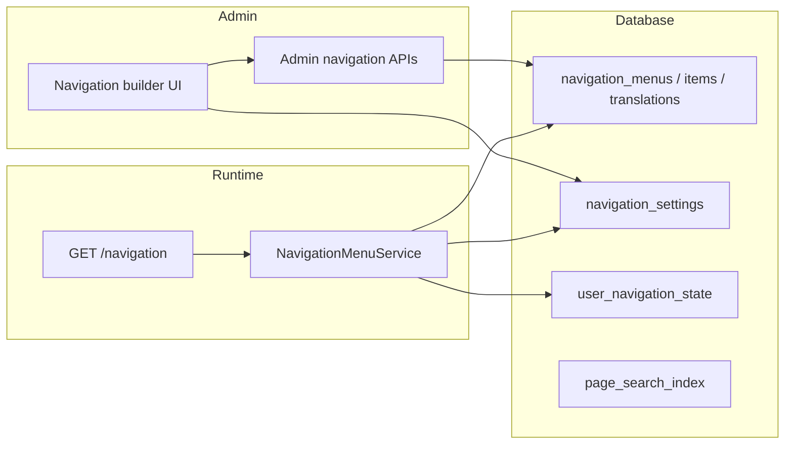

# Navigation menu builder

Audience: Developers and technical product owners.
Status: active.
Applies to: SelfHelp2 backend `0.1.33+`, frontend/mobile/shared navigation contracts.
Last verified: 2026-07-02.
Source of truth: `NavigationMenuService`, admin navigation APIs, `GET /navigation`, `@selfhelp/shared` navigation types.

## Overview

Public navigation is stored in four first-class menus (`navigation_*` tables) and resolved at runtime:

| Menu key | Platform | Surface | Consumer |
|----------|----------|---------|----------|
| `web_header` | web | header | Website header presets + burger drawer |
| `web_footer` | web | footer | Footer links |
| `mobile_drawer` | mobile | drawer | Mobile drawer content |
| `mobile_bottom_tabs` | mobile | bottom tabs | Mobile tab bar |

`GET /cms-api/v1/navigation` returns resolved menu trees, startup pages, search settings, and (for authenticated users) last-visited snapshots.

See also [28-navigation-pages-and-page-icons.md](28-navigation-pages-and-page-icons.md) for page-tree vs menu-tree and icon fields.

## Architecture

**Page tree ≠ menu tree.** The CMS page hierarchy (`id_parent_page`) is content structure only. The public menu is built exclusively from **stored** `navigation_menu_items` rows. There is no runtime virtual-child expansion.

## Menu items

Each stored item (`navigation_menu_items`) has:

- **item type** — `page`, `external_url`, or `group`
- **parent_item_id** — nested menu branch (nullable for top-level items)
- **position** — sibling order within the parent branch
- **label (page items)** — resolved from the linked page title (translatable via page fields); menu row `icon` / `mobile_icon` override page defaults per menu
- **label (group / external_url)** — stored in `navigation_menu_item_translations` per language; `navigation_menu_items.label` holds the default-language cache/fallback. Public resolve order: requested language → CMS default language → stored `label` column

Child pages appear in a menu only when an admin creates a **stored menu item** for that page (directly, via the add-page checkbox flow below, or via **Add existing child page** on a parent row).

### Adding a page with optional CMS children

When an admin adds an existing page to a menu (`POST /admin/navigation/menus/{menu_key}/items`):

1. The parent page menu item is created.
2. If the page has CMS child pages, the UI shows **checkboxes** (all checked by default):
   - direct children listed individually
   - optional **Include grandchildren** toggle for deeper descendants
3. Selected children are created as **stored menu items** under the parent menu item, ordered by **CMS page-tree order**.
4. If any selected child is already present in the same menu branch, the API returns an error (no silent skips).

**Create page here** does not show the checkbox flow (a newly created page has no children yet). Add child pages to the menu afterward via **Add existing page**, **Add existing child page** (under a parent menu row), or by creating the page under the correct CMS parent first.

### Reordering

Menu builder supports **drag-and-drop** and **Up/Down** controls among siblings at the same `parent_item_id`. Reorder persists via `PUT /admin/navigation/menus/{menu_key}/reorder`.

## Removed concepts (pre-release simplification)

The following were removed before the first public release:

| Removed | Replacement |
|---------|-------------|
| `child_source = page_children` (virtual auto-children) | Explicit stored child menu items via checkbox flow |
| `child_source = manual_plus_suggestions` | Removed — manual items only |
| `navigation_menu_item_exclusions` | Not needed — hide a page by not adding it (or remove its menu item) |
| `POST .../convert-auto-children` | Not needed — children are stored from the start when selected |
| `POST/DELETE .../exclusions` | Removed |
| Resolved `is_virtual` menu items | Removed from public payload |

Fresh installs and dev resets use **manual-only** menu items. Database seeds no longer set `page_children` on `home`.

## Groups and external links

- **group** — label-only parent; children are manual menu items. Labels are editable per language in the admin builder (`translations[]` on create/update).
- **external_url** — opens absolute URL; not tied to a page record. Same per-language label model as groups.

## Web header presets

`web_header` menus carry a **preset** lookup (`navigationHeaderPresets`):

| Preset | Structure |
|--------|-----------|
| `simple` | Flat links |
| `dropdown` | Hover dropdowns for children |
| `mega-menu` | Multi-column mega panels |
| `tabs` | Top-level tabs |
| `double-dropdown` | Two-level dropdown chrome |
| `double-mega-menu` | Nested mega layout |

On small viewports the frontend burger drawer renders the same resolved `web_header` tree.

## Mobile drawer and bottom tabs

- **Drawer** — `CmsDrawerContent` lists `mobile_drawer` items (not a static page list).
- **Bottom tabs** — `mobile_bottom_tabs` items; tab count is capped by menu `item_limit`.

There is no production fallback `menu` screen; navigation comes from the CMS payload.

## Search settings

`navigation_settings` controls header search:

- `web_header_search_mode` — `off`, `menu_pages`, `searchable_pages`, `content_index`
- `web_header_search_min_chars` — minimum query length before API calls
- `web_header_search_result_limit`, `search_default_visibility`, `search_field_policy`

Content search uses `page_search_index`, rebuilt when pages change.

## Start pages and last visited

`navigation_settings` stores guest/user start pages per platform and start modes:

- `fixed_page` — always use configured start page
- `last_visited_then_fixed_page` — resume last visited when still accessible, else fall back

Authenticated clients record visits via `PUT /navigation/last-visited` (`page_id`, optional `url`/`keyword`, `X-Client-Type: web|mobile`). Denied, deleted, headless, or inaccessible pages are rejected and omitted from startup payloads.

Per-user state lives in `user_navigation_state` (one row per user + platform).

## Route sync

Page URLs are stored in `page_routes` and kept in sync when parent pages move. `navigation_settings.id_route_sync_old_route_policy` controls legacy URL handling during imports/sync.

## Page create navigation assignments

Admin page create/update accepts `navigationAssignments` to add the new page to selected menus in one step (`NavigationAssignmentService`). Assignments always create **manual** stored menu items.

## Page bundle import/export

Bundles export/import **pages and CMS parent/child relationships** (`id_parent_page`). They do **not** export or restore menu membership — after import, assign pages to menus via the navigation builder. This avoids ordering conflicts and keeps import focused on content structure.

## Admin UI

`/admin/navigation` — menu builder with:

- menu structure list (drag + Up/Down reorder, page labels, per-menu icons)
- add existing page modal with optional child-page checkboxes
- **Add existing child page** on page/group rows (creates a stored child item under that menu branch)
- group/external modals with language-tab label editor
- settings tab (search, start pages, route sync; explicit Save)
- web header preset selector

Shareable tab URLs: `/admin/navigation?menu=web_header` (and `settings`, etc.).

## Caching

Navigation payloads are cached per user + language (`CacheService::CATEGORY_NAVIGATION`). Writes to menus, settings, or last-visited invalidate relevant scopes.

## Web header presets and depth

`web_header.preset` selects the Mantine header layout (`simple`, `dropdown`,
`mega-menu`, `tabs`, `double-dropdown`, `double-mega-menu`). Double-header presets
render a utility row (search, language, profile) above the main nav row.

`web_header.max_depth` limits nested dropdown/mega levels in the resolved tree
and in the frontend renderer; deeper page children remain reachable via the parent
page link or on-page branch navigation.

## Web footer groups

`web_footer` supports the same item types as other menus. Footer layout is stored
in menu `config.footer_layout` (`columns` default, `inline` for a flat link row)
via the navigation builder — not in the header preset lookup table.

The frontend renders top-level **group** items as footer columns (heading +
optional description + nested links). Page items use translated menu labels when
set, otherwise page titles. `aria_label` is honoured when set. External URLs open
in a new tab. Inactive items and empty groups are omitted.

## Menu-only moves vs page-tree URL sync

- **Menu reorder/move** changes only `navigation_menu_items` — page URLs and
  `page_routes` are untouched (`PageParentRouteSyncTest::testMenuReorderDoesNotChangePageUrl`).
- **Page-tree parent change** may offer **Sync URL with page parent** on create/update.
  When enabled, canonical routes update and the admin chooses whether to keep or
  remove the old route (`oldRoutePolicy`: `ask`, `keep_alias`, `remove_old_route`).

## Page search visibility

Page property `search_visibility` (`inherit` | `visible` | `hidden`) overrides the
global search policy for content/page search. The page inspector exposes friendly
labels; ACL still applies at query time.

## Example bundles

Shipped under `docs/examples/` (backend) and `examples/` (frontend catalogue):

- `hero-home.bundle.json` — seeded on untouched fresh-install `home` pages
- `mobile-onboarding.bundle.json` — importable mobile-first landing template;
  assign via Navigation → Start pages after import (not auto-seeded by default)
- CMS-in-CMS list+detail examples under `docs/examples/cms-in-cms/`

Import via admin **Import / Export** or `POST /admin/pages/import`.

## Deprecated model

Removed from active runtime (historical migrations may still mention them):

- `pages.nav_position`, `pages.footer_position`
- `navPosition` / `footerPosition` admin fields
- `web_nav_render`, `mobile_nav_render`, `GlobalDynamicNav`, `MenuPositionEditor`

## Related commands

- `php bin/console app:page-routes:check-conflicts`
- `php bin/console app:navigation:rebuild-search-index`
- `php bin/console app:seed-hero-home` (example bundle)

## Tests

- Backend: `tests/Controller/Api/V1/Frontend/Navigation*`, `tests/Integration/CMS/Navigation*`, `tests/Golden/NavigationMenuBuilderWorkflowTest.php`
- Frontend: `WebsiteHeaderRenderer.test.tsx`, `HeaderSearch.test.tsx`, `BurgerMenuClient.test.tsx`
- Mobile: `navigationMenu.test.mjs`, drawer integration via `useNavigation`
