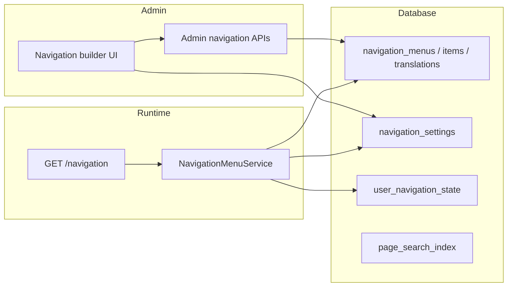

# Navigation menu builder

Audience: Developers and technical product owners.
Status: active.
Applies to: SelfHelp2 backend `0.1.33+`, frontend/mobile/shared navigation contracts (`@selfhelp/shared` `2.0.0`).
Last verified: 2026-07-06.
Source of truth: `NavigationMenuService`, admin navigation APIs, `GET /navigation`, `@selfhelp/shared` navigation types.

## Overview

Public navigation is stored in four first-class menus (`navigation_*` tables) and resolved at runtime:

| Menu key | Platform | Surface | Consumer |
|----------|----------|---------|----------|
| `web_header` | web | header | Website header presets + burger drawer |
| `web_footer` | web | footer | Footer links |
| `mobile_drawer` | mobile | drawer | Mobile drawer content |
| `mobile_bottom_tabs` | mobile | bottom tabs | Mobile tab bar |

`GET /cms-api/v1/navigation` returns resolved menu trees, startup pages, search settings, and (for authenticated users) last-visited snapshots.

See also [28-navigation-pages-and-page-icons.md](28-navigation-pages-and-page-icons.md) for page-tree vs menu-tree and icon fields.

## Architecture

**Page tree ≠ menu tree.** The CMS page hierarchy (`id_parent_page`) is content structure only. The public menu is built exclusively from **stored** `navigation_menu_items` rows. There is no runtime virtual-child expansion.

## Menu items

Each stored item (`navigation_menu_items`) has:

- **item type** — `page`, `external_url`, or `group`
- **parent_item_id** — nested menu branch (nullable for top-level items)
- **position** — sibling order within the parent branch
- **layer** — `web_header` root items only: `top` places the item in the upper
  row of double presets, `NULL` means the main nav row. Ignored (and rejected on
  write) for children and non-header menus
- **label (page items)** — resolved from the linked page title (translatable via page fields); menu row `icon` / `mobile_icon` override page defaults per menu
- **label (group / external_url)** — stored in `navigation_menu_item_translations` per language; `navigation_menu_items.label` holds the default-language cache/fallback. Public resolve order: requested language → CMS default language → stored `label` column
- **description / aria_label** — per-language presentation texts in
  `navigation_menu_item_translations`; always present in the public payload
  (`null` when unset). `description` feeds mega-menu/footer link subtext,
  `aria_label` overrides the accessible name

Child pages appear in a menu only when an admin creates a **stored menu item** for that page (directly, via the add-page checkbox flow below, or via **Add existing child page** on a parent row).

### Adding a page with optional CMS children

When an admin adds an existing page to a menu (`POST /admin/navigation/menus/{menu_key}/items`):

1. The parent page menu item is created.
2. If the page has CMS child pages, the UI shows **checkboxes** (all checked by default):
   - direct children listed individually
   - optional **Include grandchildren** toggle for deeper descendants
3. Selected children are created as **stored menu items** under the parent menu item, ordered by **CMS page-tree order**.
4. If any selected child is already present in the same menu branch, the API returns an error (no silent skips).

**Create page here** does not show the checkbox flow (a newly created page has no children yet). Add child pages to the menu afterward via **Add existing page**, **Add existing child page** (under a parent menu row), or by creating the page under the correct CMS parent first.

### Reordering

Menu builder supports **drag-and-drop** and **Up/Down** controls among siblings at the same `parent_item_id`. Reorder persists via `PUT /admin/navigation/menus/{menu_key}/reorder`.

## Removed concepts (pre-release simplification)

The following were removed before the first public release:

| Removed | Replacement |
|---------|-------------|
| `child_source = page_children` (virtual auto-children) | Explicit stored child menu items via checkbox flow |
| `child_source = manual_plus_suggestions` | Removed — manual items only |
| `navigation_menu_items.id_child_source` + `auto_include_depth` columns, `navigationChildSources` lookups | Dropped entirely (navigation overhaul migration) — all items are manual |
| `navigation_menus.config` JSON (`footer_layout` key) | Typed `id_preset` lookup on the menu (`columns` / `inline` in `navigationMenuPresets`) |
| Bundle v1.0 `n` translation key | `aria_label` (the DB column was created as `aria_label` from the start — no column rename happened) |
| `selfhelp/navigation-bundle` v1.0 | v2.0 only; v1.0 imports are rejected |
| `navigation_menu_item_exclusions` | Not needed — hide a page by not adding it (or remove its menu item) |
| `POST .../convert-auto-children` | Not needed — children are stored from the start when selected |
| `POST/DELETE .../exclusions` | Removed |
| Resolved `is_virtual` menu items | Removed from public payload |

Fresh installs and dev resets use **manual-only** menu items. Database seeds no longer set `page_children` on `home`.

## Groups and external links

- **group** — label-only parent; children are manual menu items. Labels are editable per language in the admin builder (`translations[]` on create/update).
- **external_url** — opens absolute URL; not tied to a page record. Same per-language label model as groups.

## Web header presets

`web_header` menus carry a **preset** lookup (`navigationMenuPresets`):

| Preset | Structure |
|--------|-----------|
| `simple` | Flat links |
| `dropdown` | Hover dropdowns for children |
| `mega-menu` | Multi-column mega panels |
| `tabs` | Top-level tabs |
| `double-dropdown` | Two-level dropdown chrome |
| `double-mega-menu` | Nested mega layout |

Double presets render two rows: root items with `layer = 'top'` form the upper
utility row (flat links next to search/language/profile), everything else the
main nav row. Single presets ignore `layer` and render one merged row (main
items first, then top items); the stored `layer` value survives preset
switches, so toggling back to a double preset restores the previous split.

On small viewports the frontend burger drawer renders the same resolved `web_header` tree (main items first, then a divider and the top-layer links).

## Child-page navigation (branch presentation)

How a web page presents its menu branch (siblings + children) is a typed
contract (`navigationChildrenNavModes` lookup type):

| Mode | Rendering (web) |
|------|-----------------|
| `sidebar` | Sticky left sidebar with the branch pages; collapses to a pill strip on small screens (platform default) |
| `pills` | Horizontal pill strip above the content (the pre-0.1.33 look) |
| `none` | No branch navigation chrome |

- **Menu-level default:** `navigation_menus.id_children_nav` (web menus only;
  seeded `sidebar` for `web_header`). Set via
  `PATCH /admin/navigation/menus/{key}` (`children_nav`).
- **Per-parent override:** `navigation_menu_items.id_children_nav`
  (NULL = inherit). Set via menu-item create/update (`children_nav`).
- **Breadcrumbs:** `navigation_menus.show_breadcrumbs` renders a breadcrumb
  trail above nested pages (menu-level toggle, same PATCH).
- **Payload:** web menus always emit `children_nav` + `show_breadcrumbs`;
  mobile menus emit `null`/`false` (native presentation). The navigation
  bundle v2.0 carries both.
- **Resolution** lives in `@selfhelp/shared` `branchNav`
  (`resolveWebBranchNavContext`): effective mode (item override → menu default
  → `sidebar`), branch group, breadcrumb trail, and the prev/next pager
  (neighbour page titles, auto-translated). Migration
  `Version20260706143547` (+ round-trip test) seeds the lookups and columns.

## Mobile drawer and bottom tabs

- **Drawer** — `CmsDrawerContent` lists `mobile_drawer` items (not a static page list).
- **Bottom tabs** — `mobile_bottom_tabs` items; tab count is capped by menu `item_limit`.

There is no production fallback `menu` screen; navigation comes from the CMS payload.

## Search settings

`navigation_settings` controls header search:

- `web_header_search_mode` — `off`, `menu_pages`, `searchable_pages`, `content_index`
- `web_header_search_min_chars` — minimum query length before API calls
- `web_header_search_result_limit`, `search_default_visibility`, `search_field_policy`

Content search uses `page_search_index`, rebuilt when pages change. The
`content_index` mode matches the projection in **every** language (not just the
request language) and dedupes hits per page, preferring the requested
language's title/snippet — so a German visitor typing an English title still
finds the page.

## Branding

`navigation_settings` also carries the global brand block returned as
`branding` in `GET /navigation`:

- `logo_asset_path` / `logo_alt` — asset served as the header/drawer logo
  (falls back to the plain product name when unset)
- `id_logo_link_page` — page the logo links to (`link_url` in the payload;
  home when unset)
- `logo_size` — `sm` | `md` | `lg` | `xl` (logo heights 24/32/44/56 px,
  resolved identically on web and mobile via `@selfhelp/shared`
  `resolveBrandingPresentation` / `NAVIGATION_BRANDING_LOGO_HEIGHTS`)
- `logo_variant` — `logo-and-name` (default) | `logo-only` | `name-only`

All five are accepted by `PATCH /admin/navigation/settings`
(schema-validated enums; unknown values are rejected with 422). The admin
builder's Settings tab exposes them with a live preview; the asset dropdown
refetches on open so newly uploaded assets appear without a page reload.

## Start pages and last visited

`navigation_settings` stores guest/user start pages per platform and start modes:

- `fixed_page` — always use configured start page
- `last_visited_then_fixed_page` — resume last visited when still accessible, else fall back

Authenticated clients record visits via `PUT /navigation/last-visited` (`page_id`, optional `url`/`keyword`, `X-Client-Type: web|mobile`). Denied, deleted, headless, or inaccessible pages are rejected and omitted from startup payloads.

Per-user state lives in `user_navigation_state` (one row per user + platform).

## Route sync

Page URLs are stored in `page_routes` and kept in sync when parent pages move. `navigation_settings.id_route_sync_old_route_policy` controls legacy URL handling during imports/sync.

## Page create navigation assignments

Admin page create/update accepts `navigationAssignments` to add the new page to selected menus in one step (`NavigationAssignmentService`). Assignments always create **manual** stored menu items.

## Page bundle import/export

Bundles export/import **pages and CMS parent/child relationships** (`id_parent_page`) only. Menu membership uses the separate **`selfhelp/navigation-bundle` v2.0** format via `POST /admin/navigation/export` and `POST /admin/navigation/import`. Legacy `navigation.assignments` in page bundles is warned and ignored.

### Navigation bundle export/import

- Format: `selfhelp/navigation-bundle` v2.0 (independent from `selfhelp/page-bundle` v2.0). `1.0` bundles are rejected with a clear error — there is no legacy import path.
- Menus carry `preset` / `max_depth` / `item_limit`; items carry `layer` and per-language `label` / `description` / `aria_label` translation objects. No `config` object exists anywhere in the bundle.
- Export modes: `full_snapshot` (whole menu(s)) or `branch` (selected pages + ancestor/sibling branches).
- Optional embedded `pages[]` when `include_pages` is true.
- Import options: `missing_pages_mode` (`strict` | `skip_missing` | `create_stubs`), per-menu `menu_policies` (`replace` | `merge` | `append`), optional `keyword_prefix`.
- Menu depth is capped at **three levels** (top-level + children + grandchildren) on write and in bundles (`NavigationMenuDepthSupport::MAX_LEVEL = 2`). Grandchildren render as indented sub-links in web dropdown/mega panels and as a third collapsible level in the mobile drawer; deeper page-tree descendants are flattened on bulk add.

Permissions: `admin.navigation.export`, `admin.navigation.import`.

## Example bundles

Canonical location: **`sh-selfhelp_frontend/examples/`** (`pages/`, `cms-in-cms/`, `navigation/`). The backend resolves them from the monorepo sibling path and falls back to `tests/fixtures/examples/` for CI.

- `pages/hero-home.bundle.json` — full headless landing template (hero split,
  stats band, feature cards, how-it-works, quote, CTA; de-CH + en-GB); also
  seeded on untouched fresh-install `home` pages
- `pages/mobile-onboarding.bundle.json` — mobile-first guest onboarding
  template (image hero, value points, register/login CTAs; headless)
- `cms-in-cms/team-members.bundle.json` — list+detail CMS-in-CMS demo
- `navigation/menu-demo.bundle.json` — 22-page mini-site with all four menus wired (incl. mega-menu descriptions and a three-level Services > Training branch)

Import pages via admin **Import / Export** or `POST /admin/pages/import`. Import navigation via **Navigation** export/import or `POST /admin/navigation/import`.

## Admin UI

`/admin/navigation` — menu builder with:

- menu structure list (drag + Up/Down reorder, page labels, per-menu icons)
- **Top row / Main row sections** on `web_header` double presets (drag between rows or use the row actions; top-row items cannot have children)
- add existing page modal with optional child-page checkboxes
- **Add existing child page** on page/group rows (creates a stored child item under that menu branch)
- group/external modals with language-tab label, description, and aria-label editors
- settings tab (search, start pages, route sync; explicit Save)
- web header preset selector and web footer preset selector (`columns` / `inline`)
- **child-pages navigation selector** (`sidebar` / `pills` / `none`) + breadcrumbs
  toggle on the web header tab; per-item override in the item edit modal
- page pickers label pages with their **localized title** (keyword as fallback/
  secondary line) using the admin pages `title`/`titles` fields
- bottom-tabs item counter against the menu `item_limit`

Shareable tab URLs: `/admin/navigation?menu=web_header` (and `settings`, etc.).

## Caching

Navigation payloads are cached per user + language (`CacheService::CATEGORY_NAVIGATION`). Writes to menus, settings, or last-visited invalidate relevant scopes.

## Web header presets and depth

`web_header.preset` selects the Mantine header layout (`simple`, `dropdown`,
`mega-menu`, `tabs`, `double-dropdown`, `double-mega-menu`). Double-header
presets render the top row from `layer = 'top'` root items plus the utility
controls (search, language, profile); see **Web header presets** above for the
layer merge/restore rules.

`web_header.max_depth` limits nested dropdown/mega levels in the resolved tree
and in the frontend renderer; deeper page children remain reachable via the parent
page link or on-page branch navigation.

## Web footer presets

`web_footer` supports the same item types as other menus. The footer layout is a
**preset lookup** on the menu (`columns` default, `inline` for a flat link row —
both codes live in the shared `navigationMenuPresets` lookup type), selected in
the navigation builder and returned as `preset` in the public payload — the
same mechanism as header presets. `AdminNavigationService` validates the preset
code against the menu key (header codes only on `web_header`, footer codes only
on `web_footer`, none on mobile menus).

With `columns`, top-level **group** items render as footer columns (heading +
optional description + nested links) and non-group root items as a standalone
link column. With `inline`, the tree is flattened to one link row (group
headings dropped, their children promoted) via the shared `flattenFooterItems`
helper. Page items use translated menu labels when set, otherwise page titles.
`aria_label` is honoured when set. External URLs open in a new tab. Inactive
items and empty groups are omitted.

## Menu-only moves vs page-tree URL sync

- **Menu reorder/move** changes only `navigation_menu_items` — page URLs and
  `page_routes` are untouched (`PageParentRouteSyncTest::testMenuReorderDoesNotChangePageUrl`).
- **Page-tree parent change** may offer **Sync URL with page parent** on create/update.
  When enabled, canonical routes update and the admin chooses whether to keep or
  remove the old route (`oldRoutePolicy`: `ask`, `keep_alias`, `remove_old_route`).

## Page search visibility

Page property `search_visibility` (`inherit` | `visible` | `hidden`) overrides the
global search policy for content/page search. The page inspector exposes friendly
labels; ACL still applies at query time.

## Example bundles

See the **Page bundle import/export** section above for canonical paths and bundle catalogue.

## Deprecated model

Removed from active runtime (historical migrations may still mention them):

- `pages.nav_position`, `pages.footer_position`
- `navPosition` / `footerPosition` admin fields
- `web_nav_render`, `mobile_nav_render`, `GlobalDynamicNav`, `MenuPositionEditor`

## Related commands

- `php bin/console app:page-routes:check-conflicts`
- `php bin/console app:navigation:rebuild-search-index`
- `php bin/console app:seed-hero-home` (example bundle)

## Tests

- Backend: `tests/Controller/Api/V1/Frontend/Navigation*`, `tests/Integration/CMS/Navigation*`, `tests/Golden/NavigationMenuBuilderWorkflowTest.php`
- Frontend: `WebsiteHeaderRenderer.test.tsx`, `HeaderSearch.test.tsx`, `BurgerMenuClient.test.tsx`
- Mobile: `navigationMenu.test.mjs`, drawer integration via `useNavigation`
