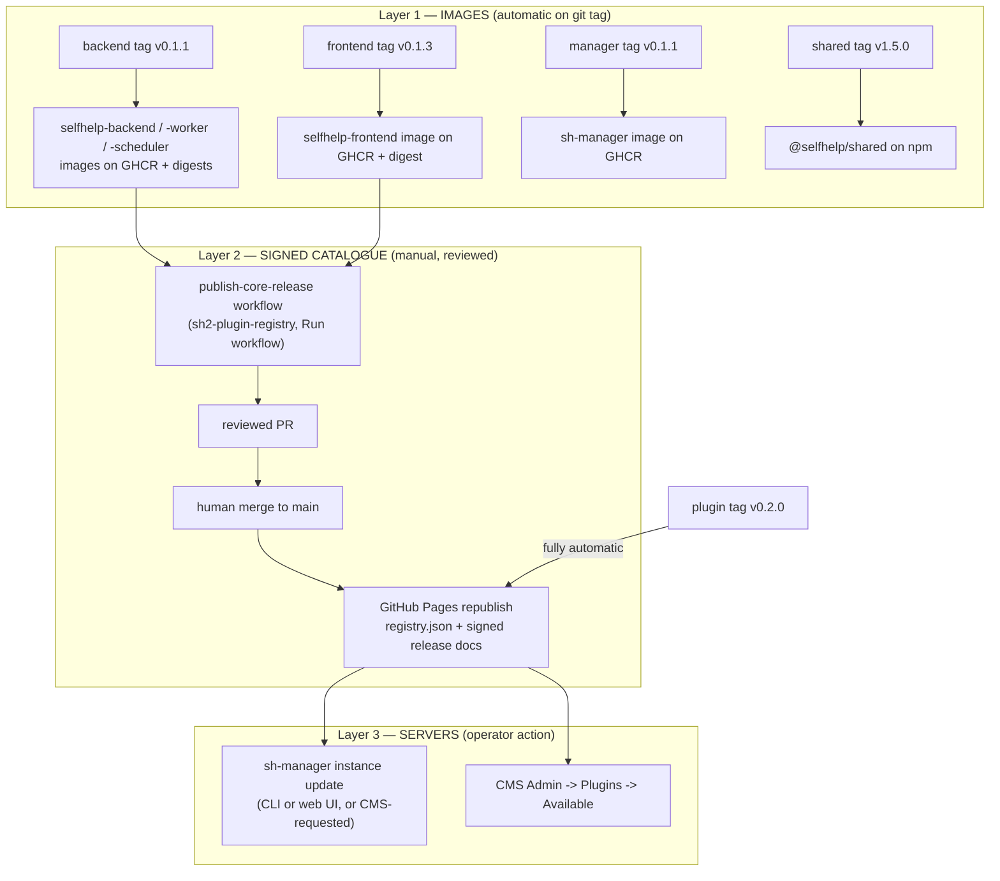

<!--
SPDX-FileCopyrightText: 2026 Humdek, University of Bern
SPDX-License-Identifier: MPL-2.0
-->

# Ecosystem release and update runbook

Audience: Release engineers, maintainers, and server operators (including first-time publishers).
Status: active.
Applies to: the whole SelfHelp ecosystem — `sh-selfhelp_backend`, `sh-selfhelp_frontend`, `sh-selfhelp_shared`, `sh-selfhelp_mobile`, `sh-manager`, `sh2-plugin-registry`, and plugin repos (e.g. `sh2-shp-survey-js`).
Last verified: 2026-06-10 (every flow below was executed for real on this date: manager `v0.1.1`, backend `v0.1.1`, frontend `v0.1.3` — all green).
Source of truth: `.github/workflows/docker-release.yml` (backend), `frontend-release.yml` + `publish-verify.yml` (frontend), `publish.yml` (shared), `release.yml` (manager), `publish-core-release.yml` + `build-registry.yml` (registry), `config/services.yaml`, `release/frontend-release.template.json` (frontend), `registry.json` + `releases/**` (registry), and the manager `packages/*` + `apps/*` sources.

This is the **one end-to-end page**: what to bump, what to tag, what runs by
itself, what stays manual (and why), where every "required version of the
other repo" lives, and how a published release finally lands on a running
server — by CLI and by GUI.

Deep references it links into: the registry's
[release runbook](https://github.com/humdek-unibe-ch/sh2-plugin-registry/blob/main/docs/operations/release-runbook.md)
(signing/keys/secrets detail), the backend
[cross-repo compatibility matrix](../developer/cross-repo-compatibility-matrix.md)
(contract-change rules), and the
[platform & plugin ecosystem map](platform-and-plugin-ecosystem.md)
(who owns what at runtime).

## 1. The three layers of a release

A SelfHelp "release" is three separate layers. Only the first one is
triggered by a git tag; the second is deliberately manual; the third is an
operator action:



**Direct answer to "is the core published automatically when we push
backend/frontend tags?" — No, by design.** A backend/frontend tag only
builds and pushes the **images** and prints their digests. The **core
release** (the signed metadata the manager installs from) is published by
manually running the registry's `publish-core-release` workflow with those
digests; it opens a PR that a human reviews and merges. Nothing reaches
operators until that merge. The two reasons: releases are **Ed25519-signed**
with the production key (a guarded repo secret), and digests must be
**reviewed** before they become installable. Plugins are the only exception:
a plugin tag publishes straight through to the registry.

## 2. The repos and what each one publishes

| Repo | Publishes | Trigger | Version source that MUST match the tag |
| --- | --- | --- | --- |
| `sh-selfhelp_backend` | `ghcr.io/humdek-unibe-ch/selfhelp-backend`, `-worker`, `-scheduler` images | tag `v*` → `docker-release.yml` | `selfhelp_cms_version_default` in `config/services.yaml` (by convention; not enforced) |
| `sh-selfhelp_frontend` | `ghcr.io/humdek-unibe-ch/selfhelp-frontend` image + unsigned `frontend-release.json` descriptor | tag `v*` → `frontend-release.yml` (+ `publish-verify.yml` boot-smoke gate) | `package.json` `version` (**enforced** — the run hard-fails on mismatch) |
| `sh-selfhelp_shared` | `@selfhelp/shared` on npm (OIDC trusted publishing) | tag `v*` → `publish.yml` | `package.json` `version` |
| `sh-selfhelp_mobile` | (no release pipeline yet — app-store/EAS flow TBD) | — | `package.json` |
| `sh-manager` | `ghcr.io/humdek-unibe-ch/sh-manager` image | tag `v*` → `release.yml` | root `package.json` + `MANAGER_VERSION` constants (see §3) |
| `sh2-plugin-registry` | the signed catalogue itself (GitHub Pages) | merge to `main` → `build-registry.yml`; releases assembled by `publish-core-release.yml` (manual) | release doc `version` input |
| plugin repos | signed `.shplugin` + manifest + plugin-release doc pushed INTO the registry | tag `v*` → plugin `publish-to-registry.yml` | `plugin.json` `version` (**enforced**) |

Current line (2026-06-10): backend/core `0.1.1`, frontend `0.1.3`, shared
`1.5.0`, manager `0.1.1`, plugin API `0.1.0`, SurveyJS plugin `0.2.0`.

## 3. Where the "required version of each other" lives

This is the single checklist for compatibility settings. Pre-1.0 rule for
core/frontend/plugins: **every `0.x` minor is breaking**, so ranges track one
minor (`>=0.1.0 <0.2.0`). `@selfhelp/shared` is already on the `1.x` line, so
normal SemVer applies to it.

### 3.1 Self-reported versions (what a component says it is)

| Component | File : field | Notes |
| --- | --- | --- |
| Backend CMS | `sh-selfhelp_backend/config/services.yaml` : `selfhelp_cms_version_default` | Bump in the `chore(release)` commit before tagging. Per instance it is **overridden** by the `SELFHELP_CMS_VERSION` env, which the manager writes into the generated instance `.env`. |
| Backend plugin API | same file : `selfhelp_plugin_api_version_default` | Mirrors `PLUGIN_API_VERSION` in `@selfhelp/shared` plugin-sdk. Bump only on breaking plugin-SDK changes. |
| Frontend | `sh-selfhelp_frontend/package.json` : `version` | `frontend-release.yml` refuses to run if the tag differs. Per instance the deployed value is the `SELFHELP_FRONTEND_VERSION` env written by the manager. |
| Shared | `sh-selfhelp_shared/package.json` : `version` | The ecosystem's contract anchor (see matrix doc). |
| Manager | `sh-manager/package.json` : `version` **plus** `packages/schemas/src/version.ts` `MANAGER_VERSION`, `apps/cli/src/env.ts` `MANAGER_VERSION`, `apps/cli/src/bin.ts` `.version(...)`, `apps/web/src/bin.ts` fallback | All five must be bumped together (they were for `0.1.1`). |
| Plugin | `plugin.json` : `version` | patch = code only, minor = ships a DB migration, major = breaking. |

### 3.2 Cross-component requirements (what each one demands of the others)

| Constraint | Set in (the input) | Becomes authoritative in (the signed output) | Read by |
| --- | --- | --- | --- |
| Frontend → core: `backendCompatibility.requiredCoreRange` + `requiredApiVersion` | `sh-selfhelp_frontend/release/frontend-release.template.json` (baked into the tag build's `frontend-release.json`) | `sh2-plugin-registry/releases/frontend/selfhelp-frontend-<v>.json` (via `publish-core-release` `metadata` input, e.g. `{"requiredCoreRange":">=0.1.0 <0.2.0"}`) | manager resolver (`@shm/resolver`) when pairing a frontend with a core |
| Core → frontend: `frontendCompatibility.requiredFrontendRange` | `publish-core-release` `metadata.frontendRange` (or seeded from the previous core release via `seed_from`) | `releases/core/selfhelp-core-<v>.json` | manager resolver |
| Core upgrade floor: `minimumDirectUpgradeFrom` | `publish-core-release` `metadata.minUpgradeFrom` | core release doc | manager update preflight (blocks too-old direct jumps) |
| Core DB span: `database.migrationRange` (+ `destructive`, `requiresBackup`) | `publish-core-release` `metadata.migrationRange` / `destructive` — set it to `Version20260501000000..<newest migration in the tagged commit>` | core release doc | manager migration-risk gate (`--accept-migration-risk`) |
| Worker/scheduler → core: `backendCompatibility.requiredCoreRange` | `publish-core-release` `metadata` for kinds `worker`/`scheduler` | `releases/worker|scheduler/...json` | manager `pickWorkerForCore` / `pickSchedulerForCore` |
| Frontend/mobile → shared | `package.json` `dependencies["@selfhelp/shared"]` (e.g. `^1.5.0`) | recorded into the frontend release doc as `builtFrom.sharedPackageVersion` | humans + CI (`ecosystem-compat.yml` proves main-vs-main still type-checks) |
| Plugin → core: `compatibility.selfhelp` | `plugin.json` | signed plugin release doc `compatibility.core` | backend `PluginCompatibilityValidator` (against `selfhelp.cms_version`) + manager preflight |
| Plugin → plugin API: `pluginApiVersion` | `plugin.json` | plugin release doc `compatibility.pluginApi` | backend validator (against `selfhelp.plugin_api_version`) |
| Registry → manager: `requiresManager` | `sh2-plugin-registry/registry.json` (top level, currently `>=0.1.0`) | same file | manager refuses artifacts requiring a newer manager (`requiresManagerSatisfied`) |

**When you bump what** (the practical rule):

- Backend `0.1.x → 0.1.(x+1)` (non-breaking): nothing else changes — existing
  `>=0.1.0 <0.2.0` ranges already cover it.
- Backend `0.1.x → 0.2.0` (breaking): publish core `0.2.0`, AND release a
  frontend whose `requiredCoreRange` is `>=0.2.0 <0.3.0`, AND set the new
  core's `frontendRange` accordingly, AND ship compatible plugin versions
  (`compatibility.selfhelp: ">=0.2.0 <0.3.0"`). This is a coordinated wave —
  follow the merge order in `docs/developer/branch-merge-order.md` first.
- Shared **minor** (additive): frontend/mobile pick it up within their caret
  range; bump their `package.json` pin when they actually use the new types.
- Shared **major** (breaking): frontend AND mobile must bump + adapt in the
  same wave.
- Manager bump: only when manager behaviour changes; raise
  `requiresManager` in `registry.json` only when a release genuinely needs
  the newer manager (it is a hard gate for every operator).

## 4. Release runbooks (commands)

Run only the parts for what changed; the flows are independent. For a full
coordinated wave the order is: **shared → backend → frontend → registry
(core, then frontend) → plugins → manager (only if it changed)**.

### 4.1 Shared (`@selfhelp/shared`)

```bash
cd sh-selfhelp_shared
# bump package.json version + CHANGELOG, commit, push, wait for green
git tag v1.5.0 && git push origin v1.5.0     # publish.yml -> npm via OIDC
```

### 4.2 Backend → the three core images

```bash
cd sh-selfhelp_backend
# 1. chore(release) commit: bump selfhelp_cms_version_default + CHANGELOG.md
# 2. main must be green (core-backend-check, backend-tests, migration-test)
git tag v0.1.1 && git push origin v0.1.1     # docker-release.yml
```

What runs: license policy gate, then for each of
`selfhelp-backend|worker|scheduler`: build → push to GHCR → SBOM → Trivy scan
→ cosign sign. **Collect the three digests** from the run's Summary page
(each matrix job prints `digest: sha256:…`), or locally:

```bash
docker buildx imagetools inspect ghcr.io/humdek-unibe-ch/selfhelp-backend:0.1.1
```

### 4.3 Frontend → the frontend image

```bash
cd sh-selfhelp_frontend
npm version 0.1.3 --no-git-tag-version       # tag MUST equal package.json
# update CHANGELOG.md; verify release/frontend-release.template.json
# backendCompatibility still matches the core line you target
git add -A && git commit -m "chore(release): v0.1.3" && git push
git tag v0.1.3 && git push origin v0.1.3     # frontend-release.yml + publish-verify.yml
```

**Collect the image digest** from the run output (or `imagetools inspect`).
The run also attaches `frontend-release.json` (unsigned descriptor) to the
GitHub Release — useful as the value template for step 4.4.

### 4.4 Registry → the signed core + frontend releases (the manual step)

GitHub → `sh2-plugin-registry` → **Actions → publish-core-release → Run
workflow**. Once for `core`, once for `frontend`:

| Input | core example | frontend example |
| --- | --- | --- |
| `kind` | `core` | `frontend` |
| `version` | `0.1.1` (= backend tag) | `0.1.3` (= frontend tag) |
| `channel` | `stable` | `stable` |
| `seed_from` | `releases/core/selfhelp-core-0.1.0.json` | `releases/frontend/selfhelp-frontend-0.1.0.json` |
| `digests` | `{"backend":"sha256:…","worker":"sha256:…","scheduler":"sha256:…"}` | `{"image":"sha256:…"}` |
| `metadata` | `{"minUpgradeFrom":"0.1.0","frontendRange":">=0.1.0 <0.2.0","migrationRange":"Version20260501000000..Version20260610124237"}` | `{"requiredCoreRange":">=0.1.0 <0.2.0","requiredApiVersion":"0.1.0"}` |

The workflow assembles the release doc, signs it with the **production**
Ed25519 key (repo secrets `SELFHELP_SIGNING_KEY` / `…_KEY_ID` — `stable`
refuses to dev-sign), adds the ref to `registry.json`, re-validates
everything, and opens a PR on `publish/<kind>-<version>`. **Review the
digests against the pipeline output, then merge.** The merge republishes
GitHub Pages; managers see the release on their next refresh. Never
auto-merge this PR.

### 4.5 Plugins (fully automatic after the tag)

```bash
cd sh2-shp-survey-js
# bump plugin.json version + CHANGELOG, commit, push, wait for green
git tag v0.2.0 && git push origin v0.2.0     # publish-to-registry.yml does the rest
```

### 4.6 Manager

```bash
cd sh-manager
# bump ALL FIVE version spots (§3.1) + CHANGELOG, commit, push, green check
git tag v0.1.1 && git push origin v0.1.1     # release.yml -> ghcr.io/humdek-unibe-ch/sh-manager
```

## 5. Getting releases onto servers (install + update)

### 5.1 CLI (canonical)

```bash
# one-time server bootstrap (shared Traefik proxy + inventory)
sh-manager server init --server-id srv-001 --mode production --email ops@example.ch

# fresh instance from the official registry (signed images, no building)
sh-manager instance install --id website1 --domain website1.example.ch \
  --registry https://humdek-unibe-ch.github.io/sh2-plugin-registry/ \
  --version latest --provision --admin-email ops@example.ch

# update: ALWAYS dry-run first (preflight: advisories + core<->frontend<->plugin compat)
sh-manager instance update website1 --dry-run
sh-manager instance update website1                          # backup-first, rollback-on-failure
sh-manager instance update website1 --accept-migration-risk  # only for flagged destructive migrations
```

The manager writes the per-instance `.env` including `SELFHELP_CMS_VERSION`
and `SELFHELP_FRONTEND_VERSION`, so the CMS admin System page reports the
deployed versions truthfully. Running the manager itself from Docker:

```bash
docker run --rm -v /var/run/docker.sock:/var/run/docker.sock \
  -v /opt/selfhelp:/opt/selfhelp \
  ghcr.io/humdek-unibe-ch/sh-manager:v0.1.1 instance list
```

### 5.2 GUI (manager web UI)

```bash
sh-manager-web --root /opt/selfhelp                       # bootstrap install wizard
sh-manager-web --root /opt/selfhelp --mode persistent --persist   # operations console
# from your machine: ssh -L 8765:127.0.0.1:8765 you@server -> open http://127.0.0.1:8765
```

- **Install wizard** (bootstrap mode): preflight checks → mode/domain/instance
  config → review → install → success screen; binds to `127.0.0.1` and
  self-locks after a successful install.
- **Operations console** (persistent mode): operator login (session + CSRF),
  live server status, and the same lifecycle actions as the CLI (update,
  backup, restore, clone, health, remove).

### 5.3 From inside the CMS (admin-requested update)

Admins do not run Docker. The CMS records intent; the manager executes:

1. Admin → **System Maintenance**: the "Target version" picker is fed by
   `GET /admin/system/update/releases` (live core versions from the registry).
2. `GET /admin/system/update/preflight?target=<v>` blocks if any installed
   plugin is incompatible with the target core.
3. `POST /admin/system/update/request` records the instance-scoped request
   (202).
4. The manager loop (`sh-manager instance process-operations <id>
   --backend-url … --token …`) claims it and runs the same
   backup → pull → compose → migrate → health pipeline, streaming status
   back; the admin watches `GET /admin/system/update/status`.

Details: [platform-and-plugin-ecosystem.md](platform-and-plugin-ecosystem.md)
§Path B and `../developer/25-instance-scoped-system-layer.md`.

## 6. Troubleshooting (what actually broke, and the fix)

| Symptom | Cause | Fix |
| --- | --- | --- |
| Release run dies in seconds: `Unable to resolve action aquasecurity/trivy-action@0.28.0` (manager `v0.1.0`, 2026-06-10) | Pre-`0.35.0` trivy-action tags were force-pushed then deleted upstream after the March 2026 supply-chain compromise (GHSA-69fq-xp46-6x23) | Pin by commit SHA: `aquasecurity/trivy-action@57a97c7e7821a5776cebc9bb87c984fa69cba8f1 # 0.35.0`. Never pin this action by mutable tag. Fixed in manager `release.yml`; backend/frontend already pinned. |
| Release fails at "Upload Trivy results to code scanning": `Resource not accessible by integration` (frontend `v0.1.2`, 2026-06-10) | The workflow's `permissions:` block lacked `security-events: write`, so `codeql-action/upload-sarif` could not write code-scanning results — and the failure killed the release AFTER the image was pushed | Add `security-events: write` to the workflow permissions; upload step moved to `upload-sarif@v4` and marked `continue-on-error: true` (the SARIF is advisory — it also ships as a release artifact). Fixed in frontend + manager release workflows. |
| Warning: "CodeQL Action v3 will be deprecated in December 2026" | `upload-sarif@v3` | Use `@v4` (done in frontend + manager). |
| Frontend release fails at "Resolve version" | tag ≠ `package.json` version | Bump `package.json`, commit, tag the new commit. Never move a published tag. |
| A tag's release failed and you fixed the workflow | Tag-triggered runs execute the workflow file **at the tag's commit** — re-running the old tag re-runs the broken file | Land the fix on `main`, bump the version, push a **new** tag (that is why `v0.1.2` → `v0.1.3` on the frontend and `v0.1.0` → `v0.1.1` on the manager). |
| `publish-core-release` refuses to run for `stable` | `SELFHELP_SIGNING_KEY`/`…_KEY_ID` secrets missing in the registry repo | Configure the secrets, or rehearse on `channel: test` (see the manager's `docs/operator/rehearsal-publish-install-update.md`). |
| Manager refuses an artifact: "requires a newer manager" | `registry.json` `requiresManager` is ahead of the installed manager | Update the manager first (`docker pull ghcr.io/humdek-unibe-ch/sh-manager:latest` or new image tag). |

More signing/keys/secrets troubleshooting: the registry's
[release-runbook §7](https://github.com/humdek-unibe-ch/sh2-plugin-registry/blob/main/docs/operations/release-runbook.md#7-troubleshooting).

## 7. Proof this runbook works (2026-06-10 live test)

| Step | Run | Result |
| --- | --- | --- |
| Manager fix + `v0.1.1` tag | [manager-release #27283202597](https://github.com/humdek-unibe-ch/sh-manager/actions/runs/27283202597) | green — first `ghcr.io/humdek-unibe-ch/sh-manager` image published |
| Backend `v0.1.1` tag | [docker-release #27283241114](https://github.com/humdek-unibe-ch/sh-selfhelp_backend/actions/runs/27283241114) | green — 3 images + digests |
| Frontend fix + `v0.1.3` tag | [frontend-release #27283299556](https://github.com/humdek-unibe-ch/sh-selfhelp_frontend/actions/runs/27283299556) | green — image + descriptor + SARIF upload working |
| Registry `publish-core-release` (core `0.1.1`, frontend `0.1.3`) | run via Actions UI with the digests from the rows above | PR per kind; human review + merge publishes |
