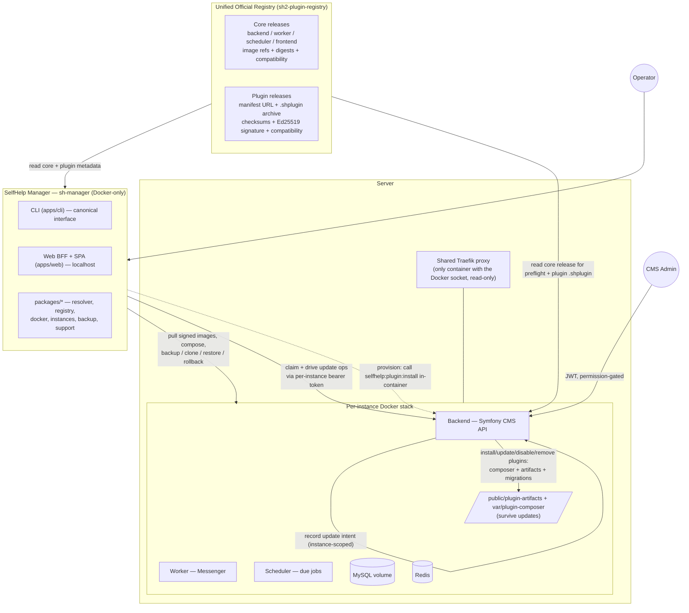
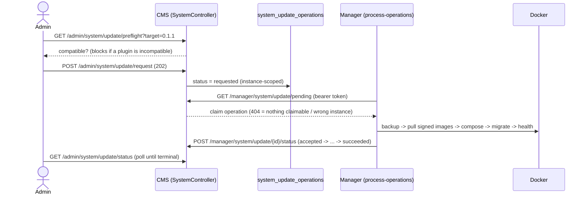

<!--
SPDX-FileCopyrightText: 2026 Humdek, University of Bern
SPDX-License-Identifier: MPL-2.0
-->

# Platform & Plugin Ecosystem

Audience: Operators, deployers, and backend developers.
Status: active.
Applies to: SelfHelp2 platform (backend `0.1.1`, plugin API `0.1.0`).
Last verified: 2026-06-10.
Source of truth: `src/Service/System/`, `src/Controller/Api/V1/Admin/SystemController.php`, `src/Controller/Api/V1/Manager/SystemManagerController.php`, the plugin layer under `src/Plugin/`, the `sh-manager` repository (`packages/*`, `apps/cli`, `apps/web`), and the unified registry contract in `docs/plugins/`.

This is the **one big map** of how a SelfHelp deployment is installed, updated, and
maintained. It explains the **hybrid model** in one place: who owns the Docker
core platform, who owns the plugins, what the single registry holds, and the two
operational paths an operator/admin actually uses.

> One unified registry. Two installers.
>
> - **Core** — the SelfHelp Manager (`sh-manager`) installs/updates the Dockerized
>   core platform (backend, worker, scheduler, frontend images).
> - **Plugins** — the CMS/backend installs signed plugin artifacts as host
>   extensions (Composer + ESM runtime + migrations). Plugins are **not** Docker
>   services.

## The big map



## Who owns what

| Concern | Owner | Never does |
| --- | --- | --- |
| Docker images, compose, volumes, networks | **Manager** (`sh-manager`) | The CMS never runs Docker, `compose`, image pulls, or volume ops. |
| Core install / update / backup / restore / clone / rollback | **Manager** | The CMS never performs these; it only **records intent** and **surfaces status**. |
| Compatibility preflight before a core update | **Both** — CMS computes an instance-scoped preflight; Manager re-checks before acting | — |
| Plugin install / update / disable / uninstall / purge | **CMS/backend** (admin API + CLI, Messenger-driven) | The Manager never installs plugins directly; it only triggers the backend CLI during initial provisioning. |
| Plugin Composer deps + ESM runtime artifacts + plugin migrations | **CMS/backend** | The Manager never touches `var/plugin-composer/` or `public/plugin-artifacts/`. |
| The signed catalogue of releases | **Unified registry** | Neither installer hand-edits `registry.json`. |

Two invariants make this safe, and both are enforced in code:

1. **The CMS never controls Docker.** `sh-manager` is the only component allowed to
   talk to the Docker socket; runtime containers never receive it (only the shared
   Traefik proxy does, read-only). See the manager `@shm/docker` guards and
   `docs/developer/25-instance-scoped-system-layer.md` ("Core principle").
2. **Instance scope is server-derived.** Every CMS system-layer read/write is scoped
   to the instance resolved server-side; a client-supplied `instance_id` is denied
   and logged before validation (`SystemUpdateService::denyCrossInstance()`).

## The unified registry

The registry (`sh2-plugin-registry`, served as a static signed site) is the single
catalogue for **both** axes. Releases are Ed25519-signed and SHA-256-checksummed;
the manager and the CMS both **refuse** unsigned / untrusted / `dev`-keyed releases
in production.

| Release kind | Installed by | Carries |
| --- | --- | --- |
| **Core release** | Manager | Backend/worker/scheduler/frontend image refs + digests, compatibility (core ⇄ frontend ⇄ plugin API), `minimumDirectUpgradeFrom`. |
| **Plugin release** | CMS/backend | `kind: selfhelp-plugin-release`, `id`, `version`, `channel`, `official`, `compatibility {core, pluginApi}`, optional `dependencies.plugins[]`, `artifacts {manifestUrl, archiveUrl, sha256}`, `security {signature, keyId, signedPayload}`. |

The registry index lists lightweight **release refs** (`{id, version, channel,
releaseUrl}`); each `releaseUrl` points at one of the signed release documents above.
Canonical JSON is **byte-identical** between the Node signer (`@shm/registry`) and the
host PHP `SignedPayloadBuilder`, so a signature made by either verifies in both. The
plugin-release field contract is specified in
[`../plugins/registry-and-channels.md`](../plugins/registry-and-channels.md) and the
schema [`../plugins/plugin-registry.schema.json`](../plugins/plugin-registry.schema.json);
release channels (`stable`/`beta`/`nightly`/`test`) are described there too.

### Multi-version resolution — shipped vs tracked

**Shipped (both halves resolve identically).** The unified registry `plugins[]`
array carries **multiple release refs per plugin id**, each pointing at a signed
release document. The Manager's `@shm/resolver` and the backend's
[`PluginReleaseResolver`](../../src/Plugin/Registry/Unified/PluginReleaseResolver.php)
both select the **newest release compatible with the running core**, block
incompatible ones, return a clear "no compatible version" error, keep an installed
older-but-compatible version valid, and **skip pinned plugins**. Pinning is persisted
on `plugins.pinned` with `POST /admin/plugins/{id}/pin|unpin`; the core update
preflight reports a pinned + incompatible plugin as `blocking` via the shared
[`CompatibilityError`](../../src/Plugin/Registry/Unified/CompatibilityError.php)
shape (same object the Manager preflight uses). The
[`UnifiedRegistryClient`](../../src/Plugin/Registry/Unified/UnifiedRegistryClient.php)
follows `releaseUrl`, Ed25519-verifies each release document, downloads the
`.shplugin`, and verifies `artifacts.sha256`. The
`CrossInstallerArchitectureSmokeTest` proves both halves consume the **same** signed
fixture (`tests/fixtures/registry/unified/`).

What remains **tracked for completion**: wiring the live admin
`/available|/updates|/install` endpoints onto `UnifiedRegistryClient` +
`PluginReleaseResolver` (the consumer subsystem is built and tested; the admin
endpoints still read the legacy inline path), and the frontend "Available" version
picker (installed / pinned / updateable / incompatible / blocked / latest-compatible).
Tracked under epic [#43](https://github.com/humdek-unibe-ch/sh-selfhelp_backend/issues/43)
and [#49](https://github.com/humdek-unibe-ch/sh-selfhelp_backend/issues/49).

## Version axes and how they reconcile (`0.1.0`)

SelfHelp ships as repositories that must agree on shared contracts. Pre-1.0 SemVer
applies: **every `0.x` MINOR bump is breaking**, so a compatibility range tracks one
minor (`>=0.1.0 <0.2.0`). `SemverHelper` (PHP) and `@shm/resolver` (Node) already
implement `0.x` caret semantics, so only the **declared** versions/ranges change.

| Axis | Where | Value |
| --- | --- | --- |
| Core CMS | `selfhelp.cms_version` (`config/services.yaml`) | `0.1.1` |
| Plugin API | `selfhelp.plugin_api_version` | `0.1.0` |
| `@selfhelp/shared` (TS contracts/SDK) | npm | `1.5.0` (published SDK line; frontend pins `^1.5.0`) |
| Frontend / mobile | consume `@selfhelp/shared` | `^1.5.0` / `^1.4.0` |
| Manager | `sh-manager` | `0.1.1` |
| Plugin (e.g. SurveyJS) | `plugin.json#version` / `pluginApiVersion` / `compatibility.selfhelp` | `0.1.0` / `0.1.0` / `>=0.1.0 <0.2.0` |

Full rules and "what to update when a contract changes" live in
[`../developer/cross-repo-compatibility-matrix.md`](../developer/cross-repo-compatibility-matrix.md)
and [`../plugins/versioning-and-compatibility.md`](../plugins/versioning-and-compatibility.md).

---

## Path A — From the Manager (operator)

The Manager is the **operator** tool. It is Docker-only and connected: the server
never builds; it pulls signed artifacts. The CLI is the canonical interface; the web
UI (`sh-manager-web`, localhost) exposes the same actions.

### A.1 Install core

```bash
# one-time server bootstrap: shared proxy + inventory
sh-manager server init --server-id srv-001 --mode production --email ops@example.ch

# install an isolated instance from the official registry (signed images, no build)
sh-manager instance install --id website1 --domain website1.example.ch \
  --registry https://humdek-unibe-ch.github.io/sh2-plugin-registry/ \
  --version latest --up

# install AND fully provision: wait for DB -> migrate -> create admin ->
# install initial plugins -> warm caches -> health. A generated admin password
# is printed once and never written to disk/manifest/lock.
sh-manager instance install --id website1 --domain website1.example.ch \
  --registry https://humdek-unibe-ch.github.io/sh2-plugin-registry/ \
  --version latest --provision --admin-email ops@example.ch
```

Install resolves a compatible core release, generates the per-instance Docker Compose,
non-secret `.env`, manifest, lock file, and an operator README, then brings the stack
up behind the shared Traefik proxy. **Initial plugin provisioning** is the one place
the Manager touches plugins: it calls the backend CLI **inside the backend container**
(`selfhelp:plugin:install <path-to-manifest>`), so the CMS still owns plugin install.

### A.2 Update core (compatibility preflight, backup-first, rollback-on-failure)

```bash
sh-manager instance update --dry-run website1          # preflight only, no changes
sh-manager instance update website1                    # clean minor/patch
sh-manager instance update website1 --accept-migration-risk   # destructive migration
```

What an update does (verified by `apps/cli/src/smoke.test.ts`,
`0.1.0 -> 0.2.0`):

1. **Compatibility preflight** — resolve the target core release; check the current
   instance's installed plugins against the target via the resolver. If any installed
   plugin has **no compatible version** for the target core, the update is **blocked**
   with a visible reason (e.g. *core `0.2.0` + plugin `>=0.1.0 <0.2.0` → blocked*).
2. **Backup first** — a checksummed backup (DB dump + manifest covering every required
   area) before anything mutates.
3. **Maintenance window** → pull the signed target images → recreate the compose
   stack → run migrations → health-check.
4. **Land or recover** — on success the new version is recorded; on failure the
   Manager rolls back. Automatic rollback exists **before** migrations run; after a
   destructive migration, recovery is a **restore from the backup** taken in step 2.

Volumes survive: the MySQL data volume, uploads, plugin artifacts, secrets, backups,
and logs are **never** torn down by an update (`docker compose down -v` and
MySQL-volume deletion are blocked by `@shm/docker`).

### A.3 Maintain (health, backup, restore, clone, remove, support)

```bash
sh-manager instance list
sh-manager instance health website1
sh-manager instance backup website1                    # checksummed backup-YYYYMMDD-...
sh-manager instance restore website1 <backupId>        # validates, same-instance plan
sh-manager instance clone website1 --to website1-staging
sh-manager instance remove website1 --mode disable     # keep data; stop serving
sh-manager instance remove website1 --mode full_delete # typed confirmation + volume removal
sh-manager doctor                                       # resource/port preflight
sh-manager instance support-bundle website1            # redacted, re-scanned for secrets
```

Exact flags and operator runbooks live in the `sh-manager` repo:
`docs/operator/install.md`, `update.md`, `backup-restore.md`, `clone-remove.md`,
`safe-mode-and-recovery.md`, `support-bundle.md`, `security-hardening.md`.

---

## Path B — From within the CMS (admin)

The CMS admin can **see** the instance's version/health, **run a preflight**, and
**request** a connected, signed core update — then watch it execute. The CMS records
intent and surfaces status; the **Manager** does the Docker work and writes progress
back. The CMS **does** fully own the plugin lifecycle.

### B.1 System layer — version, health, update request (instance-scoped)

Admin routes (browser, permission-gated; standard `ApiResponseFormatter` envelope):

| Method + path | Permission | Purpose |
| --- | --- | --- |
| `GET /admin/system/version` | `admin.system.read` | Version summary + installed-plugin compatibility. |
| `GET /admin/system/health` | `admin.system.read` | Aggregated component health. |
| `GET /admin/system/update/preflight?target=<v>` | `admin.system.read` | Compatibility preflight for a target version. |
| `POST /admin/system/update/request` | `admin.system.update` | Request an update for THIS instance → **202 Accepted**. |
| `GET /admin/system/update/status` | `admin.system.read` | Latest operation status for THIS instance. |
| `GET /admin/system/maintenance` | `admin.system.read` | Maintenance state (+ read-only `safe_mode`). |
| `PUT /admin/system/maintenance` | `admin.system.maintenance` | Toggle maintenance for THIS instance. |

The **preflight blocks a core update when an installed plugin is incompatible** with
the target and allows it when every installed plugin has a compatible range — the same
rule the Manager re-checks. The blocking reason is returned to the admin with the
component, current/target versions, and required range.

### B.2 The CMS-requested, Manager-executed update loop

The Manager drives a requested operation through a **token-gated** manager loop
(`Api\V1\Manager\SystemManagerController`, gated by the per-instance
`SELFHELP_MANAGER_TOKEN`; empty token = loop disabled). The browser never calls it.



Status flow: `requested → accepted → preflight_running → backup_running →
update_running → migration_running → health_check_running → succeeded`
(or `failed` / `rolled_back`). The CMS only ever writes `requested`; the Manager
writes the rest. A destructive migration requires the admin to **accept the migration
risk** and type the target version to confirm. Full details, env vars, and the
manager CLI counterpart (`sh-manager instance process-operations <id> --backend-url …
--token …`) are in
[`../developer/25-instance-scoped-system-layer.md`](../developer/25-instance-scoped-system-layer.md).

### B.3 Plugin lifecycle (CMS/backend-owned)

Plugins are host extensions installed through the existing admin APIs + CLI — **never**
as Docker services. Every install/update/uninstall flows through the same
Messenger-driven path:

| Action | Endpoint / CLI | Effect |
| --- | --- | --- |
| Install | `POST /admin/plugins/install` (202) | Resolve manifest (registry / url / paste / `.shplugin`), verify signature + checksum + compatibility, `composer require` in `var/plugin-composer/`, promote runtime artifacts to `public/plugin-artifacts/<id>-<ver>/`, run plugin migrations, update `selfhelp.plugins.lock.json` + `config/selfhelp_plugin_bundles.php`. |
| Update | `POST /admin/plugins/{id}/update` (202) | Same pipeline for a newer compatible version. |
| Disable | admin API / CLI | Hides the plugin, keeps data; plugin-owned `api_routes` rows are filtered out at load time. |
| Uninstall | `POST /admin/plugins/{id}/uninstall` (202) | Removes packages, keeps user-facing data; clears plugin-owned routes. |
| Purge | CLI `--confirm` / UI typed id | Destructive: deletes plugin-owned tables/rows/styles/lookups/routes. |

The backend reads plugin metadata from the unified registry, downloads the `.shplugin`
artifact (or resolves the registry/url runtime entrypoint), verifies signature +
checksum, checks `compatibility.selfhelp` + `compatibility.pluginApi` against this
host, and only then installs. The complete contract is the plugin docs set under
[`../plugins/`](../plugins/index.md) (`architecture.md`, `install-modes.md`,
`lock-file.md`, `security-model.md`, `plugin-operations-and-rollback.md`,
`signing.md`).

---

## Decision guide — Manager or CMS?

| I want to… | Use |
| --- | --- |
| Install a brand-new instance / server | **Manager** (`instance install`) |
| Update the **core platform** (backend/worker/scheduler/frontend) | **Either**: request from the **CMS** admin UI (Manager executes), or run `sh-manager instance update` directly |
| Back up / restore / clone / remove an instance | **Manager** |
| Install / update / disable / remove a **plugin** | **CMS** (admin Plugins UI or CLI) |
| See version, health, advisories, run an update preflight | **CMS** admin system pages |
| Toggle maintenance mode / inspect safe mode | **CMS** (maintenance is web-toggleable; safe mode is operator-only, read-only from the web) |

## Safety invariants (enforced in code + tests)

- Production is **Docker-only and connected**; the server never compiles, it pulls
  **signed** artifacts.
- Exactly **one** official registry.
- The Manager owns Docker; the CMS does not. No runtime container mounts the Docker
  socket (only the shared Traefik proxy, read-only).
- CMS update management is **instance-scoped**; a browser-provided `instance_id` is
  denied and logged; cross-instance access is impossible.
- Backups, DB volume, uploads, plugin artifacts, secrets, and logs **survive updates**.
- A core update is **blocked** if any installed plugin has no compatible version for
  the target core; the reason is visible to admin and operator.

## Related (tracking)

- Backend CMS system layer: [`../developer/25-instance-scoped-system-layer.md`](../developer/25-instance-scoped-system-layer.md).
- Admin system API reference: [`../reference/api/20-admin-system-maintenance.md`](../reference/api/20-admin-system-maintenance.md).
- Core Docker image build/sign/publish: [`docker-release-pipeline.md`](docker-release-pipeline.md).
- Cross-repo version reconciliation: [`../developer/cross-repo-compatibility-matrix.md`](../developer/cross-repo-compatibility-matrix.md).
- Plugin ecosystem: [`../plugins/architecture.md`](../plugins/architecture.md), [`../plugins/registry-and-channels.md`](../plugins/registry-and-channels.md).
- Manager repo: `sh-manager/README.md`, `docs/architecture.md`, and the `docs/operator/*` runbooks.
- Epic [`humdek-unibe-ch/sh-selfhelp_backend#43`](https://github.com/humdek-unibe-ch/sh-selfhelp_backend/issues/43) — "Reconcile all SelfHelp versions to 0.1.0 + ecosystem docs/tests" and its sub-issues (#44–#49).
- **Tracked workstream — multi-version-per-plugin registry + Available-UI version picker** and the related unified-registry contracts: [`#49`](https://github.com/humdek-unibe-ch/sh-selfhelp_backend/issues/49).
