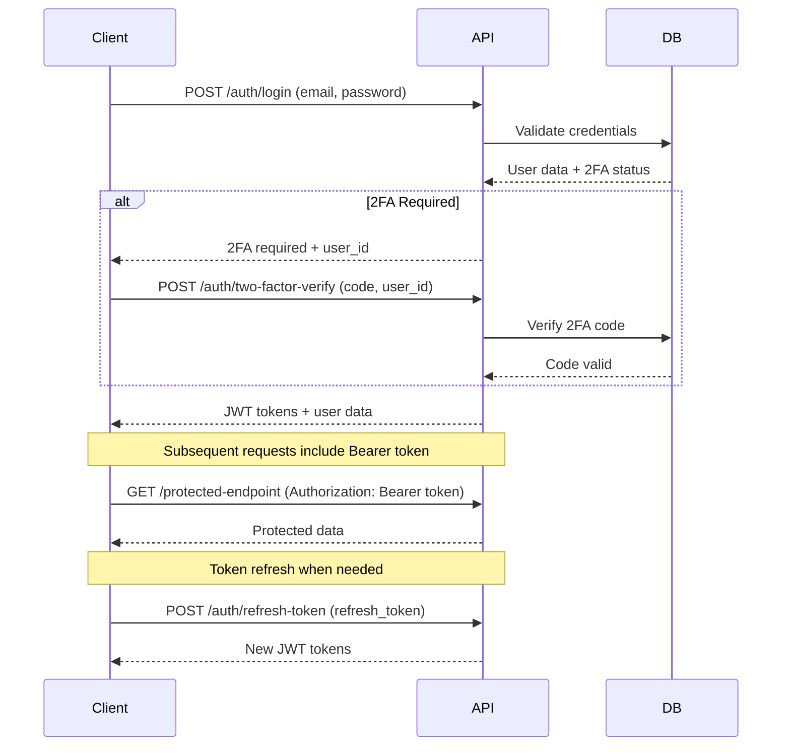

# Authentication APIs

Audience: Developers and integrators.
Status: active.
Applies to: SelfHelp2 Symfony backend.
Last verified: 2026-06-05.
Source of truth: Controllers, JSON schemas, route definitions, and exported types in this repository.

## Overview

The SelfHelp API provides comprehensive authentication and user management functionality. This includes JWT-based authentication with refresh tokens, two-factor authentication support, and user profile management.

## Token lifetimes

| Token                    | Default TTL               | Env variable              | Behaviour on expiry                                                         |
|--------------------------|---------------------------|---------------------------|-----------------------------------------------------------------------------|
| Access (JWT)             | **3600 s / 1 hour**       | `JWT_TOKEN_TTL`           | Symfony answers `401 Unauthorized`. Client calls `/auth/refresh-token`.     |
| Refresh                  | **2 592 000 s / 30 days** | `JWT_REFRESH_TOKEN_TTL`   | Symfony answers `401` from `/auth/refresh-token`. Client must log in again. |
| Impersonation (JWT)      | **900 s / 15 minutes**    | `IMPERSONATION_TOKEN_TTL` | Symfony answers `401`. There is **no refresh** for impersonation; the admin must call `/admin/users/{id}/impersonate` again or stop. |

The refresh endpoint **rotates** the refresh token: each successful call
deletes the old `refresh_tokens` row and returns a fresh pair. Holding a
long-lived session therefore advances the refresh expiry by another full
window every hour (or every access-token lifetime you configure).

The impersonation token is intentionally non-rotating and short-lived —
see [Admin Users → Impersonate User](./07-admin-users.md#impersonate-user)
for the full lifecycle (start → audit-logged mutations → stop +
blacklist).

To change these values for a particular environment, see
*Token TTL configuration* in
[`docs/developer/03-authentication-authorization.md`](../../developer/03-authentication-authorization.md#token-ttl-configuration).

## Client-side token storage

How a client stores the two tokens is outside the API's scope, but the official
Next.js frontend (`sh-selfhelp_frontend`) runs a **Backend-for-Frontend proxy**:
all `/cms-api/v1/*` calls are proxied through Next.js `/api/*`, and the JWTs
live in `sh_auth` / `sh_refresh` **httpOnly cookies** that browser JavaScript
cannot read. 401s from the backend trigger a transparent server-side silent
refresh, so UIs never have to handle token expiry themselves. External API
consumers (mobile apps, Postman, third-party integrations) use the standard
Bearer flow as documented below.

## Authentication Flow



## Core Authentication Endpoints

### Login

Authenticate a user and receive JWT tokens.

**Endpoint:** `POST /cms-api/v1/auth/login`

**Request Body:**
[View JSON Schema](../../../config/schemas/api/v1/requests/auth/login.json)
```json
{
  "email": "user@example.com",
  "password": "userpassword"
}
```

**Success Response (Normal Login):**
[View JSON Schema](../../../config/schemas/api/v1/responses/auth/login.json)
```json
{
  "status": 200,
  "message": "OK",
  "error": null,
  "logged_in": true,
  "meta": {
    "version": "v1",
    "timestamp": "2025-01-23T10:30:00Z"
  },
  "data": {
    "access_token": "eyJ0eXAiOiJKV1QiLCJhbGciOiJSUzI1NiJ9...",
    "refresh_token": "abc123def456...",
    "user": {
      "id": 123,
      "email": "user@example.com",
      "name": "John Doe",
      "language_id": 1,
      "language_locale": "en"
    }
  }
}
```

**Success Response (2FA Required):**
```json
{
  "status": 200,
  "message": "OK",
  "error": null,
  "logged_in": false,
  "meta": {
    "version": "v1",
    "timestamp": "2025-01-23T10:30:00Z"
  },
  "data": {
    "requires_2fa": true,
    "id_users": 123
  }
}
```

**Error Responses:**
- `401 Unauthorized`: Invalid credentials
- `400 Bad Request`: Missing or invalid fields
- `422 Unprocessable Entity`: Validation errors

**Permissions:** None (public endpoint)

### Two-Factor Authentication Verification

Complete the login process when 2FA is enabled.

**Endpoint:** `POST /cms-api/v1/auth/two-factor-verify`

**Request Body:**
[View JSON Schema](../../../config/schemas/api/v1/requests/auth/2fa_verify.json)
```json
{
  "code": "123456",
  "id_users": 123
}
```

**Success Response:**
```json
{
  "status": 200,
  "message": "OK",
  "error": null,
  "logged_in": true,
  "meta": {
    "version": "v1",
    "timestamp": "2025-01-23T10:30:00Z"
  },
  "data": {
    "access_token": "eyJ0eXAiOiJKV1QiLCJhbGciOiJSUzI1NiJ9...",
    "refresh_token": "abc123def456...",
    "user": {
      "id": 123,
      "email": "user@example.com",
      "name": "John Doe",
      "language_id": 1,
      "language_locale": "en"
    }
  }
}
```

**Error Responses:**
- `401 Unauthorized`: Invalid or expired verification code
- `404 Not Found`: User not found
- `400 Bad Request`: Missing or invalid fields

**Permissions:** None (public endpoint)

### Refresh Token

Obtain new JWT tokens using a refresh token.

**Endpoint:** `POST /cms-api/v1/auth/refresh-token`

**Request Body:**
[View JSON Schema](../../../config/schemas/api/v1/requests/auth/refresh_token.json)
```json
{
  "refresh_token": "abc123def456..."
}
```

**Success Response:**
```json
{
  "status": 200,
  "message": "OK",
  "error": null,
  "logged_in": true,
  "meta": {
    "version": "v1",
    "timestamp": "2025-01-23T10:30:00Z"
  },
  "data": {
    "access_token": "eyJ0eXAiOiJKV1QiLCJhbGciOiJSUzI1NiJ9...",
    "refresh_token": "new_refresh_token_hash..."
  }
}
```

**Error Responses:**
- `401 Unauthorized`: Invalid or expired refresh token
- `400 Bad Request`: Missing refresh token

**Permissions:** None (public endpoint)

### Logout

Invalidate the current session and refresh token.

**Endpoint:** `POST /cms-api/v1/auth/logout`

**Headers:**
```
Authorization: Bearer your_jwt_token
```

**Request Body (Optional):**
```json
{
  "refresh_token": "abc123def456..."
}
```

**Success Response:**
```json
{
  "status": 200,
  "message": "OK",
  "error": null,
  "logged_in": false,
  "meta": {
    "version": "v1",
    "timestamp": "2025-01-23T10:30:00Z"
  },
  "data": {
    "message": "Successfully logged out"
  }
}
```

**Error Responses:**
- `401 Unauthorized`: No valid access token provided
- `400 Bad Request`: Invalid JSON payload

**Permissions:** None (requires valid JWT token)

### Self-Registration

Create a new user account from a public register page. The new account is created blocked and an email-validation link is sent — the user activates the account through the validation flow (see [User Validation APIs](./03-user-validation.md)).

**Endpoint:** `POST /cms-api/v1/auth/register`

**Request Body:**
[View JSON Schema](../../../config/schemas/api/v1/requests/auth/register.json)
```json
{
  "page_id": 92,
  "email": "user@example.com",
  "code": "INVITE123"
}
```

- `page_id` (int, required): ID of the CMS register page. The backend locates the `register`-style section under this page and reads `open_registration` and `group` server-side. The client is never trusted to send the policy.
- `email` (string, required): User's email address. Must not already be taken.
- `code` (string, optional): Registration code. **Required** when the register section has `open_registration = 0`. Each code is single-use — it is marked consumed when the account is created and cannot be reused.

**Success Response (`201 Created`):**
```json
{
  "status": 201,
  "message": "Created",
  "error": null,
  "logged_in": false,
  "meta": {
    "version": "v1",
    "timestamp": "2026-06-01T10:30:00Z"
  },
  "data": []
}
```

**Error Responses:**
- `400 Bad Request`: `"An account with this email address already exists."`
- `400 Bad Request`: `"No register section found for this page."`
- `400 Bad Request`: `"A registration code is required."`
- `400 Bad Request`: `"Invalid registration code."`
- `400 Bad Request`: `"This registration code has already been used."`

**Permissions:** None (public endpoint)

**Notes:**
- The user is assigned to the group associated with the registration code (when `open_registration = 0`) or to the section's configured group (when `open_registration = 1`).
- A validation email is dispatched asynchronously via the job scheduler.
- Registration codes are managed via the [Admin Registration Codes APIs](./19-admin-registration-codes.md).

### Forgot Password (request a reset link)

Request a password-recovery email for an account. The response is **always a generic success**, regardless of whether the email belongs to a known account, so the endpoint cannot be used to enumerate registered users.

**Endpoint:** `POST /cms-api/v1/auth/forgot-password`

**Request Body:**
[View JSON Schema](../../../config/schemas/api/v1/requests/auth/forgot_password.json)
```json
{
  "email": "user@example.com"
}
```

**Success Response (`200 OK`):**
```json
{
  "status": 200,
  "message": "OK",
  "error": null,
  "logged_in": false,
  "meta": { "version": "v1", "timestamp": "2026-06-05T10:30:00Z" },
  "data": { "requested": true }
}
```

**Behaviour:**
- For a known **active** account a one-time recovery token is stored on the user and a recovery email (`mail_recovery`) is sent immediately. The email links to `<FRONTEND_BASE_URL>/reset/{user_id}/{token}`.
- The recovery email is a **system mail** (`required_system` delivery policy), so it is delivered even when the recipient disabled platform emails in their profile (issue #29).
- Unknown emails and non-active accounts are silently ignored.

**Permissions:** None (public endpoint)

### Reset Password (set a new password)

Consume the one-time recovery token from the reset email and set a new password. The token is single-use, is cleared on success, and triggers an immediate password-changed confirmation email (`mail_password_changed`).

**Endpoint:** `POST /cms-api/v1/auth/reset-password`

**Request Body:**
[View JSON Schema](../../../config/schemas/api/v1/requests/auth/reset_password.json)
```json
{
  "id_users": 123,
  "token": "0f1e2d3c4b5a69788796a5b4c3d2e1f0",
  "password": "newsecurepassword123"
}
```

**Success Response (`200 OK`):**
```json
{
  "status": 200,
  "message": "OK",
  "error": null,
  "logged_in": false,
  "meta": { "version": "v1", "timestamp": "2026-06-05T10:30:00Z" },
  "data": { "reset": true }
}
```

**Error Responses:**
- `400 Bad Request`: `"This password-reset link is invalid or has expired."` (unknown or mismatched token)
- `422 Unprocessable Entity`: Validation errors (e.g. password shorter than 8 characters)

**Permissions:** None (public endpoint)

## User Data & Profile Management

### Get Current User Data

Retrieve comprehensive user information including roles and permissions.

**Endpoint:** `GET /cms-api/v1/auth/user-data`

**Headers:**
```
Authorization: Bearer your_jwt_token
```

**Success Response:**
```json
{
  "status": 200,
  "message": "OK",
  "error": null,
  "logged_in": true,
  "meta": {
    "version": "v1",
    "timestamp": "2025-01-23T10:30:00Z"
  },
  "data": {
    "user": {
      "id": 123,
      "email": "user@example.com",
      "name": "John Doe",
      "user_name": "johndoe",
      "user_type_id": 1,
      "blocked": false,
      "id_languages": 1,
      "language_locale": "en",
      "timezone": "Europe/Berlin",
      "last_login": "2025-01-23T09:15:00Z",
      "created_at": "2024-01-15T10:30:00Z",
      "updated_at": "2025-01-20T14:45:00Z"
    },
    "roles": [
      {
        "id": 1,
        "name": "admin",
        "description": "Administrator role"
      }
    ],
    "permissions": [
      {
        "name": "admin.access",
        "description": "Can view and enter the admin/backend area"
      },
      {
        "name": "admin.page.read",
        "description": "Can read existing pages"
      }
    ],
    "groups": [
      {
        "id": 1,
        "name": "admin",
        "description": "Admin group"
      }
    ]
  }
}
```

**Permissions:** None (requires valid JWT token)

### Real-time ACL Events Stream (Mercure subscriber bootstrap)

Real-time `acl-changed` events are delivered through a [Mercure](https://mercure.rocks)
hub (Caddy + Mercure module) running alongside the API. PHP-FPM never holds an
SSE connection — it only POSTs publishes to the hub when ACL state actually
changes. The `/auth/events` endpoint described below returns the *discovery
payload* clients use to subscribe to the hub, either directly or through a BFF.

**Endpoint:** `GET /cms-api/v1/auth/events`

**Headers:**
```
Authorization: Bearer your_jwt_token
```

**Success response (`200 OK`, `application/json`):**

The payload is wrapped in the standard `ApiResponseFormatter` envelope
(matches every other auth endpoint such as `/auth/login`,
`/auth/refresh-token`, `/auth/user-data`) and is validated against
`config/schemas/api/v1/responses/auth/events.json` when
`VALIDATE_RESPONSE_SCHEMA=1`.

```json
{
  "status": 200,
  "message": "OK",
  "error": null,
  "logged_in": true,
  "meta": { "version": "v1", "timestamp": "2026-04-25T02:14:00+00:00" },
  "data": {
    "hubUrl": "https://app.example.com/.well-known/mercure",
    "topic": "https://selfhelp.app/users/123/acl",
    "token": "eyJhbGciOiJIUzI1NiJ9.eyJtZXJjdXJlIjp7InN1YnNjcmliZSI6Wy4uLl19fQ.…",
    "expiresIn": 3600
  }
}
```

| `data` field | Type    | Meaning                                                                                                                       |
|--------------|---------|-------------------------------------------------------------------------------------------------------------------------------|
| `hubUrl`     | string  | Public URL of the Mercure hub (`MERCURE_PUBLIC_URL`).                                                                         |
| `topic`      | string  | Per-user, private topic IRI. Issued JWT only authorises *this exact* topic.                                                   |
| `token`      | string  | HMAC-SHA256 JWT to send as `Authorization: Bearer …` when subscribing to the hub.                                             |
| `expiresIn`  | integer | Lifetime of `token` in seconds. The frontend should treat this as an upper bound and re-call `/auth/events` on every reconnect. |

**Subscribing:** open a `text/event-stream` request to
`${hubUrl}?topic=${encodeURIComponent(topic)}` with the `Authorization`
header set to `Bearer ${token}`.

- `sh-selfhelp_frontend` uses a BFF proxy
  (`src/app/api/auth/events/route.ts`): it calls this endpoint, opens
  the upstream subscription, and pipes the bytes back to the browser as
  same-origin SSE so `useAclEventStream` can use a plain
  `EventSource('/api/auth/events')`.
- `sh-selfhelp_mobile` subscribes directly to the hub with
  `react-native-sse`. Native iOS/Android builds do not need CORS for
  this because they do not send a browser `Origin` header. Expo Web
  preview does, so its host must be present in both Symfony API CORS
  (`CORS_ALLOW_ORIGIN`) and the Mercure hub `cors_origins` allow-list.

**Hub events:**

| Event           | Payload                                   | Meaning                                                                                                                                                                |
|-----------------|--------------------------------------------|------------------------------------------------------------------------------------------------------------------------------------------------------------------------|
| `acl-changed`   | `{ "aclVersion": "<hex string>" }`         | The user's `users.acl_version` changed. The client should re-fetch `/auth/user-data` and any nav/permission-gated data caches.                                          |

The Mercure hub also injects synthetic events of its own (`ping` keep-alives,
`Last-Event-ID` cursor) — they are protocol-level bookkeeping the
browser's `EventSource` handles transparently.

**Lifecycle:**

- The hub holds the long-lived SSE connection — PHP only ever does
  short publish POSTs. Subscribers can stay connected indefinitely
  (no 5-minute self-termination, no PHP-FPM worker held open).
- If the user is unauthenticated, the endpoint returns `401
  Unauthorized` with the standard error envelope (no token is issued).
- If `MERCURE_JWT_SECRET` is not configured, the endpoint returns
  `500 Internal Server Error` so the misconfiguration is obvious.

**What triggers `acl-changed`:** any code path that calls
`User::bumpAclVersion()` and flushes — Doctrine listener
`App\EventListener\AclVersionMercurePublisher` publishes the Mercure
update on `postFlush`. As of v8.0.0 those code paths are
`AdminGroupService`, `AdminRoleService`, `AdminUserService`,
`ProfileService`, and `TaskJobExecutorService` (async job grants).
New ACL-mutating code only needs to bump `acl_version` and flush the
entity — no Mercure wiring required.

**Permissions:** None (requires valid JWT token).

**Configuration / setup:** see the README "Real-time push (Mercure)"
section for the hub Docker Compose setup, JWT secret coordination,
API/browser CORS notes, and production-deployment guidance.

### Update User Name

Update the current user's display name.

**Endpoint:** `PUT /cms-api/v1/auth/user/name`

**Headers:**
```
Authorization: Bearer your_jwt_token
```

**Request Body:**
```json
{
  "name": "John Smith"
}
```

**Success Response:**
Returns updated user data (same format as GET /auth/user-data)

**Permissions:** None (requires valid JWT token)

### Update User Timezone

Update the current user's timezone preference.

**Endpoint:** `PUT /cms-api/v1/auth/user/timezone`

**Headers:**
```
Authorization: Bearer your_jwt_token
```

**Request Body:**
```json
{
  "timezone": "America/New_York"
}
```

**Success Response:**
Returns updated user data (same format as GET /auth/user-data)

**Permissions:** None (requires valid JWT token)

### Update User Password

Change the current user's password.

**Endpoint:** `PUT /cms-api/v1/auth/user/password`

**Headers:**
```
Authorization: Bearer your_jwt_token
```

**Request Body:**
```json
{
  "current_password": "oldpassword123",
  "new_password": "newpassword456",
  "confirm_password": "newpassword456"
}
```

**Success Response:**
```json
{
  "status": 200,
  "message": "OK",
  "error": null,
  "logged_in": true,
  "meta": {
    "version": "v1",
    "timestamp": "2025-01-23T10:30:00Z"
  },
  "data": {
    "message": "Password updated successfully"
  }
}
```

**Error Responses:**
- `400 Bad Request`: Current password incorrect, passwords don't match
- `422 Unprocessable Entity`: Password validation failed

**Permissions:** None (requires valid JWT token)

### Delete User Account

Permanently delete the current user's account.

**Endpoint:** `DELETE /cms-api/v1/auth/user/account`

**Headers:**
```
Authorization: Bearer your_jwt_token
```

**Request Body:**
```json
{
  "password": "userpassword",
  "confirmation": "DELETE_MY_ACCOUNT"
}
```

**Success Response:**
```json
{
  "status": 200,
  "message": "OK",
  "error": null,
  "logged_in": false,
  "meta": {
    "version": "v1",
    "timestamp": "2025-01-23T10:30:00Z"
  },
  "data": {
    "message": "Account deleted successfully"
  }
}
```

**Permissions:** None (requires valid JWT token)

## User Language Settings

### Set User Language

Update the user's preferred language.

**Endpoint:** `POST /cms-api/v1/auth/set-language`

**Headers:**
```
Authorization: Bearer your_jwt_token
```

**Request Body:**
```json
{
  "language_id": 2
}
```

**Success Response:**
```json
{
  "status": 200,
  "message": "OK",
  "error": null,
  "logged_in": true,
  "meta": {
    "version": "v1",
    "timestamp": "2025-01-23T10:30:00Z"
  },
  "data": {
    "language_id": 2,
    "language_locale": "de",
    "language_name": "German"
  }
}
```

**Permissions:** None (requires valid JWT token)

## User Validation (Account Activation)

### Validate Token

Check if a user validation token is valid before account activation.

**Endpoint:** `GET /cms-api/v1/validate/{user_id}/{token}`

**Path Parameters:**
- `user_id`: User ID (numeric)
- `token`: Validation token (32-character hex string)

**Success Response:**
```json
{
  "status": 200,
  "message": "OK",
  "error": null,
  "logged_in": false,
  "meta": {
    "version": "v1",
    "timestamp": "2025-01-23T10:30:00Z"
  },
  "data": {
    "user_id": 123,
    "email": "user@example.com",
    "name": "John Doe",
    "token_valid": true,
    "message": "Token is valid. You can proceed with account setup."
  }
}
```

**Error Responses:**
- `400 Bad Request`: Invalid route parameters or token
- `404 Not Found`: User not found

**Permissions:** None (public endpoint)

### Complete Validation

Complete the user account validation process.

**Endpoint:** `POST /cms-api/v1/validate/{user_id}/{token}/complete`

**Path Parameters:**
- `user_id`: User ID (numeric)
- `token`: Validation token (32-character hex string)

**Request Body:**
```json
{
  "name": "John Doe",
  "user_name": "johndoe",
  "password": "securepassword123",
  "confirm_password": "securepassword123",
  "language_id": 1
}
```

**Success Response:**
```json
{
  "status": 200,
  "message": "OK",
  "error": null,
  "logged_in": true,
  "meta": {
    "version": "v1",
    "timestamp": "2025-01-23T10:30:00Z"
  },
  "data": {
    "access_token": "eyJ0eXAiOiJKV1QiLCJhbGciOiJSUzI1NiJ9...",
    "refresh_token": "abc123def456...",
    "user": {
      "id": 123,
      "email": "user@example.com",
      "name": "John Doe",
      "user_name": "johndoe",
      "language_id": 1,
      "language_locale": "en"
    },
    "message": "Account validated successfully"
  }
}
```

**Error Responses:**
- `400 Bad Request`: Invalid token, validation errors
- `404 Not Found`: User not found
- `409 Conflict`: Account already validated

**Permissions:** None (public endpoint)

## API Discovery

### Get API Routes

Discover all available API routes and their required permissions.

**Endpoint:** `GET /cms-api/v1/admin/api-routes`

**Headers:**
```
Authorization: Bearer your_jwt_token
```

**Query Parameters:**
- `page`: Page number (default: 1)
- `pageSize`: Items per page (default: 50)
- `search`: Search in route names or paths

**Success Response:**
```json
{
  "status": 200,
  "message": "OK",
  "error": null,
  "logged_in": true,
  "meta": {
    "version": "v1",
    "timestamp": "2025-01-23T10:30:00Z",
    "pagination": {
      "current_page": 1,
      "per_page": 50,
      "total_items": 150,
      "total_pages": 3,
      "has_next": true,
      "has_previous": false,
      "next_page": 2
    }
  },
  "data": {
    "routes": [
      {
        "id": 1,
        "route_name": "auth_login",
        "version": "v1",
        "path": "/auth/login",
        "controller": "App\\Controller\\Api\\V1\\Auth\\AuthController::login",
        "methods": "POST",
        "requirements": null,
        "params": null,
        "required_permissions": []
      },
      {
        "id": 2,
        "route_name": "admin_pages_get_all",
        "version": "v1",
        "path": "/admin/pages",
        "controller": "App\\Controller\\Api\\V1\\Admin\\AdminPageController::getPages",
        "methods": "GET",
        "requirements": null,
        "params": {
          "page": {"in": "query", "required": false},
          "pageSize": {"in": "query", "required": false}
        },
        "required_permissions": [
          {
            "name": "admin.page.read",
            "description": "Can read existing pages"
          }
        ]
      }
    ],
    "total": 150
  }
}
```

**Permissions:** `admin.access`

## Usage Examples

### JavaScript (Frontend Integration)

```javascript
// Login
const login = async (email, password) => {
  const response = await fetch('/cms-api/v1/auth/login', {
    method: 'POST',
    headers: {
      'Content-Type': 'application/json'
    },
    body: JSON.stringify({ email, password })
  });

  const data = await response.json();

  if (data.data.requires_2fa) {
    // Handle 2FA flow
    return handleTwoFactor(data.data.id_users);
  }

  // Store tokens
  localStorage.setItem('access_token', data.data.access_token);
  localStorage.setItem('refresh_token', data.data.refresh_token);

  return data.data.user;
};

// Make authenticated requests
const apiRequest = async (endpoint, options = {}) => {
  const token = localStorage.getItem('access_token');

  const response = await fetch(`/cms-api/v1${endpoint}`, {
    ...options,
    headers: {
      'Authorization': `Bearer ${token}`,
      'Content-Type': 'application/json',
      ...options.headers
    }
  });

  // Handle token refresh if needed
  if (response.status === 401) {
    await refreshToken();
    return apiRequest(endpoint, options);
  }

  return response.json();
};

// Refresh token
const refreshToken = async () => {
  const refreshToken = localStorage.getItem('refresh_token');

  const response = await fetch('/cms-api/v1/auth/refresh-token', {
    method: 'POST',
    headers: {
      'Content-Type': 'application/json'
    },
    body: JSON.stringify({ refresh_token: refreshToken })
  });

  const data = await response.json();

  localStorage.setItem('access_token', data.data.access_token);
  localStorage.setItem('refresh_token', data.data.refresh_token);
};
```

### PHP (Backend Integration)

```php
<?php
class ApiClient
{
    private $baseUrl;
    private $accessToken;
    private $refreshToken;

    public function __construct($baseUrl)
    {
        $this->baseUrl = $baseUrl;
    }

    public function login($email, $password)
    {
        $response = $this->makeRequest('POST', '/auth/login', [
            'email' => $email,
            'password' => $password
        ]);

        if (isset($response['data']['requires_2fa'])) {
            // Handle 2FA
            return $this->verifyTwoFactor($response['data']['id_users'], $code);
        }

        $this->accessToken = $response['data']['access_token'];
        $this->refreshToken = $response['data']['refresh_token'];

        return $response['data']['user'];
    }

    public function makeAuthenticatedRequest($method, $endpoint, $data = null)
    {
        $response = $this->makeRequest($method, $endpoint, $data, true);

        // Handle token refresh
        if ($response['status'] === 401) {
            $this->refreshTokens();
            return $this->makeAuthenticatedRequest($method, $endpoint, $data);
        }

        return $response;
    }

    private function refreshTokens()
    {
        $response = $this->makeRequest('POST', '/auth/refresh-token', [
            'refresh_token' => $this->refreshToken
        ]);

        $this->accessToken = $response['data']['access_token'];
        $this->refreshToken = $response['data']['refresh_token'];
    }

    private function makeRequest($method, $endpoint, $data = null, $authenticated = false)
    {
        $url = $this->baseUrl . '/cms-api/v1' . $endpoint;

        $headers = ['Content-Type: application/json'];

        if ($authenticated) {
            $headers[] = 'Authorization: Bearer ' . $this->accessToken;
        }

        $ch = curl_init($url);
        curl_setopt($ch, CURLOPT_RETURNTRANSFER, true);
        curl_setopt($ch, CURLOPT_CUSTOMREQUEST, $method);
        curl_setopt($ch, CURLOPT_HTTPHEADER, $headers);

        if ($data) {
            curl_setopt($ch, CURLOPT_POSTFIELDS, json_encode($data));
        }

        $response = curl_exec($ch);
        curl_close($ch);

        return json_decode($response, true);
    }
}
```

## Security Considerations

1. **Token Storage**: Store tokens securely (HttpOnly cookies recommended for web apps)
2. **Token Refresh**: Implement automatic token refresh before expiration
3. **Password Requirements**: Enforce strong password policies
4. **Rate Limiting**: Respect API rate limits to avoid blocking
5. **HTTPS Only**: Always use HTTPS in production
6. **Token Expiration**: Handle expired tokens gracefully

## Error Handling

All authentication endpoints follow the standard API error format. Common error scenarios:

- **Invalid Credentials**: 401 with message "Invalid credentials"
- **Expired Token**: 401 with message "JWT Token not found" or "Expired JWT Token"
- **Missing Permissions**: 403 with message "Access Denied"
- **Validation Errors**: 400/422 with validation details in the response

---

**Next:** [User Profile Management](./02-user-profile.md) | **Back to:** [API Overview](../../README.md)
